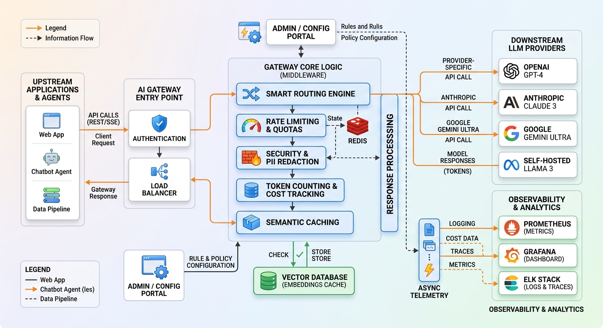
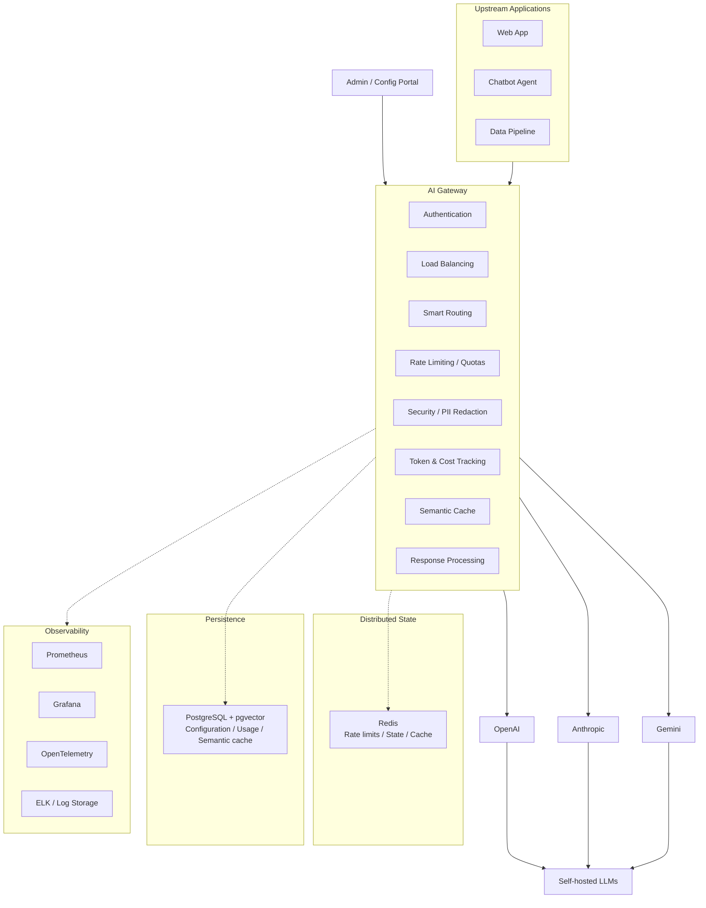
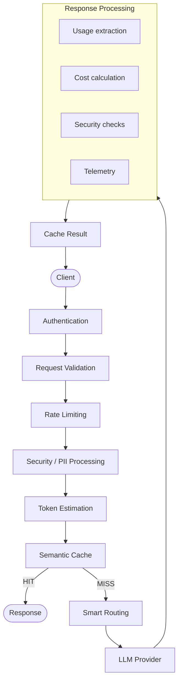
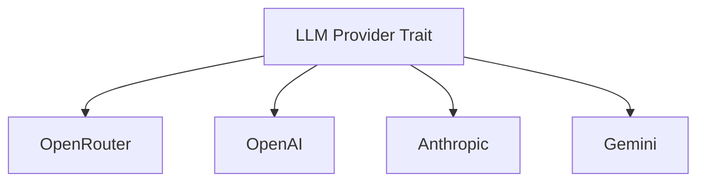
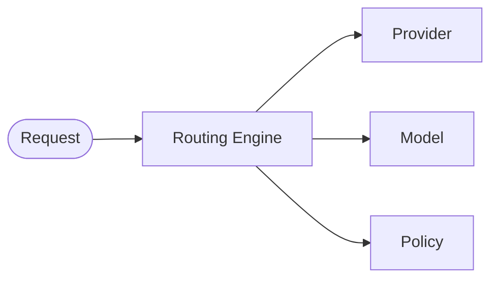
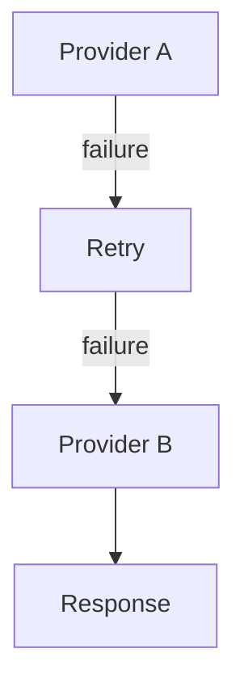
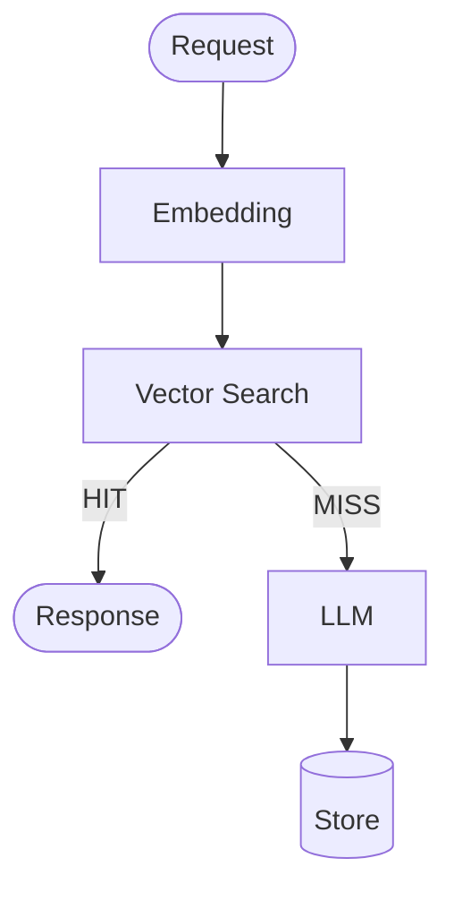
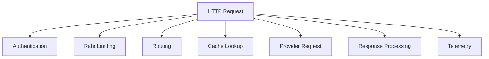
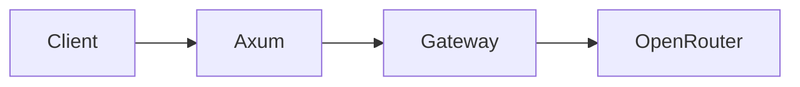
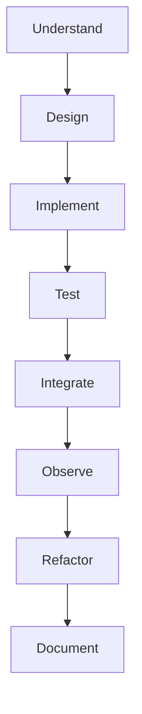

# AI Gateway — Rust

A production-oriented AI Gateway built with Rust. The project provides a unified API layer between upstream applications and multiple Large Language Model (LLM) providers.

The project is designed as both a realistic AI infrastructure project and a step-by-step Rust learning project, progressing from a simple HTTP gateway to a production-oriented, observable, multi-provider AI gateway.

## 1. Project Goals

The gateway will provide a centralized layer for applications and agents that need access to LLMs.

It will eventually support:

- Authentication and authorization
- API key management
- Multi-provider LLM access
- Intelligent model routing
- Rate limiting
- Quotas
- PII detection and redaction
- Token counting
- Cost tracking
- Semantic caching
- Provider fallback
- Retry and timeout policies
- Request/response normalization
- Multi-tenancy
- Configuration and policy management
- Metrics
- Logging
- Distributed tracing
- Health checks
- Production deployment

The architecture is intentionally implemented incrementally.

## 2. Architecture





## 3. Technology Stack

**Core**

| Component | Technology |
|---|---|
| Language | Rust |
| Async runtime | Tokio |
| HTTP framework | Axum |
| HTTP client | Reqwest |
| Serialization | Serde |
| Configuration | Config + Serde |
| Validation | Validator |
| Error handling | thiserror / anyhow |
| Logging | tracing |

**Data**

| Component | Technology |
|---|---|
| Primary database | PostgreSQL |
| Vector search | pgvector |
| Distributed state | Redis |
| Database access | SQLx |

**AI**

The gateway will use a provider abstraction so that applications do not need to know which LLM provider is being used.

Initial development can use OpenRouter, including free models where available.

Eventually the gateway will support providers such as:

- OpenRouter
- OpenAI
- Anthropic
- Google Gemini
- Self-hosted models

**Observability**

- OpenTelemetry
- Prometheus
- Grafana
- ELK
- tracing

**Deployment**

- Docker
- Docker Compose
- CI/CD

## 4. High-Level Request Flow

A request will eventually follow this pipeline:



## 5. Provider Abstraction

The gateway will not tightly couple the application to a specific LLM provider.

Conceptually:



This allows the routing engine to select a provider without changing the API layer.

## 6. Smart Routing

The routing engine will eventually consider factors such as:

- Model
- Provider
- Cost
- Latency
- Availability
- Request type
- Tenant policy
- Model capability
- Quota

For example:



Routing decisions will be configuration-driven rather than hard-coded wherever practical.

## 7. Reliability

The gateway will eventually implement:

- Request timeouts
- Provider retries
- Exponential backoff
- Circuit breakers
- Provider health checks
- Fallback providers
- Request cancellation
- Graceful shutdown
- Failure isolation

Example:



## 8. Security

Security will be treated as a first-class gateway concern.

Planned capabilities:

- Authentication
- Authorization
- API keys
- JWT
- Tenant isolation
- PII detection
- PII redaction
- Request validation
- Response validation
- Policy enforcement
- Audit logging

The gateway should prevent applications from needing to implement these controls independently for every LLM integration.

## 9. Rate Limiting and Quotas

Rate limiting will operate at multiple levels:

- User
- Tenant
- API key
- Provider
- Model

Examples:

- requests / minute
- tokens / minute
- requests / day
- tokens / day
- monthly spending limit

Redis will eventually provide distributed state for these controls.

## 10. Token and Cost Tracking

Every LLM request should produce usage information.

Example:

```
Request
 ├── tenant_id
 ├── provider
 ├── model
 ├── input_tokens
 ├── output_tokens
 ├── total_tokens
 ├── latency
 └── estimated_cost
```

This information will be used for:

- Usage reporting
- Quotas
- Billing
- Cost optimization
- Routing decisions
- Observability

## 11. Semantic Caching

The gateway will eventually support semantic caching.



The initial implementation will use:

- PostgreSQL + pgvector

This keeps the initial architecture manageable while providing a realistic vector-search implementation.

## 12. Observability

Every important gateway operation should be observable.

**Metrics**

- request_count
- request_latency
- provider_latency
- error_count
- token_usage
- estimated_cost
- cache_hit_rate
- rate_limit_count

**Logs**

Structured logs will include relevant request metadata without exposing sensitive data.

**Traces**



## 13. Project Roadmap

The project will be developed in the following phases.

**Phase 0 — Project Foundation**

Learn and establish:

- Rust project structure
- Cargo
- Rust modules
- Error handling
- Configuration
- Tokio
- Async programming

**Phase 1 — Basic HTTP Gateway**

Build:



Endpoints:

- `GET  /health`
- `POST /v1/chat/completions`

**Phase 2 — LLM Provider Abstraction**

Introduce:

```
LlmProvider
    │
    ├── OpenRouter
    ├── OpenAI
    ├── Anthropic
    └── Gemini
```

**Phase 3 — Smart Routing**

Implement:

- Provider selection
- Model selection
- Routing policies
- Provider capabilities
- Basic fallback

**Phase 4 — Authentication**

Implement:

- API keys
- JWT
- Authentication middleware
- Authorization
- Tenant identity

**Phase 5 — Rate Limiting**

Introduce Redis and implement:

- Request limits
- Token limits
- Tenant quotas
- Model quotas

**Phase 6 — Security**

Implement:

- Request validation
- PII detection
- PII redaction
- Security policies
- Audit events

**Phase 7 — Token and Cost Tracking**

Implement:

- Token usage
- Provider pricing
- Cost calculation
- Usage persistence
- Cost reporting

**Phase 8 — Semantic Cache**

Introduce:

- PostgreSQL
- pgvector

Implement:

- Embeddings
- Similarity search
- Cache lookup
- Cache invalidation
- Similarity thresholds

**Phase 9 — Response Processing**

Implement:

- Provider response normalization
- Response validation
- Usage extraction
- Error normalization
- Response security checks

**Phase 10 — Observability**

Implement:

- Structured logging
- Metrics
- Prometheus
- Grafana
- OpenTelemetry
- Distributed tracing

**Phase 11 — Admin / Configuration**

Implement:

- Provider configuration
- Routing rules
- Policies
- Rate limits
- Quotas
- Tenant configuration

**Phase 12 — Reliability**

Implement:

- Timeouts
- Retries
- Backoff
- Circuit breakers
- Provider health
- Fallback
- Graceful shutdown

**Phase 13 — Multi-Tenancy**

Implement:

```
Tenant
 ├── API keys
 ├── Models
 ├── Providers
 ├── Policies
 ├── Quotas
 └── Usage
```

**Phase 14 — Production Deployment**

Implement:

- Docker
- Docker Compose
- Health checks
- Configuration management
- Secrets
- CI/CD
- Horizontal scaling
- Production documentation

## 14. Target Project Structure

The project will evolve toward:

```
ai-gateway/
│
├── Cargo.toml
├── Cargo.lock
├── README.md
├── CHANGELOG.md
├── HANDOFF.md
├── constitution.md
├── .env.example
├── .gitignore
├── docker-compose.yml
├── Makefile
│
├── config/
│   ├── settings.yaml
│   ├── providers.yaml
│   ├── models.yaml
│   ├── routing.yaml
│   ├── development.yaml
│   ├── test.yaml
│   └── production.yaml
│
├── migrations/
│
├── docs/
│   ├── plan.md
│   ├── prd.md
│   ├── architecture.md
│   ├── api.md
│   ├── configuration.md
│   ├── providers.md
│   ├── security.md
│   ├── reliability.md
│   ├── observability.md
│   ├── testing.md
│   ├── deployment.md
│   ├── adr/
│   └── images/
│
├── specs/
│   └── 001-project-foundation/
│
├── src/
│   ├── main.rs
│   ├── lib.rs
│   │
│   ├── api/
│   │   ├── mod.rs
│   │   ├── health.rs
│   │   └── chat.rs
│   │
│   ├── application/
│   │   ├── mod.rs
│   │   └── chat_service.rs
│   │
│   ├── domain/
│   │   ├── mod.rs
│   │   ├── chat.rs
│   │   ├── model.rs
│   │   ├── provider.rs
│   │   └── error.rs
│   │
│   ├── infrastructure/
│   │   ├── mod.rs
│   │   ├── providers/
│   │   ├── persistence/
│   │   └── telemetry/
│   │
│   └── config/
│       ├── mod.rs
│       └── settings.rs
│
└── tests/
    ├── integration/
    └── fixtures/
```

This is the target structure, not the structure we will create on day one.

## 15. Learning Objectives

By completing this project, you will learn how to build a Rust backend involving:

```
Rust
 │
 ├── Ownership & borrowing
 ├── Traits
 ├── Error handling
 ├── Async Rust
 ├── Tokio
 ├── Axum
 │
 ├── HTTP APIs
 ├── Middleware
 ├── Authentication
 ├── Redis
 ├── PostgreSQL
 ├── pgvector
 │
 ├── LLM APIs
 ├── Provider abstraction
 ├── Routing
 ├── Caching
 ├── Rate limiting
 │
 ├── Observability
 ├── Distributed tracing
 ├── Metrics
 ├── Reliability
 │
 └── Production deployment
```

The guiding principle is:

Start with a small working gateway, understand every component, and progressively evolve it into a production-oriented AI Gateway.

## 16. Development Philosophy

We will follow this sequence for every major component:



We will also avoid prematurely introducing complex infrastructure. For example, we will not start with Redis, PostgreSQL, pgvector, Kubernetes, OpenTelemetry, and four LLM providers simultaneously.

The first milestone will be deliberately small:

```
Rust
  +
Tokio
  +
Axum
  +
OpenRouter
  =
Working AI Gateway
```

## 17. Development

### Prerequisites

- Rust toolchain **1.98.1** — pinned automatically by `rust-toolchain.toml`
  (install via rustup).
- Supported platform: Linux.

### Setup

```bash
cp .env.example .env   # optional — no environment variables are read in this phase
```

### Current Module Structure

The crate is structured in layered modules (dependencies point strictly inward;
see the [module boundary contract](specs/002-layered-architecture/contracts/layout.md)):

```
src/
├── lib.rs            # crate root; declares all layers
├── main.rs           # thin runner / composition root
├── domain.rs         # domain root; chat.rs + catalog.rs submodules
│   ├── chat.rs       # ChatRequest, Message, MessageRole, ChatResponse, Usage
│   └── catalog.rs    # Model, Provider
├── application.rs    # AppState composition root, orchestration
├── api.rs            # HTTP/transport layer (empty placeholder)
├── infrastructure.rs # adapters/external integrations (empty placeholder)
└── config.rs         # configuration types (empty placeholder)
```

Layers: `api → application → domain` and `infrastructure → domain`. The
domain layer depends on nothing. Note this uses the file-stem module layout
(`domain.rs` + `domain/chat.rs`) rather than the `mod.rs`-style tree shown in
the target structure above.

### Development Workflow

Run these checks in order:

```bash
cargo fmt --all --check            # formatting
cargo clippy --all-targets -- -D warnings   # static analysis
cargo check                        # compile
cargo test                         # tests
cargo build --release              # release build
cargo run --quiet                  # smoke run
```

In this phase the gateway is a zero-dependency crate (`[dependencies]` is
empty); dependencies are added by later feature phases.

### Environment Variables

No environment variables are read yet. The `AI_GATEWAY_` namespace is reserved
and documented as placeholders in `.env.example`. Variables are introduced by
later phases per the
[environment contract](specs/001-project-foundation/contracts/environment.md).

## 18. Documentation

The project documentation set is maintained under `docs/`:

- [`docs/plan.md`](docs/plan.md) — implementation roadmap
- [`docs/prd.md`](docs/prd.md) — product requirements
- [`docs/architecture.md`](docs/architecture.md) — system architecture
- [`docs/api.md`](docs/api.md) — public API contract
- [`docs/configuration.md`](docs/configuration.md) — configuration reference
- [`docs/providers.md`](docs/providers.md) — provider architecture
- [`docs/security.md`](docs/security.md) — security design
- [`docs/reliability.md`](docs/reliability.md) — reliability design
- [`docs/observability.md`](docs/observability.md) — observability
- [`docs/testing.md`](docs/testing.md) — testing strategy
- [`docs/deployment.md`](docs/deployment.md) — deployment

Governance and principles are documented in [`constitution.md`](constitution.md),
with feature specifications maintained under [`specs/`](specs/).