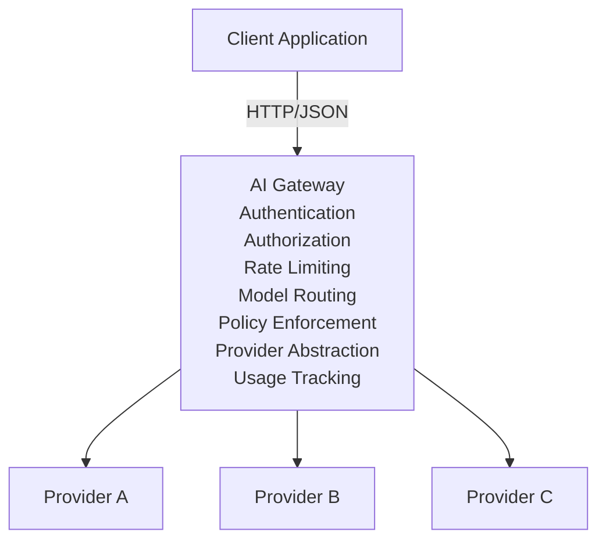

# AI Gateway API

## 1. Overview

The AI Gateway exposes a unified HTTP API for applications that need to interact with multiple Large Language Model (LLM) providers.

The gateway hides provider-specific APIs behind a normalized interface.

The API is designed to resemble common chat-completion APIs while keeping the gateway internally provider-independent.
