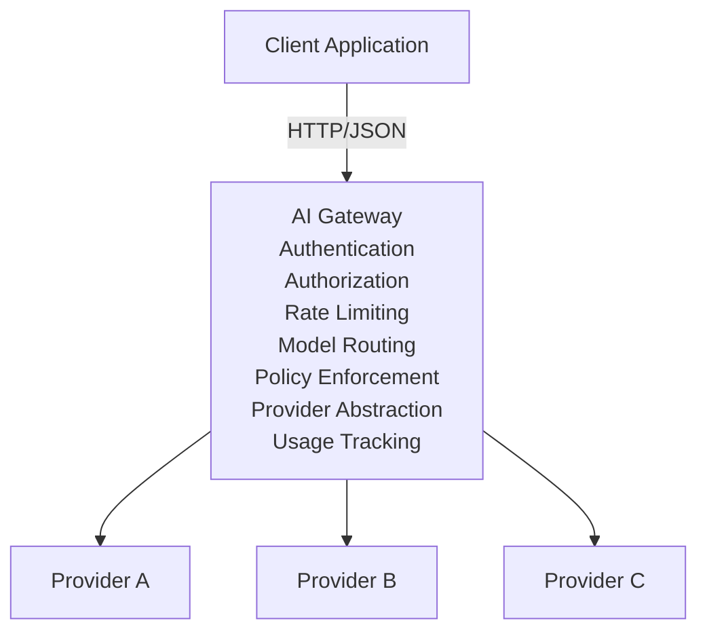
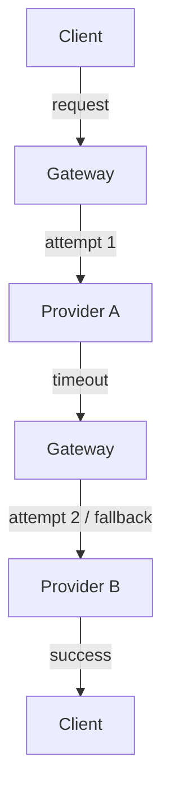
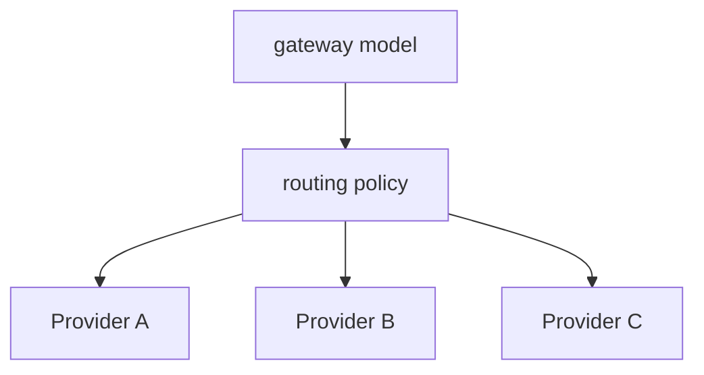
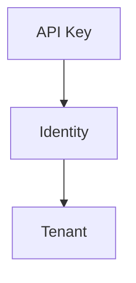
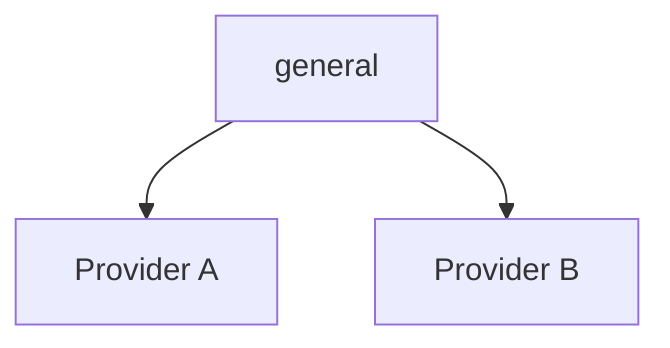

# AI Gateway — API

## 1. Overview

The AI Gateway exposes a unified HTTP API for applications that need to interact with multiple Large Language Model (LLM) providers.

The gateway hides provider-specific APIs behind a normalized interface.



The API is designed to resemble common chat-completion APIs while keeping the gateway internally provider-independent.

## 2. API Versioning

The current API version is:

```text
/v1
```

Public endpoints should be versioned explicitly.

Example:

```text
POST /v1/chat/completions
```

Future breaking API changes should use a new major version:

```text
/v2/...
```

Non-breaking changes may be introduced within the existing version.

## 3. Base URL

Development:

```text
http://localhost:8080
```

Production:

```text
https://api.example.com
```

The gateway itself does not hard-code a production hostname.

The deployment environment determines the externally accessible URL.

## 4. Authentication

Protected API endpoints use an API key.

The client sends:

```http
Authorization: Bearer <API_KEY>
```

Example:

```http
Authorization: Bearer gw_live_xxxxxxxxx
```

The gateway must:

1. Extract the authorization header.
2. Validate the API key.
3. Resolve the associated identity.
4. Determine the tenant.
5. Determine permissions.
6. Continue processing only if authorization succeeds.

API keys must never be returned in API responses.

API keys must never be written to logs.

## 5. Content Type

Requests containing JSON must use:

```http
Content-Type: application/json
```

Responses containing JSON use:

```http
Content-Type: application/json
```

Streaming responses use:

```http
Content-Type: text/event-stream
```

## 6. Request IDs

Every request receives a unique request ID.

The client may provide:

```http
X-Request-ID: 01JABC123XYZ
```

If the client does not provide one, the gateway generates one.

The gateway returns:

```http
X-Request-ID: 01JABC123XYZ
```

The request ID must be included in structured logs and traces.

Example:

```http
HTTP/1.1 200 OK
X-Request-ID: 01JABC123XYZ
```

## 7. Health API

### 7.1 Health Check

```http
GET /health
```

Purpose:

Determine whether the gateway process is alive.

Example response:

```json
{
  "status": "ok"
}
```

HTTP status:

```text
200 OK
```

This endpoint should remain lightweight and should not require authentication.

## 8. Readiness API

### 8.1 Readiness Check

```http
GET /ready
```

Purpose:

Determine whether the gateway is ready to receive traffic.

The readiness check may verify dependencies such as:

- configuration
- database
- Redis
- provider configuration

Example:

```json
{
  "status": "ready"
}
```

HTTP status:

```text
200 OK
```

If the gateway is not ready:

```text
503 Service Unavailable
```

Example:

```json
{
  "status": "not_ready"
}
```

## 9. Chat Completions API

### 9.1 Endpoint

```http
POST /v1/chat/completions
```

This is the primary gateway API.

The endpoint accepts a normalized chat request and routes it to the appropriate LLM provider.

## 10. Chat Request

Example:

```json
{
  "model": "general",
  "messages": [
    {
      "role": "user",
      "content": "Explain what an API gateway is."
    }
  ]
}
```

### 10.1 Request Schema

```json
{
  "model": "string",
  "messages": [
    {
      "role": "system | user | assistant",
      "content": "string"
    }
  ],
  "temperature": 0.7,
  "max_tokens": 500,
  "stream": false
}
```

## 11. Request Fields

### 11.1 model

Required.

```json
{
  "model": "general"
}
```

The model name represents a gateway model identifier.

The gateway should not require clients to know the underlying provider model.

For example:

```text
general
fast
reasoning
```

may internally map to:

```text
general -> provider_a:model_x
fast    -> provider_b:model_y
reasoning -> provider_c:model_z
```

This allows model routing to change without requiring client changes.

### 11.2 messages

Required.

Example:

```json
{
  "messages": [
    {
      "role": "user",
      "content": "Hello"
    }
  ]
}
```

Supported roles in the initial implementation:

```text
system
user
assistant
```

The gateway validates that the message list is not empty.

### 11.3 temperature

Optional.

Example:

```json
{
  "temperature": 0.7
}
```

The gateway validates the configured acceptable range.

The exact provider-specific behavior is handled by the provider adapter.

### 11.4 max_tokens

Optional.

Example:

```json
{
  "max_tokens": 500
}
```

The gateway may enforce maximum limits according to:

- tenant
- API key
- model
- policy
- provider

### 11.5 stream

Optional.

Default:

```json
{
  "stream": false
}
```

When:

```json
{
  "stream": true
}
```

the gateway returns an SSE stream.

See the Streaming API section.

## 12. Complete Request Example

```http
POST /v1/chat/completions HTTP/1.1
Host: localhost:8080
Authorization: Bearer <API_KEY>
Content-Type: application/json
X-Request-ID: req_123
```

```json
{
  "model": "general",
  "messages": [
    {
      "role": "system",
      "content": "You are a helpful assistant."
    },
    {
      "role": "user",
      "content": "Explain Rust ownership."
    }
  ],
  "temperature": 0.7,
  "max_tokens": 500,
  "stream": false
}
```

## 13. Chat Response

A successful non-streaming response:

```json
{
  "id": "chat_123456",
  "object": "chat.completion",
  "model": "general",
  "choices": [
    {
      "index": 0,
      "message": {
        "role": "assistant",
        "content": "Rust ownership is a memory-management model..."
      },
      "finish_reason": "stop"
    }
  ],
  "usage": {
    "prompt_tokens": 25,
    "completion_tokens": 80,
    "total_tokens": 105
  }
}
```

## 14. Response Fields

### id

Unique identifier for the completion.

Example:

```text
chat_123456
```

### object

Identifies the response type.

Example:

```text
chat.completion
```

### model

The gateway model identifier requested by the client.

Example:

```text
general
```

The response should expose the gateway-facing model identity rather than requiring clients to understand provider-specific identifiers.

### choices

Contains generated responses.

Initial implementation supports one response choice.

Example:

```json
{
  "choices": [
    {
      "index": 0,
      "message": {
        "role": "assistant",
        "content": "Hello!"
      },
      "finish_reason": "stop"
    }
  ]
}
```

## 15. Usage

When token usage is available, the gateway returns:

```json
{
  "usage": {
    "prompt_tokens": 25,
    "completion_tokens": 80,
    "total_tokens": 105
  }
}
```

Usage information is used for:

- quotas
- analytics
- cost calculation
- monitoring
- billing integration
- optimization

If a provider does not return usage information, the gateway should represent that condition explicitly rather than inventing token counts.

## 16. Streaming API

The same endpoint supports streaming.

```http
POST /v1/chat/completions
```

Request:

```json
{
  "model": "general",
  "messages": [
    {
      "role": "user",
      "content": "Explain Rust."
    }
  ],
  "stream": true
}
```

Response:

```http
Content-Type: text/event-stream
```

Example conceptual stream:

```text
data: {"id":"chat_123","delta":{"content":"Rust"}}

data: {"id":"chat_123","delta":{"content":" is"}}

data: {"id":"chat_123","delta":{"content":" a systems"}}

data: {"id":"chat_123","delta":{"content":" programming language."}}

data: [DONE]
```

The gateway must handle:

- client disconnects
- provider disconnects
- request cancellation
- timeouts
- backpressure
- partial responses
- usage accounting

Streaming implementation will be introduced after the basic non-streaming API.

## 17. Models API

### 17.1 List Models

```http
GET /v1/models
```

Returns models exposed by the gateway.

Example:

```json
{
  "object": "list",
  "data": [
    {
      "id": "general",
      "object": "model"
    },
    {
      "id": "fast",
      "object": "model"
    }
  ]
}
```

The model registry may internally contain provider-specific information.

Clients should only depend on gateway model IDs.

## 18. Error Handling

All API errors use a consistent structure.

Example:

```json
{
  "error": {
    "type": "authentication_error",
    "code": "invalid_api_key",
    "message": "The provided API key is invalid.",
    "request_id": "req_123"
  }
}
```

## 19. Error Object

The error object contains:

```json
{
  "error": {
    "type": "string",
    "code": "string",
    "message": "string",
    "request_id": "string"
  }
}
```

### type

Broad error category.

Examples:

```text
authentication_error
authorization_error
validation_error
rate_limit_error
quota_error
provider_error
timeout_error
internal_error
```

### code

Machine-readable error code.

Examples:

```text
invalid_api_key
missing_authorization
model_not_found
invalid_request
rate_limit_exceeded
quota_exceeded
provider_timeout
provider_unavailable
```

### message

Human-readable explanation.

### request_id

Identifier used to correlate the error with gateway logs and traces.

## 20. HTTP Status Codes

| Status | Meaning                                        |
| ------ | ---------------------------------------------- |
| 200    | Successful request                             |
| 201    | Resource created, where applicable             |
| 400    | Invalid request                                |
| 401    | Authentication failed                          |
| 403    | Authorization failed                           |
| 404    | Resource/model not found                       |
| 408    | Request timeout                                |
| 409    | Resource conflict                              |
| 429    | Rate limit or quota exceeded                   |
| 500    | Internal gateway error                         |
| 502    | Provider returned an invalid/unusable response |
| 503    | Gateway/provider unavailable                   |
| 504    | Provider/request timeout                       |

The exact mapping should be implemented centrally rather than independently inside every handler.

## 21. Validation Errors

Example request:

```json
{
  "model": "",
  "messages": []
}
```

Response:

```http
HTTP/1.1 400 Bad Request
```

```json
{
  "error": {
    "type": "validation_error",
    "code": "invalid_request",
    "message": "The request contains invalid fields.",
    "request_id": "req_123"
  }
}
```

The gateway should avoid returning unnecessary internal implementation details.

## 22. Authentication Errors

Missing API key:

```http
HTTP/1.1 401 Unauthorized
```

```json
{
  "error": {
    "type": "authentication_error",
    "code": "missing_api_key",
    "message": "Authentication is required.",
    "request_id": "req_123"
  }
}
```

Invalid API key:

```http
HTTP/1.1 401 Unauthorized
```

```json
{
  "error": {
    "type": "authentication_error",
    "code": "invalid_api_key",
    "message": "The provided API key is invalid.",
    "request_id": "req_123"
  }
}
```

## 23. Authorization Errors

If an authenticated client does not have permission:

```http
HTTP/1.1 403 Forbidden
```

Example:

```json
{
  "error": {
    "type": "authorization_error",
    "code": "permission_denied",
    "message": "The client is not authorized to perform this operation.",
    "request_id": "req_123"
  }
}
```

## 24. Rate Limit Errors

When a client exceeds its configured rate limit:

```http
HTTP/1.1 429 Too Many Requests
```

Example:

```json
{
  "error": {
    "type": "rate_limit_error",
    "code": "rate_limit_exceeded",
    "message": "Rate limit exceeded.",
    "request_id": "req_123"
  }
}
```

The gateway may also return:

```http
Retry-After: 10
```

## 25. Quota Errors

When a tenant or API key exceeds a configured quota:

```http
HTTP/1.1 429 Too Many Requests
```

Example:

```json
{
  "error": {
    "type": "quota_error",
    "code": "quota_exceeded",
    "message": "The configured usage quota has been exceeded.",
    "request_id": "req_123"
  }
}
```

## 26. Model Not Found

If the requested gateway model does not exist:

```http
HTTP/1.1 404 Not Found
```

Example:

```json
{
  "error": {
    "type": "validation_error",
    "code": "model_not_found",
    "message": "The requested model does not exist.",
    "request_id": "req_123"
  }
}
```

## 27. Provider Errors

Provider failures must be translated into gateway-level errors.

Example:

```json
{
  "error": {
    "type": "provider_error",
    "code": "provider_unavailable",
    "message": "The selected model provider is temporarily unavailable.",
    "request_id": "req_123"
  }
}
```

Provider-specific implementation details should not leak into the public API unless explicitly required.

Internally, the gateway should preserve provider error information for diagnostics.

## 28. Timeout Errors

If the provider exceeds the configured timeout:

```http
HTTP/1.1 504 Gateway Timeout
```

Example:

```json
{
  "error": {
    "type": "timeout_error",
    "code": "provider_timeout",
    "message": "The upstream model request timed out.",
    "request_id": "req_123"
  }
}
```

## 29. Retry and Fallback

Retry behavior is an internal gateway concern.

The client should normally see a single logical request.



The API response remains normalized.

The gateway must distinguish:

- `retryable errors`

from:

- `non-retryable errors`

Examples of potentially retryable failures:

- connection failure
- temporary provider unavailable
- upstream timeout
- transient server error

Examples of generally non-retryable failures:

- invalid request
- invalid authentication
- invalid model
- authorization failure

Exact policies are defined by the reliability subsystem.

## 30. Model Routing

Clients specify:

```json
{
  "model": "general"
}
```

The gateway resolves the model to a routing target.

Conceptually:



Routing may consider:

- configured provider priority
- provider availability
- model capabilities
- tenant policy
- cost
- latency
- rate limits
- quotas
- fallback rules

Routing behavior must not change the public API contract.

## 31. Multi-Tenancy

Every authenticated request belongs to a tenant.

Conceptually:



Tenant information is internal gateway metadata.

Tenant-level controls may include:

- allowed models
- rate limits
- quotas
- policies
- provider access
- usage limits
- cost limits

Tenant identifiers must not be exposed unnecessarily to clients.

## 32. Administrative API

Administrative endpoints are separate from the public inference API.

Future endpoints may include:

```text
GET    /admin/providers
POST   /admin/providers
GET    /admin/models
POST   /admin/models
GET    /admin/tenants
POST   /admin/tenants
GET    /admin/usage
GET    /admin/audit-events
```

These endpoints require stronger authorization than normal inference requests.

They are not part of the initial MVP.

## 33. API Endpoint Summary

| Method | Endpoint               | Authentication | Purpose                  |
| ------ | ---------------------- | -------------: | ------------------------ |
| GET    | `/health`              |             No | Liveness                 |
| GET    | `/ready`               |             No | Readiness                |
| POST   | `/v1/chat/completions` |            Yes | Generate chat completion |
| GET    | `/v1/models`           |            Yes | List available models    |
| GET    | `/admin/providers`     |          Admin | List providers           |
| POST   | `/admin/providers`     |          Admin | Create provider          |
| GET    | `/admin/models`        |          Admin | List models              |
| POST   | `/admin/models`        |          Admin | Create model             |
| GET    | `/admin/usage`         |          Admin | Usage information        |
| GET    | `/admin/audit-events`  |          Admin | Audit information        |

Administrative endpoints are planned features and may not exist in the MVP.

## 34. Rust Domain Representation

The public JSON API should map into provider-independent Rust domain types.

Conceptually:

```rust
pub struct ChatRequest {
    pub model: String,
    pub messages: Vec<Message>,
    pub temperature: Option<f32>,
    pub max_tokens: Option<u32>,
    pub stream: bool,
}
```

Message:

```rust
pub struct Message {
    pub role: MessageRole,
    pub content: String,
}
```

Role:

```rust
pub enum MessageRole {
    System,
    User,
    Assistant,
}
```

The API layer should deserialize HTTP JSON into these domain/application structures.

Provider adapters should not receive raw Axum request objects.

## 35. API Layer Responsibility

The API layer is responsible for:

```text
HTTP
  |
  +-- request parsing
  |
  +-- authentication middleware
  |
  +-- validation
  |
  +-- application service
  |
  +-- response serialization
  |
  +-- HTTP error mapping
```

The API layer must not contain:

- provider-specific logic
- routing algorithms
- database business logic
- retry algorithms
- cost calculations
- complex policy decisions

Those belong to appropriate application/domain/infrastructure components.

## 36. Provider Independence

The public API must remain independent from providers.

Bad:

```json
{
  "openrouter_model": "provider-specific-model"
}
```

Preferred:

```json
{
  "model": "general"
}
```

The gateway internally resolves:



This is a core architectural requirement.

## 37. Security Requirements

The API implementation must:

- require authentication for protected endpoints
- validate all incoming requests
- enforce request size limits
- avoid logging API keys
- avoid exposing provider credentials
- avoid returning internal stack traces
- validate model identifiers
- enforce tenant authorization
- enforce configured limits
- generate request IDs
- support audit logging for sensitive administrative operations

Secrets must be supplied through secure configuration mechanisms rather than committed to source control.

## 38. API Evolution

The API should evolve in the following order:

### MVP

```text
GET  /health
GET  /ready
POST /v1/chat/completions
```

### Stage 2

```text
GET /v1/models
```

### Stage 3

```text
streaming
authentication
authorization
rate limiting
quotas
```

### Stage 4

```text
admin APIs
usage
cost
policy management
```

### Stage 5

Additional APIs may be introduced based on production requirements.

## 39. API Design Principles

The API follows these principles:

1. **Provider independence** — Clients interact with gateway models, not provider-specific implementations.
2. **Explicit versioning** — Breaking API changes require a new API version.
3. **Consistent errors** — All failures use a predictable error structure.
4. **Request correlation** — Every request has a request ID.
5. **Security by default** — Protected APIs require authentication and authorization.
6. **Observable requests** — Requests can be correlated with logs, metrics, and traces.
7. **Stable contracts** — Internal architecture can evolve without requiring client changes.
8. **Streaming support** — Streaming is exposed through the same chat completion endpoint.
9. **Explicit limits** — Request, token, rate, and quota constraints are enforced centrally.
10. **Separation of concerns** — HTTP concerns remain separate from application, domain, and provider infrastructure.

## 40. Initial MVP Contract

The first implementation should support only:

```text
GET /health
GET /ready
POST /v1/chat/completions
```

The initial request:

```json
{
  "model": "general",
  "messages": [
    {
      "role": "user",
      "content": "Hello"
    }
  ]
}
```

The initial response:

```json
{
  "id": "chat_123",
  "object": "chat.completion",
  "model": "general",
  "choices": [
    {
      "index": 0,
      "message": {
        "role": "assistant",
        "content": "Hello! How can I help?"
      },
      "finish_reason": "stop"
    }
  ]
}
```

The first implementation should **not** attempt to implement the complete production API at once.

The API will grow incrementally as the corresponding SpecKit features are implemented.

## 41. Related Documents

Architecture:

```text
docs/architecture.md
```

Product requirements:

```text
docs/prd.md
```

Implementation roadmap:

```text
docs/plan.md
```

Future related documents:

```text
docs/providers.md
docs/configuration.md
docs/security.md
docs/reliability.md
docs/observability.md
docs/testing.md
docs/deployment.md
```

Feature specifications:

```text
specs/
```

The API contract should remain synchronized with the corresponding SpecKit feature specifications.