# AI Gateway — Architecture

## 1. Overview

AI Gateway is a high-performance, production-oriented gateway written in Rust.

Its primary responsibility is to provide a unified interface between AI applications and multiple LLM providers.

The gateway abstracts provider-specific APIs and centralizes cross-cutting concerns such as:

- Authentication
- Authorization
- Model routing
- Rate limiting
- Quotas
- Provider resilience
- Streaming
- Usage tracking
- Cost tracking
- Observability
- Security
- Policy enforcement

The architecture is designed to evolve incrementally.

The initial implementation will be intentionally small and will gradually introduce additional infrastructure.

## 2. Architectural Goals

The architecture must provide:

1. Provider independence.
2. Clear separation of concerns.
3. Strong type safety.
4. Explicit error handling.
5. Testability.
6. Horizontal scalability.
7. Operational observability.
8. Secure provider credential handling.
9. Configurable routing and policies.
10. Minimal coupling between the gateway core and infrastructure.

## 3. Architectural Principles

### 3.1 Separation of Concerns

The system is divided into logical layers.

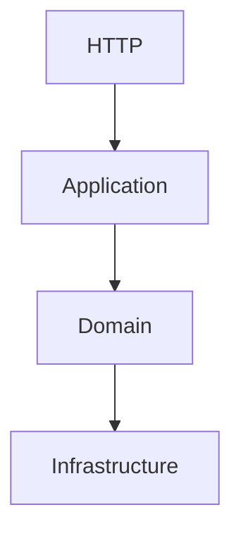

Each layer has a clear responsibility.

### 3.2 Dependency Inversion

Core business logic should depend on traits rather than concrete infrastructure implementations.

For example:

```rust
trait LlmProvider {
    async fn chat(
        &self,
        request: ChatRequest,
    ) -> Result<ChatResponse, ProviderError>;
}
```

The routing layer depends on `LlmProvider`, not directly on OpenRouter or another provider.

### 3.3 Provider Independence

Provider-specific logic must remain isolated.

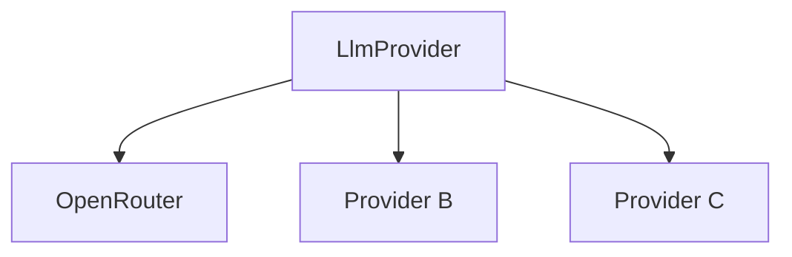

Adding a provider should not require significant changes to the gateway core.

### 3.4 Configuration Over Hardcoding

Operational behavior should be configurable.

Examples:

- Providers
- Models
- Routing
- Timeouts
- Retry policies
- Rate limits
- Quotas
- Pricing

### 3.5 Explicit Failure Handling

Provider failures are expected and must be modeled explicitly.

```text
ProviderError
├── Authentication
├── Authorization
├── Timeout
├── RateLimited
├── Unavailable
├── InvalidRequest
├── InvalidResponse
└── Unknown
```

### 3.6 Observability by Design

Every important operation should produce appropriate:

- Logs
- Metrics
- Traces

Observability is part of the architecture rather than a final add-on.

## 4. High-Level Architecture

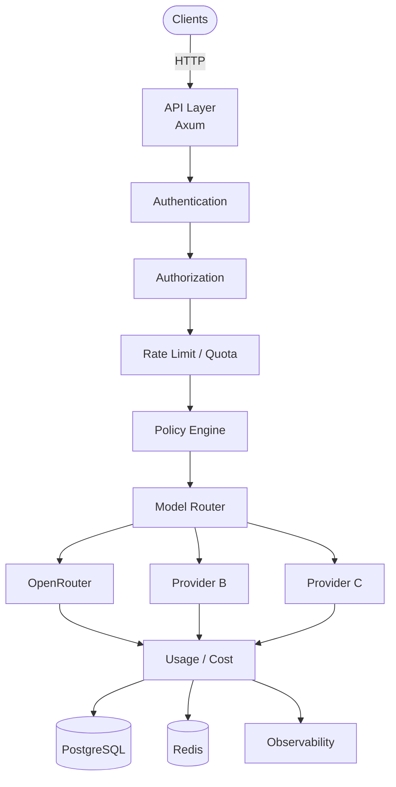

## 5. Architectural Layers

The application is organized into four major layers.

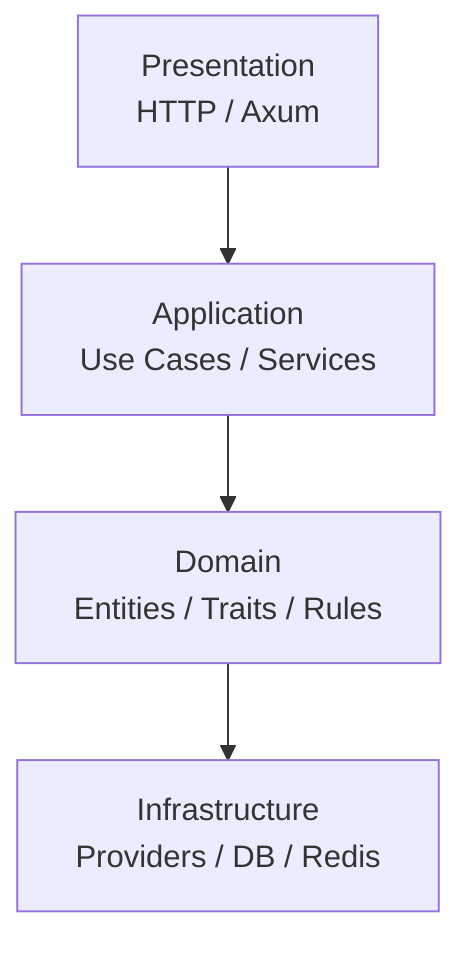

## 6. Presentation Layer

The presentation layer handles HTTP concerns.

Responsibilities:

- HTTP routing
- Request extraction
- Request validation
- Authentication middleware
- Response serialization
- HTTP error mapping
- Streaming responses

Technology:

```text
Axum
Tokio
Serde
```

Example routes:

```text
GET  /health
GET  /ready
POST /v1/chat/completions
```

The HTTP layer should not contain provider-specific logic.

## 7. Application Layer

The application layer orchestrates use cases.

Example:

```text
ChatCompletionService
```

Responsibilities:

1. Receive validated request.
2. Resolve client identity.
3. Apply authorization.
4. Apply policies.
5. Check limits.
6. Resolve model.
7. Select provider.
8. Execute provider request.
9. Handle retries/fallback.
10. Record usage.
11. Produce response.

Conceptually:

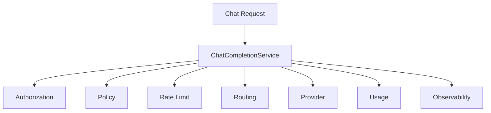

## 8. Domain Layer

The domain layer contains core concepts and business rules.

Potential domain objects:

```text
ChatRequest
ChatResponse
Message
Model
Provider
Tenant
ApiKey
Usage
RoutingDecision
Policy
```

Potential domain enums:

```text
ProviderStatus
ModelStatus
MessageRole
ErrorCategory
RequestStatus
```

The domain should not depend directly on:

- Axum
- PostgreSQL
- Redis
- HTTP clients
- Specific LLM providers

## 9. Infrastructure Layer

Infrastructure contains implementations of external integrations.

Examples:

```text
Provider Clients
PostgreSQL Repository
Redis Repository
HTTP Client
Telemetry
Configuration
```

Infrastructure implements interfaces defined by the application/domain layers.

Example:

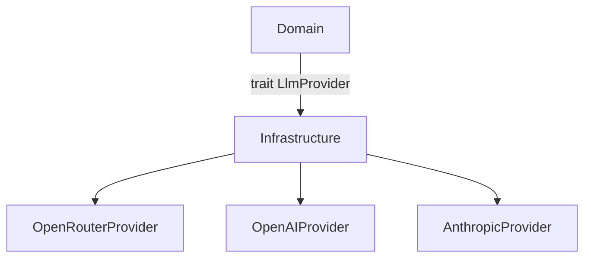

## 10. Request Lifecycle

A normal request follows this flow:

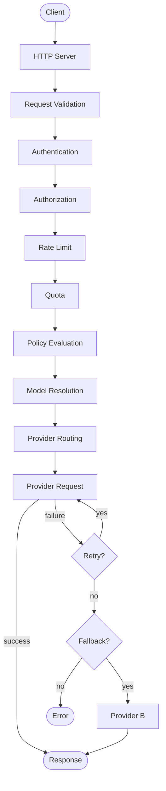

## 11. API Architecture

The API is divided into public and administrative APIs.

### Public API

```text
/v1/*
```

Initial endpoints:

```text
GET  /health
GET  /ready
POST /v1/chat/completions
```

Future:

```text
GET /v1/models
```

### Administrative API

```text
/admin/*
```

Potential endpoints:

```text
GET    /admin/providers
POST   /admin/providers
PUT    /admin/providers/{id}

GET    /admin/models
POST   /admin/models
PUT    /admin/models/{id}

GET    /admin/api-keys
POST   /admin/api-keys
DELETE /admin/api-keys/{id}

GET    /admin/usage
GET    /admin/health
```

Administrative APIs require elevated authorization.

## 12. API Request Model

The gateway should expose a provider-neutral request model.

Example conceptual model:

```rust
pub struct ChatRequest {
    pub model: String,
    pub messages: Vec<Message>,
    pub temperature: Option<f32>,
    pub max_tokens: Option<u32>,
    pub stream: bool,
}
```

The external API model should remain stable even when provider APIs differ.

## 13. Provider Architecture

The provider abstraction is a central architectural component.

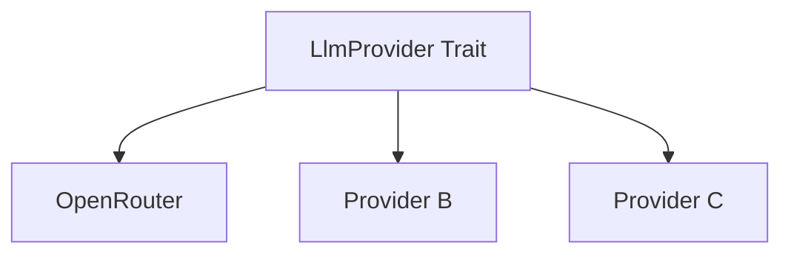

Example:

```rust
#[async_trait]
pub trait LlmProvider: Send + Sync {
    async fn chat(
        &self,
        request: &ChatRequest,
    ) -> Result<ChatResponse, ProviderError>;
}
```

Provider implementations translate the normalized gateway request into provider-specific requests.

## 14. Provider Adapter Pattern

Each provider should have an adapter.

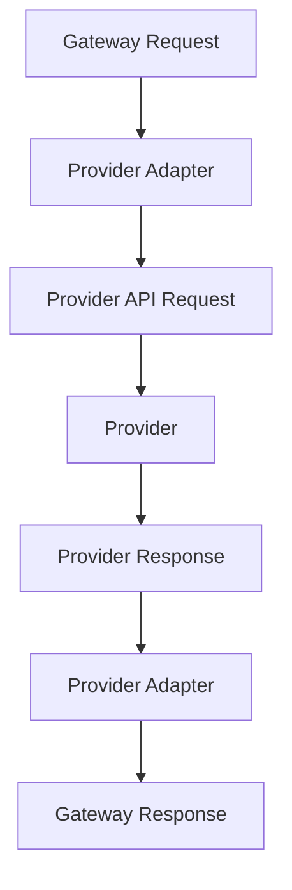

This prevents provider-specific data structures from leaking into the domain.

## 15. Model Routing Architecture

Routing is responsible for selecting an appropriate provider.

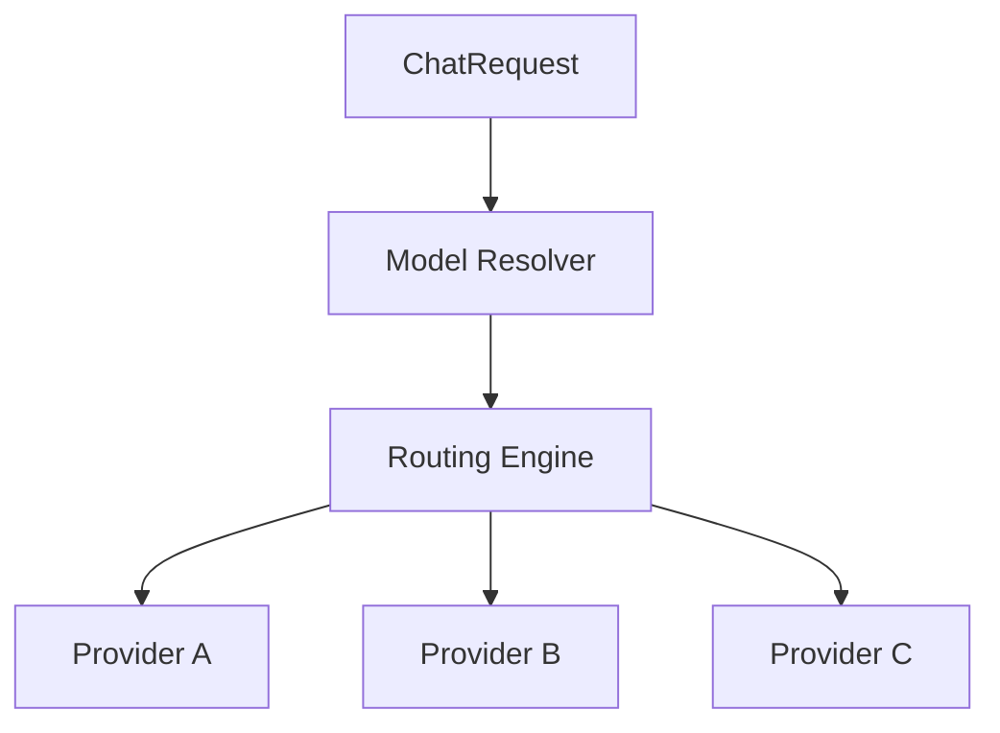

Routing inputs may include:

- Requested model
- Model alias
- Provider availability
- Provider priority
- Client policy
- Tenant policy
- Provider health
- Model capability

The routing engine returns a `RoutingDecision`.

Conceptually:

```rust
pub struct RoutingDecision {
    pub provider_id: String,
    pub model_id: String,
}
```

## 16. Model Registry

The model registry provides a normalized view of available models.

Example:

```yaml
models:
  fast:
    provider: openrouter
    model: provider/model-name

  reasoning:
    provider: openrouter
    model: provider/reasoning-model
```

A logical model alias may map to a provider-specific model.

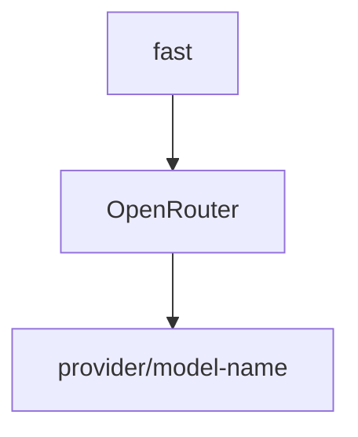

## 17. Authentication Architecture

Authentication occurs before protected application operations.

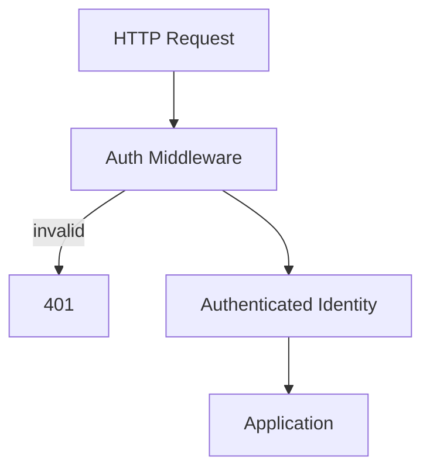

The initial implementation will use API keys.

Authentication should produce an internal identity:

```text
Identity
├── tenant_id
├── api_key_id
└── permissions
```

## 18. Authorization Architecture

Authorization evaluates whether the authenticated identity can perform an operation.

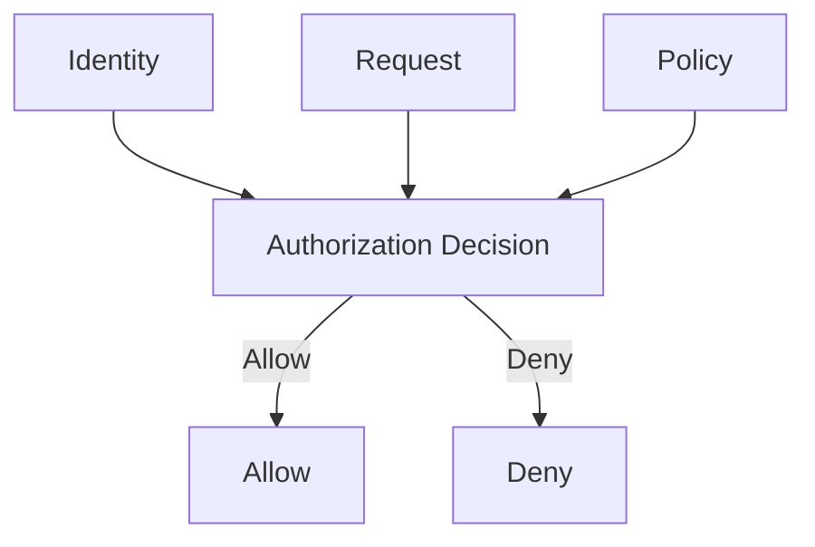

Authorization can eventually consider:

- Endpoint
- Model
- Provider
- Tenant
- API key
- Token limits

## 19. Rate Limiting Architecture

Rate limiting protects the gateway and providers.

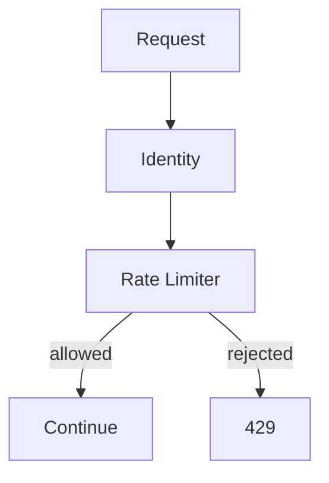

The architecture should support:

```text
API Key
Tenant
Model
Provider
```

Redis may be introduced when distributed rate limiting is required.

## 20. Quota Architecture

Quota management tracks longer-term consumption.

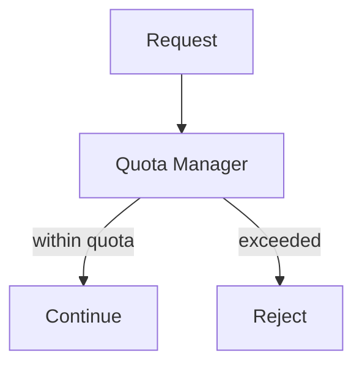

Potential quota dimensions:

```text
requests / day
tokens / day
tokens / month
cost / month
```

## 21. Reliability Architecture

Provider calls are protected by reliability mechanisms.

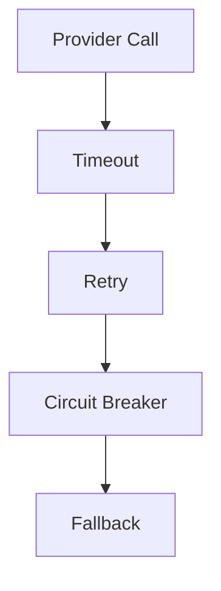

Not every failure should trigger every mechanism.

The system must classify failures before deciding what action to take.

## 22. Retry Architecture

Retry policy should contain:

```text
max_attempts
initial_delay
max_delay
backoff_factor
retryable_errors
```

Example:

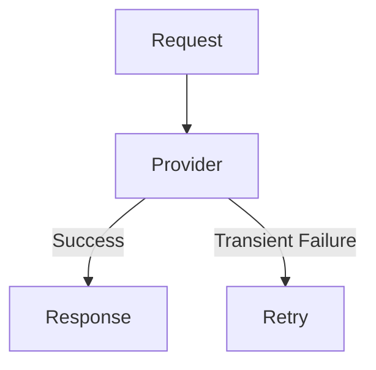

Retries must respect the original request deadline.

## 23. Circuit Breaker

The circuit breaker protects the system from repeatedly sending requests to an unhealthy provider.

States:

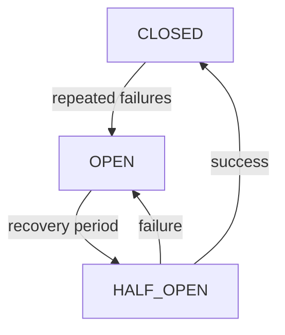

## 24. Fallback Architecture

Fallback provides an alternate provider when the primary provider cannot serve a request.

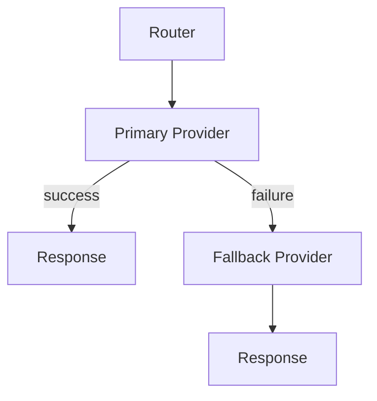

Fallback must only occur when:

- The fallback provider supports the required model/capability.
- The request is allowed by policy.
- The failure is eligible for fallback.

## 25. Streaming Architecture

Streaming requests use asynchronous response streams.

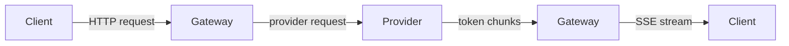

The gateway must handle:

- Backpressure
- Client disconnects
- Provider disconnects
- Cancellation
- Timeouts
- Partial responses
- Usage accounting

## 26. Usage Architecture

After or during a provider request, usage information is captured.

```mermaid
flowchart TD
    PR[Provider Response] --> UE[Usage Extractor]
    UE --> IT[Input Tokens]
    UE --> OT[Output Tokens]
    UE --> TT[Total Tokens]
    IT --> UR[Usage Recorder]
    OT --> UR
    TT --> UR
    UR --> PG[(PostgreSQL)]
```

## 27. Cost Architecture

Cost calculation should be isolated from provider adapters.

```mermaid
flowchart TD
    U[Usage] --> CC[Cost Calculator]
    Pr[Pricing] --> CC
    CC --> EC[Estimated Cost]
```

Example:

```text
input_tokens  × input_price
+
output_tokens × output_price
=
estimated_cost
```

Pricing must be configurable rather than hardcoded into request handling.

## 28. Persistence Architecture

PostgreSQL is the primary persistent datastore.

Potential tables:

```text
tenants
api_keys
providers
models
requests
usage_records
audit_events
```

Conceptual relationship:

```mermaid
flowchart TD
    T[Tenant] --> Keys[API Keys]
    T --> R[Requests]
    R --> P[Provider]
    R --> M[Model]
    R --> U[Usage]
```

## 29. Redis Architecture

Redis may be used for distributed ephemeral state.

Potential uses:

- Rate limiting
- Distributed counters
- Caching
- Short-lived provider state
- Distributed coordination

Redis should not become a mandatory dependency for the earliest development phase.

## 30. Observability Architecture

Observability has three primary components:

```mermaid
flowchart TD
    App[Application] --> L[Logs]
    App --> M[Metrics]
    App --> T[Traces]
```

Recommended technologies:

```text
tracing
OpenTelemetry
Prometheus-compatible metrics
```

## 31. Logging

Logs should be structured.

Example conceptual event:

```json
{
  "request_id": "...",
  "provider": "openrouter",
  "model": "...",
  "duration_ms": 850,
  "status": "success"
}
```

Sensitive information must not be logged.

The system must avoid logging:

- API keys
- Provider secrets
- Authorization headers
- Sensitive prompt content unless explicitly configured and permitted

## 32. Metrics

Initial metrics:

```text
gateway_requests_total
gateway_errors_total
gateway_request_duration_seconds
provider_requests_total
provider_errors_total
provider_request_duration_seconds
gateway_retries_total
gateway_fallbacks_total
gateway_tokens_total
gateway_rate_limit_total
```

Metrics should include controlled labels to prevent excessive cardinality.

## 33. Distributed Tracing

A request should have a trace spanning gateway operations.

Example:

```mermaid
flowchart TD
    Root[Trace] --> H[HTTP request]
    Root --> A[authentication]
    Root --> Az[authorization]
    Root --> RL[rate_limit]
    Root --> R[routing]
    Root --> PR[provider_request]
    Root --> U[usage_record]
```

## 34. Configuration Architecture

Configuration is divided into logical sections.

```yaml
server:
  host: "0.0.0.0"
  port: 8080

providers:
  ...

models:
  ...

routing:
  ...

rate_limits:
  ...

timeouts:
  ...

retry:
  ...

observability:
  ...
```

Environment variables override sensitive or environment-specific values.

## 35. Application State

The gateway should construct shared application state during startup.

Conceptually:

```rust
pub struct AppState {
    pub config: Config,
    pub router: Arc<ModelRouter>,
    pub providers: Arc<ProviderRegistry>,
    pub usage: Arc<UsageService>,
}
```

As the system grows, state should remain organized around services rather than becoming a large unstructured container.

## 36. Rust Project Structure

The initial structure:

```text
ai-gateway/
├── Cargo.toml
├── Cargo.lock
├── README.md
├── constitution.md
├── prd.md
├── architecture.md
│
├── specs/
│   └── 001-gateway-core/
│
├── docs/
│
├── migrations/
│
├── config/
│
├── tests/
│
└── src/
    ├── main.rs
    ├── lib.rs
    │
    ├── api/
    │   ├── mod.rs
    │   ├── health.rs
    │   └── chat.rs
    │
    ├── application/
    │   ├── mod.rs
    │   └── chat_service.rs
    │
    ├── domain/
    │   ├── mod.rs
    │   ├── chat.rs
    │   ├── model.rs
    │   ├── provider.rs
    │   └── error.rs
    │
    ├── infrastructure/
    │   ├── mod.rs
    │   ├── providers/
    │   ├── persistence/
    │   └── telemetry/
    │
    └── config/
        ├── mod.rs
        └── settings.rs
```

This structure will evolve as features are introduced.

## 37. Dependency Direction

Dependencies should point inward.

```mermaid
flowchart TD
    API --> App[Application]
    App --> Domain
    Infra[Infrastructure] --> Domain
```

The domain should remain independent of infrastructure.

Infrastructure implements domain/application abstractions.

## 38. Error Architecture

Errors should be categorized at appropriate boundaries.

Example:

```mermaid
flowchart TD
    DE[Domain Error] --> AE[Application Error]
    AE --> HE[HTTP Error]
```

Example:

```rust
pub enum AppError {
    Validation(ValidationError),
    Authentication(AuthenticationError),
    Authorization(AuthorizationError),
    RateLimit(RateLimitError),
    Routing(RoutingError),
    Provider(ProviderError),
    Internal(InternalError),
}
```

The API layer maps these errors into stable HTTP responses.

## 39. Security Architecture

Security boundaries:

```mermaid
flowchart TD
    I[Internet] --> GW[Gateway]
    GW --> PG[(PostgreSQL)]
    GW --> Prov[Providers]
```

Security controls include:

- API-key authentication
- Authorization
- Input validation
- Request size limits
- TLS at deployment boundary
- Secret isolation
- Audit logging
- Rate limiting
- Tenant isolation
- Secure error responses

## 40. Multi-Tenancy

The architecture should support tenant isolation.

Conceptually:

```text
Tenant A
   │
   ├── API Keys
   ├── Policies
   ├── Quotas
   └── Usage

Tenant B
   │
   ├── API Keys
   ├── Policies
   ├── Quotas
   └── Usage
```

Tenant identity must flow through the request lifecycle.

## 41. Audit Architecture

Security-sensitive operations should produce audit events.

Examples:

```text
API key created
API key revoked
Provider added
Provider disabled
Model configuration changed
Policy changed
```

Audit records should contain:

```text
actor
action
resource
timestamp
request_id
result
```

Sensitive secrets must not be stored in audit records.

## 42. Deployment Architecture

The gateway should be deployable as a container.

```mermaid
flowchart TD
    LB[Load Balancer] --> G1[Gateway-1]
    LB --> G2[Gateway-2]
    LB --> GN[Gateway-N]
    G1 --> PG[(PostgreSQL)]
    G2 --> PG
    GN --> PG
    G1 --> R[(Redis)]
    G2 --> R
    GN --> R
    PG --> EXT[External LLM Providers]
```

Gateway instances should be stateless where practical.

## 43. Startup Sequence

Application startup should follow a predictable sequence.

```mermaid
flowchart TD
    PS[Process Start] --> LC[Load Configuration]
    LC --> IL[Initialize Logging]
    IL --> IDB[Initialize Database]
    IDB --> IR[Initialize Redis]
    IR --> IPC[Initialize Provider Clients]
    IPC --> IS[Initialize Services]
    IS --> BR[Build Router]
    BR --> SHS[Start HTTP Server]
```

Optional dependencies should not prevent startup unless their functionality is required by the configured deployment mode.

## 44. Shutdown Sequence

The gateway must support graceful shutdown.

```mermaid
flowchart TD
    SS[Shutdown Signal] --> SA[Stop Accepting Requests]
    SA --> AR[Allow Active Requests]
    AR --> CS[Cancel/Complete Streams]
    CS --> FT[Flush Telemetry]
    FT --> CC[Close Connections]
    CC --> Exit[Exit]
```

Tokio cancellation mechanisms should be used where appropriate.

## 45. Initial MVP Architecture

The first implementation must remain intentionally simple.

```mermaid
flowchart TD
    C([Client]) --> S[Axum Server]
    S --> Svc[ChatCompletionService]
    Svc --> Tr[LlmProvider Trait]
    Tr --> OP[OpenRouter Provider]
    OP --> O[OpenRouter]
```

Initial components:

```text
Axum
Tokio
Serde
Tracing
Provider Trait
OpenRouter Adapter
```

No PostgreSQL, Redis, complex policy engine, or distributed infrastructure is required in the first milestone.

## 46. Architecture Evolution

The architecture evolves in controlled stages.

### Stage 1

```mermaid
flowchart TD
    HTTP --> S[Service] --> P[Provider]
```

### Stage 2

```mermaid
flowchart TD
    HTTP --> S[Service] --> R[Router] --> P[Provider]
```

### Stage 3

```mermaid
flowchart TD
    HTTP --> A[Auth] --> P[Policy] --> R[Router] --> Prov[Provider]
```

### Stage 4

```mermaid
flowchart TD
    HTTP --> A[Auth] --> RL[Rate Limit] --> P[Policy] --> R[Router] --> Rel[Reliability] --> Prov[Provider]
```

### Stage 5

```text
Gateway
├── Authentication
├── Authorization
├── Rate Limiting
├── Quotas
├── Policy
├── Routing
├── Reliability
├── Streaming
├── Usage
├── Cost
└── Observability
```

### Stage 6

```mermaid
flowchart TD
    LB[Load Balancer] --> G1[Gateway]
    LB --> G2[Gateway]
    LB --> G3[Gateway]
    G1 --> PG[(PostgreSQL)]
    G2 --> PG
    G3 --> PG
    G1 --> R[(Redis)]
    G2 --> R
    G3 --> R
    PG --> Prov[Providers]
    R --> Prov
```

## 47. SpecKit Development Mapping

Architecture work should be implemented feature by feature.

Recommended specifications:

```text
001-gateway-core
002-provider-abstraction
003-model-routing
004-authentication
005-authorization
006-rate-limiting
007-reliability
008-streaming
009-observability
010-usage-tracking
011-cost-management
012-persistence
013-policy-engine
014-caching
015-admin-api
016-security-hardening
017-performance
018-production-deployment
```

Each feature follows:

```mermaid
flowchart TD
    Spec[spec.md] --> Plan[plan.md]
    Plan --> Tasks[tasks.md]
    Tasks --> Impl[implementation]
    Impl --> Tests[tests]
```

## 48. Architecture Decision Records

Important architectural decisions should be recorded as ADRs.

Recommended directory:

```text
docs/
└── adr/
    ├── 001-rust.md
    ├── 002-axum.md
    ├── 003-provider-abstraction.md
    ├── 004-postgresql.md
    ├── 005-redis.md
    └── 006-observability.md
```

Each ADR should explain:

- Context
- Decision
- Alternatives
- Consequences

## 49. Key Architectural Boundaries

The most important boundaries are:

```mermaid
flowchart TD
    HTTP[HTTP Boundary] --> App[Application Boundary]
    App --> Prov[Provider Boundary]
    Prov --> Ext[External Provider]
    App --> Pers[Persistence Boundary]
    Pers --> PG[(PostgreSQL)]
    App --> Cache[Cache Boundary]
    Cache --> R[(Redis)]
```

These boundaries should remain explicit throughout development.

## 50. Architectural Quality Attributes

The architecture prioritizes:

| Attribute       | Approach                                          |
| --------------- | ------------------------------------------------- |
| Performance     | Rust + Tokio + async I/O                          |
| Scalability     | Stateless gateway instances                       |
| Reliability     | Timeout + retry + circuit breaker + fallback      |
| Security        | Authentication + authorization + secret isolation |
| Maintainability | Layered architecture + traits                     |
| Testability     | Dependency inversion                              |
| Observability   | Logs + metrics + traces                           |
| Extensibility   | Provider abstraction                              |
| Operability     | Configuration + admin APIs                        |
| Cost visibility | Usage + pricing + cost calculation                |

## 51. Final Architectural Model

The final target architecture is:

```mermaid
flowchart TD
    CL[Clients] --> LB[Load Balancer]
    LB --> G1[Gateway Instance]
    LB --> G2[Gateway Instance]
    LB --> G3[Gateway Instance]
    G1 --> Api[API / Axum]
    G2 --> Api
    G3 --> Api
    Api --> Auth[Authentication]
    Auth --> Az[Authorization]
    Az --> RQ[Rate / Quota]
    RQ --> PE[Policy Engine]
    PE --> MR[Model Router]
    MR --> PA[Provider A]
    MR --> PB[Provider B]
    MR --> PC[Provider C]
    PA --> UC[Usage / Cost]
    PB --> UC
    PC --> UC
    UC --> PG[(PostgreSQL)]
    UC --> Redis[(Redis)]
    UC --> Obs[Observability]
    Obs --> L[Logs]
    Obs --> M[Metrics]
    Obs --> T[Traces]
```

This architecture provides the target direction while allowing the project to start with a **very small Rust gateway** and progressively add production capabilities without prematurely introducing unnecessary complexity.