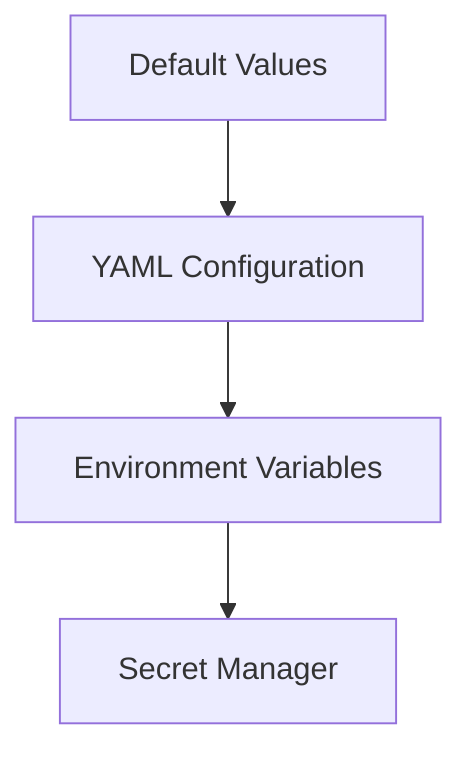
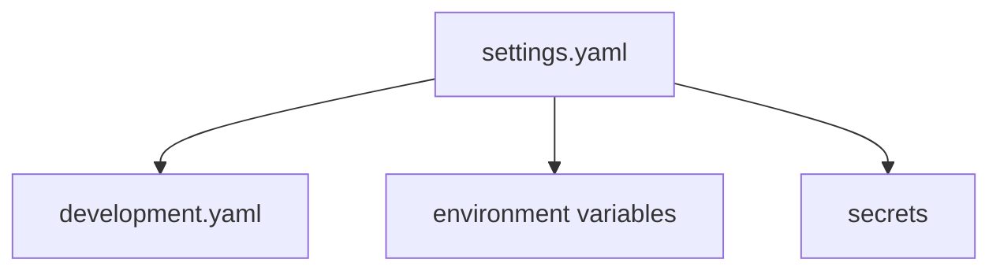
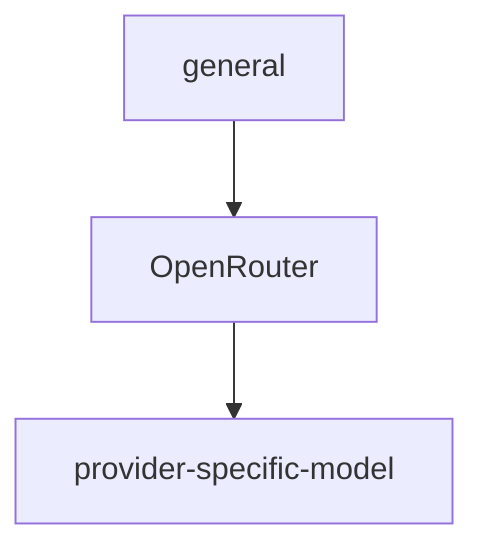
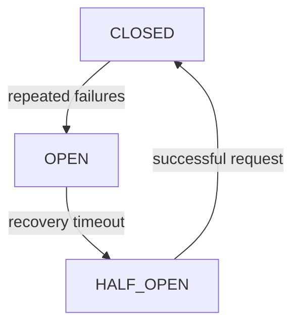
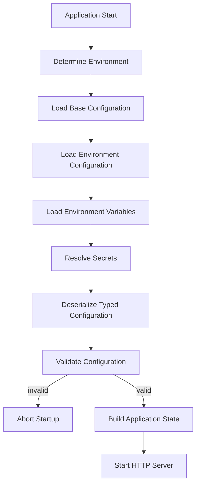
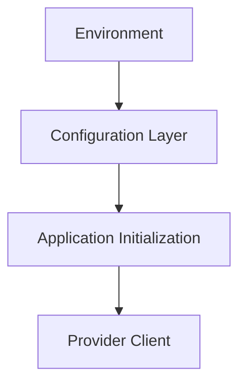
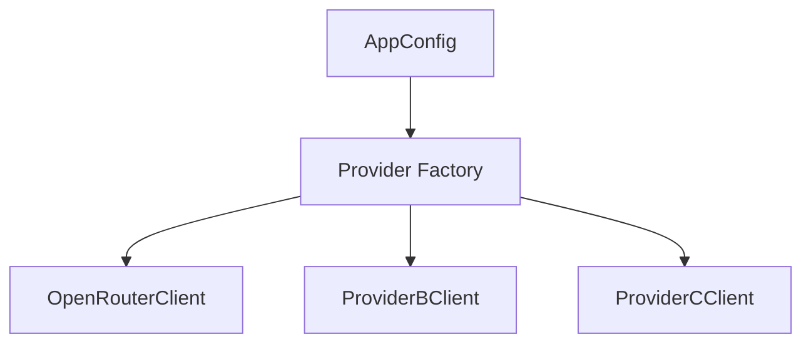
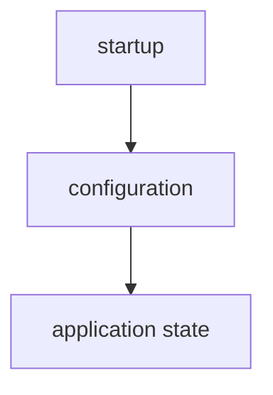
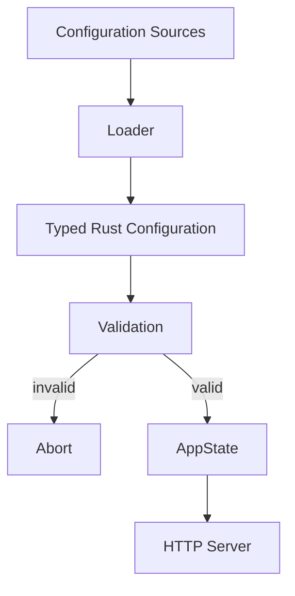

# AI Gateway — Configuration

## 1. Overview

The AI Gateway uses configuration to control runtime behavior without hard-coding environment-specific values into the application.

Configuration covers:

- HTTP server
- LLM providers
- models
- routing
- authentication
- rate limits
- quotas
- timeouts
- retries
- observability
- persistence
- Redis
- security
- environment settings

The configuration system must support development, testing, and production environments.

## 2. Configuration Principles

The configuration system follows these principles:

- Configuration over hard-coding
- Environment-specific configuration
- Secrets must not be committed to Git
- Configuration must be validated at startup
- Invalid configuration must prevent application startup
- Non-secret configuration may use YAML
- Secrets should be provided through environment variables or a secret manager
- Application code should receive typed configuration
- Configuration should be immutable after startup unless dynamic configuration is explicitly introduced
- Provider-specific configuration must remain isolated from domain logic

## 3. Configuration Sources

The gateway can obtain configuration from several sources.

Recommended order:



Environment variables and secret-manager values override normal configuration values where applicable.

The application must never require secrets to be stored in YAML files.

## 4. Configuration Files

The project uses:

```text
config/
├── settings.yaml
├── providers.yaml
├── models.yaml
├── routing.yaml
├── development.yaml
├── test.yaml
└── production.yaml
```

The exact file structure may evolve as the project grows.

An alternative single-file configuration can initially be used:

```text
config/settings.yaml
```

The MVP should prefer simplicity and avoid unnecessary configuration fragmentation.

## 5. Environment

The gateway supports at least:

- development
- test
- production

The active environment can be selected using:

```bash
export APP_ENV=development
```

Production:

```bash
export APP_ENV=production
```

## 6. Configuration Precedence

When multiple sources define the same setting, the highest-priority value wins.

Recommended precedence:

1. Application defaults
2. Base YAML configuration
3. Environment-specific YAML configuration
4. Environment variables
5. Secret manager



## 7. Server Configuration

**Example:**

```yaml
server:
  host: "0.0.0.0"
  port: 8080
  request_timeout_seconds: 60
  max_request_body_bytes: 1048576
```

**Fields:**

| Field | Description |
|---|---|
| host | HTTP bind address |
| port | HTTP port |
| request_timeout_seconds | Maximum request duration |
| max_request_body_bytes | Maximum request body size |

**Development example:**

```yaml
server:
  host: "127.0.0.1"
  port: 8080
```

**Production example:**

```yaml
server:
  host: "0.0.0.0"
  port: 8080
```

## 8. Provider Configuration

Provider configuration defines how the gateway communicates with LLM providers.

**Example:**

```yaml
providers:
  openrouter:
    enabled: true
    base_url: "https://openrouter.ai/api/v1"
    api_key_env: "OPENROUTER_API_KEY"
    timeout_seconds: 60
```

The actual API key must not be stored directly in YAML.

Instead:

```yaml
api_key_env: "OPENROUTER_API_KEY"
```

The application reads:

```bash
export OPENROUTER_API_KEY=...
```

## 9. Provider Configuration Model

Conceptually:

```rust
pub struct ProviderConfig {
    pub enabled: bool,
    pub base_url: String,
    pub api_key_env: String,
    pub timeout_seconds: u64,
}
```

The configuration layer should load the environment variable specified by `api_key_env`.

The resulting secret should be held only in memory.

## 10. OpenRouter Configuration

The initial implementation uses OpenRouter as the first provider.

**Example:**

```yaml
providers:
  openrouter:
    enabled: true
    base_url: "https://openrouter.ai/api/v1"
    api_key_env: "OPENROUTER_API_KEY"
    timeout_seconds: 60
```

**Environment:**

```bash
export OPENROUTER_API_KEY="your-key"
```

The provider adapter is responsible for translating the gateway's normalized request into the OpenRouter request format.

The rest of the application should not depend directly on OpenRouter-specific request types.

## 11. Model Configuration

Models are exposed through gateway-level identifiers.

**Example:**

```yaml
models:
  general:
    provider: "openrouter"
    provider_model: "provider-specific-model"
    enabled: true
```

The client sends:

```json
{
  "model": "general"
}
```

The gateway resolves:



This keeps provider-specific model identifiers out of client applications.

## 12. Model Configuration Fields

**Example:**

```yaml
models:
  general:
    provider: "openrouter"
    provider_model: "provider-specific-model"
    enabled: true
    max_tokens: 4096
```

**Possible fields:**

| Field | Description |
|---|---|
| provider | Provider name |
| provider_model | Provider-specific model identifier |
| enabled | Whether the model can be used |
| max_tokens | Gateway-enforced maximum output tokens |

Additional fields can be introduced later.

## 13. Model Aliases

The gateway may expose stable aliases:

```yaml
models:
  general:
    provider: "openrouter"
    provider_model: "provider-specific-model"

  fast:
    provider: "openrouter"
    provider_model: "another-provider-model"
```

Clients use:

- `general`
- `fast`

rather than provider-specific names.

This allows the infrastructure team to change the underlying model without changing client applications.

## 14. Routing Configuration

Routing determines which provider/model should handle a request.

**Initial configuration:**

```yaml
routing:
  default_strategy: "configured"
```

**Example future configuration:**

```yaml
routing:
  default_strategy: "priority"

  routes:
    general:
      - provider: "openrouter"
        priority: 1
      - provider: "provider_b"
        priority: 2
```

Possible routing strategies include:

- configured
- priority
- round_robin
- least_latency
- cost_optimized
- fallback

The MVP should initially use a simple configured route.

Complex routing will be introduced later.

## 15. Authentication Configuration

**Example:**

```yaml
authentication:
  enabled: true
  api_key_header: "Authorization"
```

The API key itself must not appear in configuration files.

**Example:**

```text
Authorization: Bearer <API_KEY>
```

Future authentication configuration may include:

```yaml
authentication:
  enabled: true
  api_key_header: "Authorization"
  issuer: ""
  audience: ""
```

JWT/OIDC configuration should only be added when that authentication mechanism is actually implemented.

## 16. Rate Limiting Configuration

**Initial configuration:**

```yaml
rate_limits:
  enabled: true
  requests_per_minute: 60
```

**Future configuration may support:**

```yaml
rate_limits:
  enabled: true

  default:
    requests_per_minute: 60

  tenant:
    requests_per_minute: 1000

  api_key:
    requests_per_minute: 100
```

Rate limits may eventually be enforced using Redis for distributed deployments.

## 17. Quota Configuration

Quota controls aggregate resource usage.

**Example:**

```yaml
quotas:
  enabled: true
  requests_per_day: 10000
  tokens_per_day: 1000000
```

Future quota dimensions may include:

- requests
- tokens
- cost
- time

**Example:**

```yaml
quotas:
  enabled: true

  requests_per_day: 10000
  tokens_per_day: 1000000
  cost_per_day: 50.0
```

Quota enforcement should be implemented separately from rate limiting.

## 18. Timeout Configuration

**Example:**

```yaml
timeouts:
  request_seconds: 60
  provider_seconds: 45
  streaming_idle_seconds: 30
```

The gateway should have explicit timeouts for external operations.

Timeouts prevent a provider or dependency from consuming resources indefinitely.

## 19. Retry Configuration

**Example:**

```yaml
retry:
  enabled: true
  max_attempts: 3
  initial_backoff_ms: 200
  max_backoff_ms: 2000
```

Retry behavior should only apply to errors classified as retryable.

The gateway must not blindly retry every failure.

Examples of potentially retryable failures:

- connection failure
- temporary provider failure
- upstream timeout
- HTTP 5xx

Examples of non-retryable failures:

- invalid request
- authentication failure
- authorization failure
- invalid model

## 20. Circuit Breaker Configuration

Circuit breakers will be introduced after the basic retry mechanism.

**Example:**

```yaml
circuit_breaker:
  enabled: true
  failure_threshold: 5
  recovery_timeout_seconds: 30
```

Conceptually:



## 21. Observability Configuration

**Example:**

```yaml
observability:
  logging:
    level: "info"

  metrics:
    enabled: true

  tracing:
    enabled: true
```

**Environment-specific logging:**

Development:

```yaml
observability:
  logging:
    level: "debug"
```

Production:

```yaml
observability:
  logging:
    level: "info"
```

## 22. OpenTelemetry Configuration

**Future configuration:**

```yaml
observability:
  tracing:
    enabled: true
    service_name: "ai-gateway"
    otlp_endpoint: "http://otel-collector:4317"
```

The endpoint should be configurable rather than hard-coded.

Tracing should capture request lifecycle information without recording secrets or unnecessarily sensitive request content.

## 23. Database Configuration

The production architecture uses PostgreSQL.

**Example:**

```yaml
database:
  enabled: true
  max_connections: 20
  min_connections: 5
```

The database URL should be provided through an environment variable.

**Example:**

```bash
export DATABASE_URL="postgresql://..."
```

Do not place database credentials in committed YAML configuration.

## 24. Redis Configuration

Redis is used for distributed state such as:

- rate-limit counters
- quotas
- caching
- distributed coordination

**Example:**

```yaml
redis:
  enabled: true
  max_connections: 20
```

Connection information should be supplied through an environment variable.

**Example:**

```bash
export REDIS_URL="redis://..."
```

Redis is not required for the first MVP.

## 25. Security Configuration

**Example:**

```yaml
security:
  max_request_body_bytes: 1048576
  expose_internal_errors: false
  require_request_id: false
```

**Possible future settings:**

```yaml
security:
  max_request_body_bytes: 1048576
  expose_internal_errors: false
  require_request_id: false
  enable_audit_logging: true
```

Security configuration should have safe production defaults.

## 26. Caching Configuration

Caching is a later-stage feature.

**Example:**

```yaml
cache:
  enabled: false
  ttl_seconds: 300
```

Caching must be explicitly enabled.

The gateway must carefully distinguish:

- cacheable requests

from:

- non-cacheable requests

Caching should not be implemented merely because Redis is available.

## 27. Cost Configuration

Cost calculation requires model pricing information.

**Example:**

```yaml
pricing:
  enabled: true

  models:
    general:
      input_cost_per_million_tokens: 0.0
      output_cost_per_million_tokens: 0.0
```

Pricing should be treated as configuration/data rather than hard-coded business logic.

Cost calculations should use actual usage information when available.

## 28. Complete Development Configuration

**Example:**

```yaml
server:
  host: "127.0.0.1"
  port: 8080
  request_timeout_seconds: 60
  max_request_body_bytes: 1048576

providers:
  openrouter:
    enabled: true
    base_url: "https://openrouter.ai/api/v1"
    api_key_env: "OPENROUTER_API_KEY"
    timeout_seconds: 60

models:
  general:
    provider: "openrouter"
    provider_model: "provider-specific-model"
    enabled: true
    max_tokens: 4096

routing:
  default_strategy: "configured"

authentication:
  enabled: true
  api_key_header: "Authorization"

rate_limits:
  enabled: false

quotas:
  enabled: false

timeouts:
  request_seconds: 60
  provider_seconds: 45
  streaming_idle_seconds: 30

retry:
  enabled: true
  max_attempts: 2
  initial_backoff_ms: 200
  max_backoff_ms: 1000

observability:
  logging:
    level: "debug"

  metrics:
    enabled: true

  tracing:
    enabled: false

database:
  enabled: false

redis:
  enabled: false

cache:
  enabled: false

security:
  max_request_body_bytes: 1048576
  expose_internal_errors: false
```

## 29. Complete Production Configuration

Production should enable the appropriate infrastructure components.

Conceptual example:

```yaml
server:
  host: "0.0.0.0"
  port: 8080
  request_timeout_seconds: 60
  max_request_body_bytes: 1048576

providers:
  openrouter:
    enabled: true
    base_url: "https://openrouter.ai/api/v1"
    api_key_env: "OPENROUTER_API_KEY"
    timeout_seconds: 45

models:
  general:
    provider: "openrouter"
    provider_model: "provider-specific-model"
    enabled: true
    max_tokens: 4096

routing:
  default_strategy: "priority"

authentication:
  enabled: true
  api_key_header: "Authorization"

rate_limits:
  enabled: true
  requests_per_minute: 60

quotas:
  enabled: true

timeouts:
  request_seconds: 60
  provider_seconds: 45
  streaming_idle_seconds: 30

retry:
  enabled: true
  max_attempts: 3
  initial_backoff_ms: 200
  max_backoff_ms: 2000

circuit_breaker:
  enabled: true
  failure_threshold: 5
  recovery_timeout_seconds: 30

observability:
  logging:
    level: "info"

  metrics:
    enabled: true

  tracing:
    enabled: true
    service_name: "ai-gateway"

database:
  enabled: true
  max_connections: 20
  min_connections: 5

redis:
  enabled: true
  max_connections: 20

cache:
  enabled: false

security:
  max_request_body_bytes: 1048576
  expose_internal_errors: false
  enable_audit_logging: true
```

Production secrets remain outside this file.

## 30. Environment Variables

Recommended environment variables:

- `APP_ENV`
- `HOST`
- `PORT`
- `OPENROUTER_API_KEY`
- `DATABASE_URL`
- `REDIS_URL`
- `OTEL_EXPORTER_OTLP_ENDPOINT`
- `RUST_LOG`

**Example:**

```bash
export APP_ENV=development
export OPENROUTER_API_KEY="..."
export RUST_LOG=info
```

**Production:**

```bash
export APP_ENV=production
export OPENROUTER_API_KEY="..."
export DATABASE_URL="..."
export REDIS_URL="..."
export OTEL_EXPORTER_OTLP_ENDPOINT="..."
```

## 31. Rust Configuration Structure

The configuration should be represented by typed Rust structures.

Conceptually:

```rust
#[derive(Debug, Clone, Deserialize)]
pub struct AppConfig {
    pub server: ServerConfig,
    pub providers: ProvidersConfig,
    pub models: ModelsConfig,
    pub routing: RoutingConfig,
    pub authentication: AuthenticationConfig,
    pub rate_limits: RateLimitConfig,
    pub quotas: QuotaConfig,
    pub timeouts: TimeoutConfig,
    pub retry: RetryConfig,
    pub observability: ObservabilityConfig,
    pub database: DatabaseConfig,
    pub redis: RedisConfig,
    pub cache: CacheConfig,
    pub security: SecurityConfig,
}
```

Nested structures should be used rather than one large flat configuration structure.

## 32. Configuration Validation

Configuration must be validated before the HTTP server starts.

Examples of invalid configuration:

- `port = 0`
- negative timeout
- empty provider URL
- enabled provider without API key
- model references unknown provider
- negative rate limit
- `retry attempts = 0`
- invalid routing strategy

The application should fail fast.

**Example startup behavior:**

```text
Loading configuration...
Validating configuration...
Configuration invalid.
Application startup aborted.
```

The gateway should not start in a partially configured state.

## 33. Cross-Field Validation

Some validation requires checking relationships between configuration sections.

**Example:**

```yaml
models:
  general:
    provider: "openrouter"
```

If:

```yaml
providers:
  openrouter:
    enabled: false
```

the configuration may be invalid if `general` is expected to be available.

Another example:

```yaml
routing:
  default_strategy: "priority"
```

requires valid routing targets.

Cross-field validation belongs in the configuration/application startup layer.

## 34. Secret Management

The following values are considered secrets:

- API keys
- database credentials
- Redis credentials
- tokens
- private keys
- provider credentials

Secrets must not be:

- committed to Git
- stored in `settings.yaml`
- included in Docker images
- printed during startup
- included in logs
- returned through API responses

Use environment variables during development.

Production should support a dedicated secret-management mechanism.

## 35. .env Files

A local development `.env` file may be used:

```text
.env
```

**Example:**

```bash
OPENROUTER_API_KEY=...
RUST_LOG=debug
```

`.env` must be included in `.gitignore`.

The repository should contain:

```text
.env.example
```

instead.

**Example:**

```bash
OPENROUTER_API_KEY=
RUST_LOG=info
APP_ENV=development
```

## 36. Configuration Loading Flow

Startup should conceptually follow:



## 37. Configuration and Domain Separation

Domain code must not directly read environment variables.

Bad:

```rust
std::env::var("OPENROUTER_API_KEY")
```

inside domain logic.

Preferred:



The domain should remain independent from infrastructure configuration.

## 38. Configuration and Provider Abstraction

Provider configuration should be converted into provider-specific clients during application startup.

**Example:**



The application then interacts through:

```rust
dyn LlmProvider
```

rather than directly reading configuration during every request.

## 39. Runtime Configuration

The MVP uses startup-time configuration.

Configuration is loaded once:



Runtime configuration reload is not part of the MVP.

Future versions may support dynamic configuration for:

- model routing
- rate limits
- quotas
- provider availability
- pricing
- policies

Dynamic configuration must be introduced deliberately because it adds consistency and operational complexity.

## 40. Configuration Testing

Configuration must have automated tests.

Tests should cover:

**Valid configuration**

- valid YAML
- valid environment variables
- valid provider configuration
- valid model configuration

**Invalid configuration**

- missing required fields
- invalid port
- invalid URL
- unknown provider
- unknown model provider
- invalid timeout
- invalid retry configuration
- invalid routing configuration

**Secret handling**

Verify that:

- secrets are not serialized
- secrets are not logged
- secrets are not included in normal configuration output

## 41. Configuration Documentation Requirements

Every configuration field should document:

- name
- type
- required/optional status
- default
- valid range
- purpose
- environment variable override, if applicable
- whether it is secret

**Example:**

| Setting | Type | Required | Secret | Description |
|---|---|---|---|---|
| server.port | integer | No | No | HTTP port |
| server.host | string | No | No | HTTP bind address |
| providers.openrouter.base_url | URL | Yes | No | Provider endpoint |
| OPENROUTER_API_KEY | string | Yes | Yes | OpenRouter credential |
| database.max_connections | integer | No | No | DB pool size |
| REDIS_URL | string | If Redis enabled | Yes | Redis connection |

## 42. MVP Configuration Scope

The initial MVP should implement only the configuration required for:

- server
- provider
- model
- routing
- timeouts
- retry
- observability

The MVP should not initially require:

- PostgreSQL
- Redis
- circuit breakers
- caching
- quotas
- dynamic configuration
- admin configuration APIs

Those will be introduced with their corresponding features.

## 43. Configuration Evolution

Configuration should evolve together with the gateway features.

Recommended order:

- **Phase 1** — Server configuration
- **Phase 2** — Provider configuration
- **Phase 3** — Model configuration
- **Phase 4** — Routing configuration
- **Phase 5** — Authentication configuration
- **Phase 6** — Rate limits and quotas
- **Phase 7** — Reliability configuration
- **Phase 8** — Observability configuration
- **Phase 9** — Database and Redis
- **Phase 10** — Caching and policy configuration

Configuration should not be designed as a giant static system before the corresponding functionality exists.

## 44. Related Documents

- Product requirements: `docs/prd.md`
- Architecture: `docs/architecture.md`
- API: `docs/api.md`
- Implementation plan: `docs/plan.md`
- Provider design: `docs/providers.md`
- Security: `docs/security.md`
- Reliability: `docs/reliability.md`
- Observability: `docs/observability.md`
- Deployment: `docs/deployment.md`

## 45. Configuration Contract

The configuration system must provide:



The configuration subsystem is responsible for making the gateway's runtime behavior explicit, typed, validated, environment-aware, and safe for production use.