# AI Gateway — Product Requirements Document

## 1. Product Overview

### Product Name

**AI Gateway**

### Product Type

Production-oriented AI infrastructure gateway.

### Purpose

AI Gateway is a high-performance gateway written in Rust that provides a unified interface for interacting with multiple Large Language Model (LLM) providers.

The gateway sits between AI applications and model providers, providing a consistent API while handling provider routing, authentication, rate limiting, resilience, observability, usage tracking, cost management, and operational policies.

Instead of every application integrating independently with multiple AI providers:

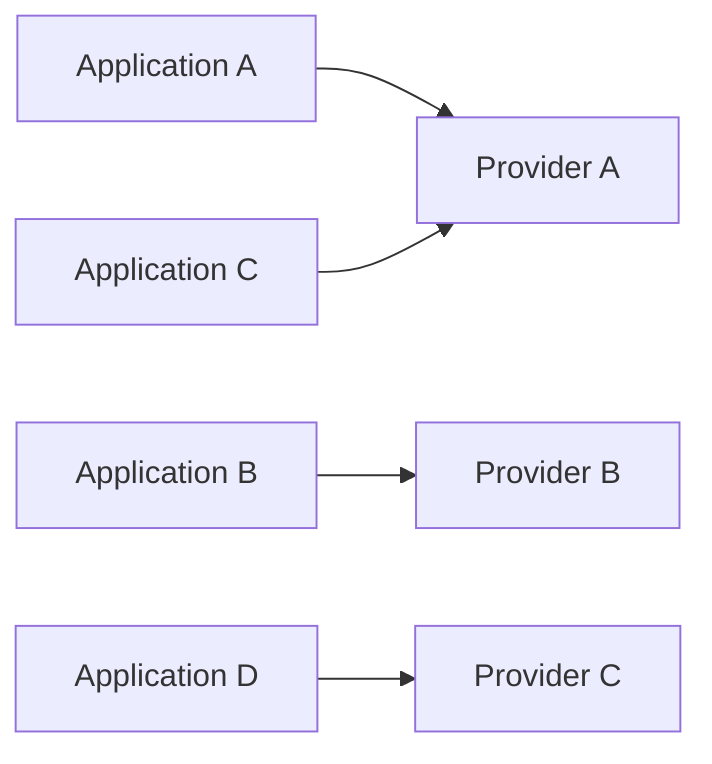

the gateway provides a centralized abstraction:

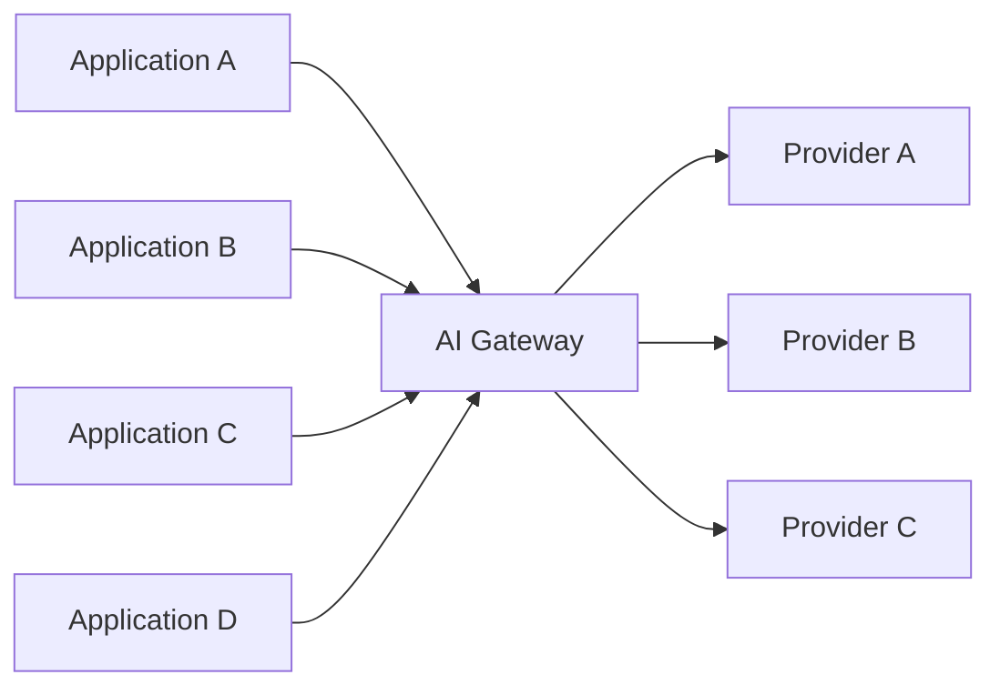

The system will initially focus on LLM chat/completion workloads and evolve incrementally toward a production-grade AI platform.

## 2. Problem Statement

Modern AI applications often integrate directly with individual model providers.

This creates several problems:

- Provider-specific APIs
- Different authentication mechanisms
- Different model naming conventions
- Provider outages
- Inconsistent error handling
- Difficult model switching
- Limited centralized observability
- No centralized rate limiting
- Difficult usage tracking
- Difficult cost attribution
- Repeated infrastructure code across applications
- Difficult multi-provider management

Applications should be able to communicate with an internal AI gateway through a stable API without needing to understand the details of individual providers.

## 3. Product Vision

Provide a reliable, observable, secure, and extensible AI gateway that abstracts LLM providers behind a consistent API.

The long-term vision is:

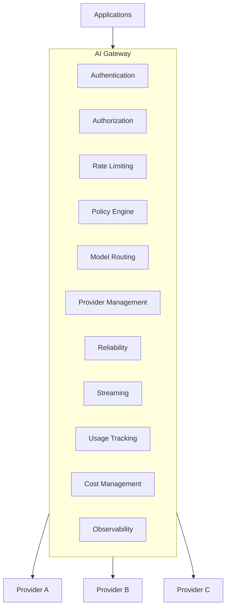

## 4. Goals

### 4.1 Primary Goals

The system must:

1. Provide a unified API for LLM requests.
2. Support multiple LLM providers.
3. Abstract provider-specific implementations.
4. Route requests to appropriate models/providers.
5. Support configurable provider selection.
6. Provide authentication.
7. Provide authorization.
8. Provide rate limiting and quotas.
9. Handle provider failures gracefully.
10. Support retries and timeouts.
11. Support provider fallback.
12. Support streaming responses.
13. Provide structured logging.
14. Provide metrics.
15. Provide distributed tracing.
16. Track token usage.
17. Track estimated AI costs.
18. Persist relevant operational data.
19. Provide administrative APIs.
20. Support automated testing.
21. Support containerized deployment.
22. Support CI/CD.
23. Provide production-oriented security controls.

## 5. Non-Goals

The initial product will not attempt to:

- Train foundation models.
- Host LLMs directly.
- Build a vector database.
- Build a RAG application.
- Build an AI agent framework.
- Build a general-purpose workflow engine.
- Replace model providers.
- Implement model inference infrastructure.
- Build a complete AI application UI.

The gateway is infrastructure that **connects applications to AI providers**.

## 6. Target Users

### 6.1 Application Developers

Developers building:

- AI assistants
- RAG applications
- AI agents
- Document-processing systems
- Customer-support applications
- Internal AI tools

They need a consistent API without implementing provider-specific integrations.

### 6.2 Platform Engineers

Platform engineers need:

- Centralized provider management
- Routing
- Authentication
- Rate limiting
- Observability
- Reliability
- Cost management

### 6.3 Engineering / Operations Teams

Operations teams need:

- Metrics
- Logs
- Traces
- Usage information
- Provider health
- Error visibility
- Operational controls

## 7. Core User Experience

A client should be able to send a request similar to:

```http
POST /v1/chat/completions
Authorization: Bearer <API_KEY>
Content-Type: application/json
```

with a request body containing the requested model and messages.

The client should not need to know:

- Which provider is selected
- How the provider is authenticated
- Which retry policy is used
- Whether fallback occurs
- How usage is recorded
- How costs are calculated

The gateway handles these concerns.

## 8. Functional Requirements

### FR-001 — Health Endpoint

The gateway shall expose a health endpoint.

```http
GET /health
```

The endpoint shall indicate whether the application process is operational.

### FR-002 — Readiness Endpoint

The gateway shall expose:

```http
GET /ready
```

Readiness should reflect whether required dependencies are available for serving traffic.

### FR-003 — Chat Completion API

The gateway shall expose:

```http
POST /v1/chat/completions
```

The endpoint shall accept structured chat requests.

### FR-004 — Provider Abstraction

The gateway shall define an internal provider abstraction.

Conceptually:

```text
LlmProvider
    │
    ├── Provider A
    ├── Provider B
    └── Provider C
```

Provider-specific implementation details shall remain behind the abstraction.

### FR-005 — Provider Registry

The system shall maintain a registry of configured providers.

A provider configuration should include information such as:

- Provider identifier
- Provider type
- Endpoint
- Authentication configuration
- Enabled/disabled state
- Supported models
- Timeout configuration

Secrets must not be stored directly in source code.

### FR-006 — Model Registry

The gateway shall maintain information about supported models.

A model may contain:

- Model identifier
- Provider
- Model capabilities
- Context limit
- Availability
- Pricing metadata
- Routing metadata

### FR-007 — Model Routing

The gateway shall determine which provider should process a request.

Routing may consider:

- Requested model
- Provider availability
- Provider configuration
- Routing rules
- Model aliases
- Provider priority

### FR-008 — Authentication

The gateway shall authenticate clients before processing protected requests.

The initial authentication mechanism shall support API keys.

### FR-009 — Authorization

The gateway shall determine whether an authenticated client is authorized to perform the requested operation.

Authorization may consider:

- Tenant
- API key
- Model
- Provider
- Endpoint
- Usage limits

### FR-010 — Rate Limiting

The gateway shall support configurable rate limits.

Limits may be applied by:

- API key
- Tenant
- Model
- Provider

The system shall return an appropriate error when a request exceeds its configured limit.

### FR-011 — Quotas

The gateway shall support usage quotas.

Possible quota dimensions include:

- Requests
- Tokens
- Time period
- Tenant
- API key

### FR-012 — Timeout Management

The gateway shall apply configurable request timeouts.

Provider requests that exceed their configured timeout shall be terminated and handled according to the gateway's error policy.

### FR-013 — Retry Management

The gateway shall support configurable retries for retryable provider failures.

The retry mechanism shall:

- Classify errors.
- Respect retry limits.
- Support backoff.
- Avoid retrying non-retryable failures.
- Respect request deadlines.

### FR-014 — Provider Fallback

The gateway shall support fallback providers when configured.

Example:

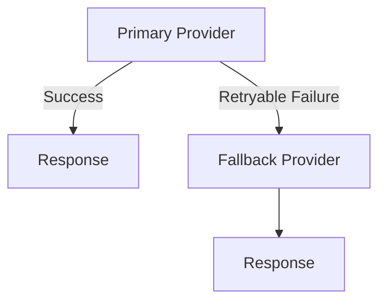

Fallback must respect model compatibility and policy configuration.

### FR-015 — Streaming

The gateway shall support streaming model responses.

The gateway shall forward provider-generated response chunks to clients while maintaining appropriate request lifecycle management.

### FR-016 — Request Identification

Each request shall receive a unique request identifier.

The identifier shall be usable across:

- Logs
- Metrics
- Traces
- Errors
- Usage records
- Audit records

### FR-017 — Structured Logging

The system shall produce structured logs.

Logs should include relevant fields such as:

- Request ID
- Trace ID
- Provider
- Model
- HTTP status
- Duration
- Error category

Sensitive information must not be logged.

### FR-018 — Metrics

The gateway shall expose operational metrics.

Initial metrics should include:

- Request count
- Error count
- Request latency
- Provider latency
- Provider errors
- Token usage
- Rate-limit events
- Retry count
- Fallback count

### FR-019 — Distributed Tracing

The gateway shall support distributed tracing.

Important operations should be represented as trace spans.

Example:

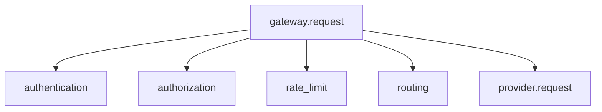

### FR-020 — Usage Tracking

The gateway shall record AI usage.

Usage information should include, where available:

- Input tokens
- Output tokens
- Total tokens
- Model
- Provider
- Request ID
- Timestamp
- Tenant/API-key association

### FR-021 — Cost Tracking

The system shall estimate request costs based on configured model pricing information.

Cost calculations shall be versionable/configurable because provider pricing may change.

### FR-022 — Persistence

The system shall persist operational information using a relational database.

The initial target database is PostgreSQL.

Potential entities include:

```text
tenants
api_keys
providers
models
requests
usage_records
audit_events
```

### FR-023 — Configuration

The gateway shall support configuration through configuration files and environment variables.

Configuration shall include:

- Server settings
- Provider settings
- Model settings
- Routing
- Rate limits
- Timeouts
- Retry policies
- Database
- Observability

Secrets shall be supplied through secure environment/configuration mechanisms rather than committed to source control.

### FR-024 — Administration API

The gateway shall expose administrative operations for authorized operators.

Administrative functionality may include:

- Provider management
- Model management
- API-key management
- Routing configuration
- Usage inspection
- Operational status

Administrative endpoints shall require elevated authorization.

### FR-025 — Policy Engine

The gateway shall support configurable policies.

Policies may determine:

- Which models a client can use
- Which providers a client can use
- Maximum tokens
- Rate limits
- Quotas
- Routing constraints

### FR-026 — Caching

The gateway may support configurable caching for appropriate request types.

Caching must account for:

- Cache key construction
- TTL
- Model
- Request parameters
- Tenant isolation
- Security

Caching is not required for the initial MVP.

## 9. API Requirements

### Public API

Initial public API:

```text
GET  /health
GET  /ready
POST /v1/chat/completions
```

Future APIs may include:

```text
GET /v1/models
```

and administrative APIs under:

```text
/admin/*
```

## 10. Error Handling

The gateway shall expose consistent errors regardless of the underlying provider.

Conceptual error categories:

```text
AuthenticationError
AuthorizationError
ValidationError
RateLimitError
QuotaExceededError
RoutingError
ProviderUnavailableError
ProviderTimeoutError
ProviderResponseError
InternalError
```

The client should not need to understand provider-specific error formats.

## 11. Security Requirements

### SEC-001

API keys must never be committed to source control.

### SEC-002

Secrets must not be written to application logs.

### SEC-003

Authentication must occur before protected operations.

### SEC-004

Administrative APIs must require elevated authorization.

### SEC-005

Input payloads must be validated.

### SEC-006

Request sizes must be bounded.

### SEC-007

Provider credentials must be isolated from client credentials.

### SEC-008

Sensitive operational data must be protected.

### SEC-009

The gateway must provide audit information for security-sensitive administrative actions.

## 12. Reliability Requirements

The gateway shall be designed to tolerate provider failures.

Reliability mechanisms include:

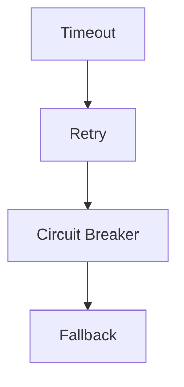

The system should distinguish between:

### Retryable failures

Examples:

- Temporary provider unavailability
- Certain network failures
- Certain transient server errors

### Non-retryable failures

Examples:

- Invalid request
- Authentication failure
- Authorization failure
- Unsupported model

## 13. Observability Requirements

Every production request should be observable through:

```text
Logs
Metrics
Traces
```

The system should make it possible to answer:

- How many requests are being processed?
- Which models are used?
- Which providers are failing?
- What is the latency?
- How many requests are retried?
- How many requests use fallback?
- How many tokens are consumed?
- What is the estimated cost?

## 14. Performance Requirements

The gateway should introduce minimal overhead relative to the underlying provider request.

Performance testing shall measure:

- Requests per second
- Concurrent requests
- P50 latency
- P95 latency
- P99 latency
- CPU usage
- Memory usage

Performance targets will be established during benchmarking rather than assumed before measurements exist.

## 15. Scalability Requirements

The gateway should support horizontal scaling.

Target architecture:

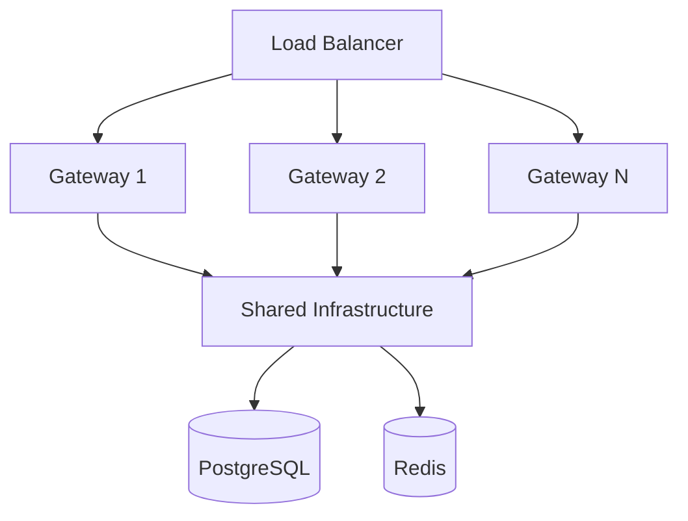

The gateway application should remain as stateless as practical.

## 16. Technology Requirements

The implementation shall use Rust.

Primary technologies:

```text
Rust
Tokio
Axum
Serde
SQLx
PostgreSQL
Redis
tracing
OpenTelemetry
Docker
GitHub Actions
```

Specific libraries may change during implementation when technical evaluation demonstrates a better alternative.

## 17. Architecture Principles

The system shall follow these principles:

### Separation of concerns

HTTP, application logic, domain logic, provider integrations, persistence, and infrastructure should remain separated.

### Dependency inversion

Core application logic should depend on abstractions rather than concrete providers.

### Provider independence

Adding a provider should not require rewriting the gateway core.

### Configuration over hardcoding

Routing and operational policies should be configurable.

### Explicit error handling

Failures should be represented explicitly and classified appropriately.

### Observability by design

Logging, metrics, and tracing should be incorporated during development rather than added at the end.

### Security by design

Authentication, authorization, secret management, and input validation should be architectural concerns.

## 18. Proposed Architecture

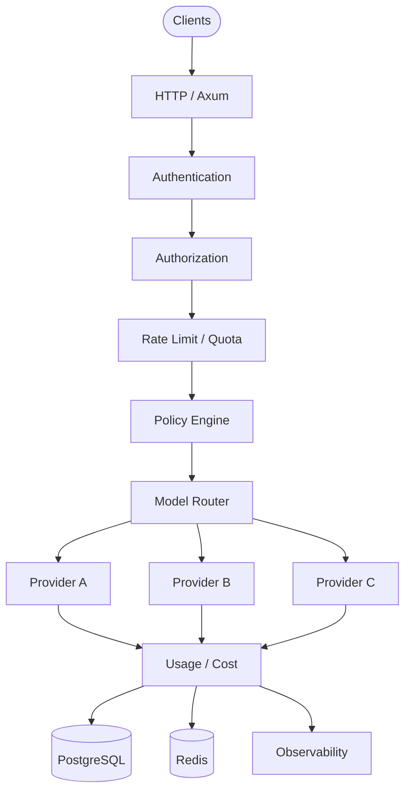

## 19. MVP Scope

The first usable version should remain intentionally small.

### MVP includes

```text
Rust
  │
  ├── Axum HTTP server
  ├── Health endpoint
  ├── Chat completion endpoint
  ├── Request validation
  ├── Provider trait
  ├── One real provider
  ├── Model configuration
  ├── Basic routing
  ├── Error handling
  ├── Structured logging
  └── Tests
```

### MVP does not include

```text
PostgreSQL
Redis
Complex routing
Circuit breakers
Advanced policy engine
Admin UI
Cost analytics
Distributed tracing
Kubernetes
```

These will be introduced incrementally.

## 20. Product Evolution

The product will evolve through the following stages:

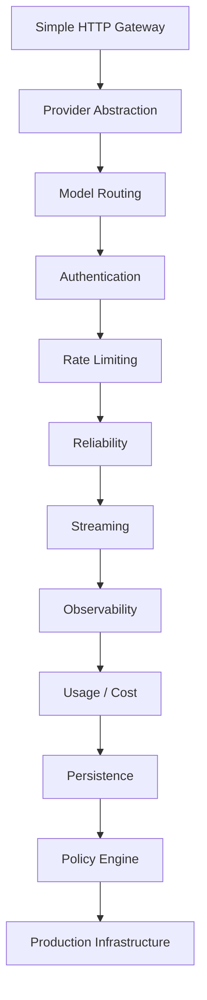

## 21. Testing Requirements

The project shall use multiple testing levels.

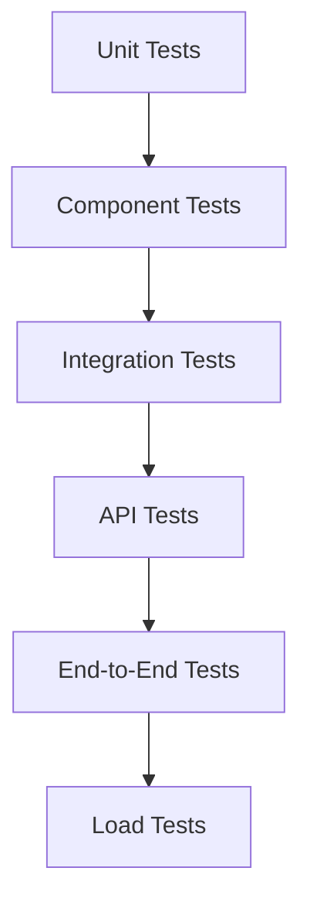

Important scenarios include:

- Valid request
- Invalid request
- Unknown model
- Provider failure
- Provider timeout
- Retry
- Fallback
- Authentication failure
- Authorization failure
- Rate-limit violation
- Quota violation
- Streaming
- Concurrent requests

## 22. CI/CD Requirements

Every change should pass automated checks.

Pipeline:

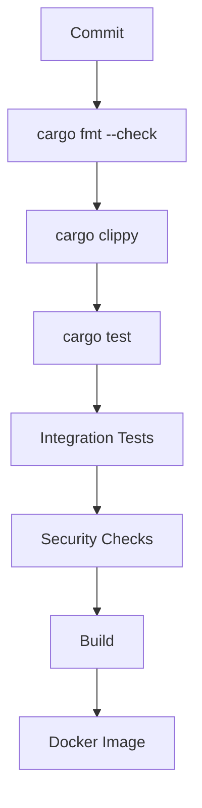

## 23. Deployment Requirements

The application shall be containerized.

Local development should support:

```text
Docker Compose
```

Production deployment should support horizontal scaling.

Potential future deployment environments include:

- Kubernetes
- Cloud container platforms
- Virtual machines

The deployment architecture should not require Kubernetes for local development.

## 24. Success Criteria

The project will be considered successful when:

1. A client can send an LLM request through the gateway.
2. The gateway can communicate with at least one real provider.
3. Provider integrations are abstracted behind a common interface.
4. Models can be configured without modifying gateway core logic.
5. Requests are authenticated.
6. Requests can be rate limited.
7. Provider failures are handled predictably.
8. Provider fallback works when configured.
9. Streaming requests work.
10. Requests produce structured logs.
11. Metrics are available.
12. Traces can follow a request through the gateway.
13. Token usage can be recorded.
14. Costs can be estimated.
15. Operational data can be persisted.
16. Automated tests cover critical behavior.
17. The application can be built as a Docker image.
18. CI validates changes automatically.
19. Security controls are documented and tested.
20. The architecture can scale horizontally.

## 25. Development Strategy

The project shall be developed incrementally.

Each feature should follow:

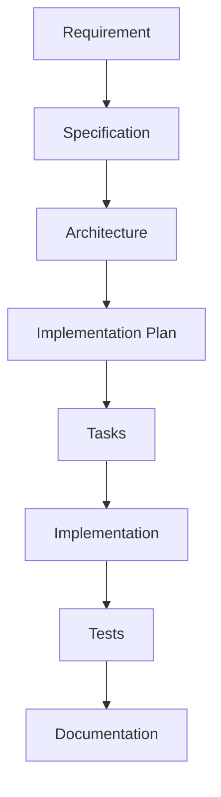

SpecKit will be used to maintain this workflow.

No major architectural feature should be implemented before its requirements and design have been documented.

## 26. Initial Deliverables

The initial project documentation will contain:

```text
README.md
constitution.md
prd.md
```

Then SpecKit will generate the specification workflow for individual features.

The first feature specification should be:

```text
001-gateway-core
```

Its scope should be deliberately small:

```text
HTTP server
    +
health endpoint
    +
chat endpoint
    +
request/response models
    +
basic error handling
```

This establishes the foundation before introducing providers, routing, authentication, persistence, and other production concerns.