# AI Gateway — Provider Architecture

## 1. Overview

The AI Gateway must support multiple Large Language Model (LLM) providers through a common provider abstraction.

The gateway must not couple its application or domain logic to a specific provider.

The initial implementation uses **OpenRouter** as the first provider.

Future providers can be added without changing the public gateway API or core application logic.

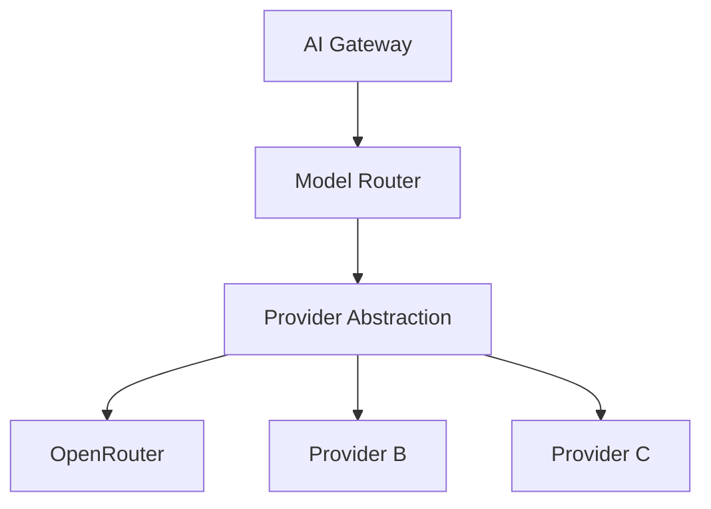

## 2. Provider Architecture Goals

The provider subsystem must provide:

1. Provider independence
2. A normalized request interface
3. A normalized response interface
4. Provider-specific adapters
5. Provider-specific error translation
6. Provider configuration isolation
7. Provider health information
8. Provider enable/disable control
9. Support for routing and fallback
10. Support for streaming
11. Testability without real provider calls

## 3. Core Design Principle

The rest of the gateway should depend on an abstraction:

```rust
LlmProvider
```

and not directly on:

```text
OpenRouter
Provider B
Provider C
```

The dependency direction should be:

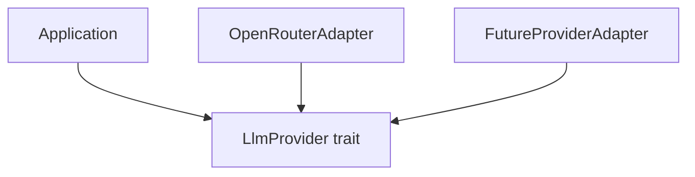

This is an application of the Dependency Inversion Principle.

## 4. Provider Responsibilities

A provider adapter is responsible for translating between the gateway's normalized representation and a provider's API.

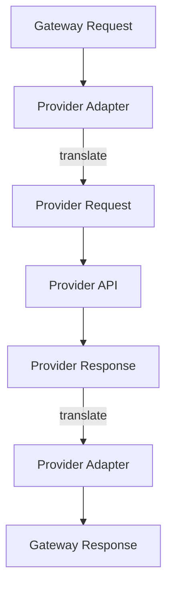

The provider adapter owns:

- provider HTTP client
- provider authentication
- provider request format
- provider response format
- provider error format
- provider-specific headers
- provider-specific streaming format

The provider adapter must not own:

- gateway authentication
- tenant authorization
- gateway rate limiting
- gateway quotas
- model routing decisions
- gateway policies
- global usage tracking

Those belong to the gateway.

## 5. Provider Trait

The initial provider abstraction is:

```rust
#[async_trait]
pub trait LlmProvider: Send + Sync {
    async fn chat(
        &self,
        request: &ChatRequest,
    ) -> Result<ChatResponse, ProviderError>;
}
```

The trait represents the minimum non-streaming provider contract.

The exact trait may evolve as streaming and advanced provider capabilities are introduced.

## 6. Provider Trait Responsibilities

The `LlmProvider` trait should represent capabilities common to all supported providers.

It should not contain provider-specific concepts.

Good:

```rust
async fn chat(
    &self,
    request: &ChatRequest,
) -> Result<ChatResponse, ProviderError>;
```

Avoid:

```rust
async fn openrouter_chat(
    &self,
    request: &OpenRouterRequest,
) -> ...
```

The latter couples the abstraction to one provider.

## 7. Normalized Chat Request

The provider layer receives the gateway's normalized request.

Conceptually:

```rust
pub struct ChatRequest {
    pub model: String,
    pub messages: Vec<Message>,
    pub temperature: Option<f32>,
    pub max_tokens: Option<u32>,
    pub stream: bool,
}
```

The request represents the gateway contract.

Provider adapters translate it into provider-specific request types.

## 8. Normalized Message

```rust
pub struct Message {
    pub role: MessageRole,
    pub content: String,
}
```

Role:

```rust
pub enum MessageRole {
    System,
    User,
    Assistant,
}
```

The gateway owns this representation.

A provider adapter converts these roles into the provider's expected representation.

## 9. Normalized Chat Response

Conceptually:

```rust
pub struct ChatResponse {
    pub id: String,
    pub model: String,
    pub message: Message,
    pub finish_reason: Option<String>,
    pub usage: Option<Usage>,
}
```

Usage:

```rust
pub struct Usage {
    pub prompt_tokens: u64,
    pub completion_tokens: u64,
    pub total_tokens: u64,
}
```

The provider adapter is responsible for converting provider usage information into this normalized representation.

## 10. Provider-Specific Models

Provider-specific request and response structures should remain inside the provider infrastructure layer.

Example:

```text
src/
└── infrastructure/
    └── providers/
        └── openrouter/
            ├── client.rs
            ├── models.rs
            ├── mapper.rs
            └── error.rs
```

Example:

```rust
struct OpenRouterChatRequest {
    // provider-specific fields
}
```

This type should not leak into the domain layer.

## 11. Provider Registry

The gateway requires a provider registry.

Conceptually:

```rust
pub struct ProviderRegistry {
    providers: HashMap<String, Arc<dyn LlmProvider>>,
}
```

Example:

```text
ProviderRegistry

openrouter -> OpenRouterProvider
provider_b -> ProviderB
provider_c -> ProviderC
```

The registry allows the routing subsystem to resolve a provider by identifier.

## 12. Provider Lookup

The application should perform:

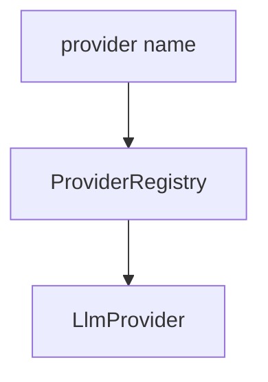

Example:

```rust
let provider = registry
    .get("openrouter")
    .ok_or(ProviderError::NotConfigured)?;
```

The application does not need to know which concrete Rust type implements the provider.

## 13. Provider Factory

A provider factory creates provider clients from configuration.

Conceptually:

```rust
pub struct ProviderFactory;
```

Example flow:

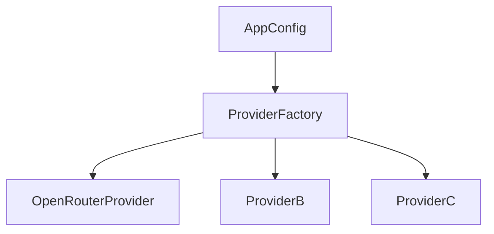

The factory should be responsible for:

- reading provider configuration
- constructing HTTP clients
- resolving credentials
- validating provider configuration
- creating provider implementations

## 14. Provider Initialization

At application startup:

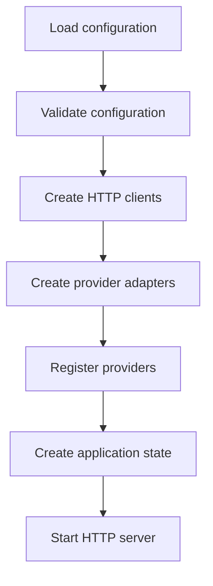

Providers should be initialized once rather than recreated for every request.

## 15. OpenRouter Provider

OpenRouter is the first provider implementation.

Conceptually:

```text
src/
└── infrastructure/
    └── providers/
        └── openrouter/
            ├── mod.rs
            ├── client.rs
            ├── models.rs
            ├── mapper.rs
            └── error.rs
```

Responsibilities:

#### `client.rs`

HTTP communication.

#### `models.rs`

OpenRouter-specific request and response types.

#### `mapper.rs`

Conversion between gateway and OpenRouter types.

#### `error.rs`

OpenRouter error translation.

#### `mod.rs`

Provider module exports and implementation.

## 16. OpenRouter Configuration

The provider uses configuration such as:

```yaml
providers:
  openrouter:
    enabled: true
    base_url: "https://openrouter.ai/api/v1"
    api_key_env: "OPENROUTER_API_KEY"
    timeout_seconds: 60
```

The API key is loaded from:

```text
OPENROUTER_API_KEY
```

The secret must not be stored in the YAML file.

## 17. OpenRouter Client

The OpenRouter client should own the provider HTTP client.

Conceptually:

```rust
pub struct OpenRouterProvider {
    client: reqwest::Client,
    base_url: String,
    api_key: SecretString,
}
```

The exact secret type may be selected during implementation.

The provider should reuse the HTTP client instead of creating a new client for every request.

## 18. Request Mapping

Gateway request:

```json
{
  "model": "general",
  "messages": [
    {
      "role": "user",
      "content": "Explain Rust ownership."
    }
  ],
  "temperature": 0.7,
  "max_tokens": 500
}
```

is first resolved by the model registry:

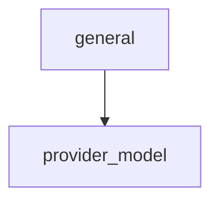

Then the OpenRouter adapter creates its provider-specific request.

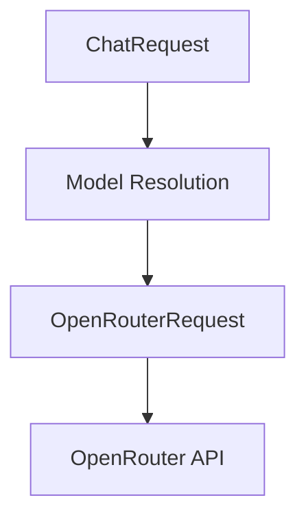

## 19. Provider Model Resolution

The client should not normally specify provider-specific model identifiers.

Instead:

```json
{
  "model": "general"
}
```

The gateway configuration contains:

```yaml
models:
  general:
    provider: "openrouter"
    provider_model: "provider-specific-model"
```

The model registry resolves:

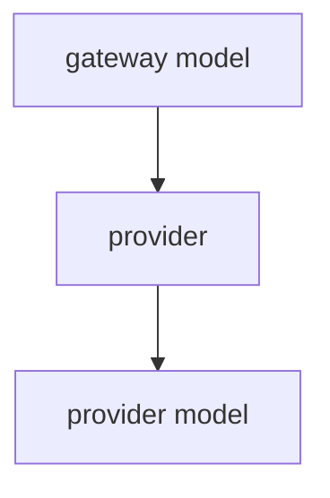

This separation is important for portability.

## 20. Response Mapping

The provider response must be converted into the gateway response.

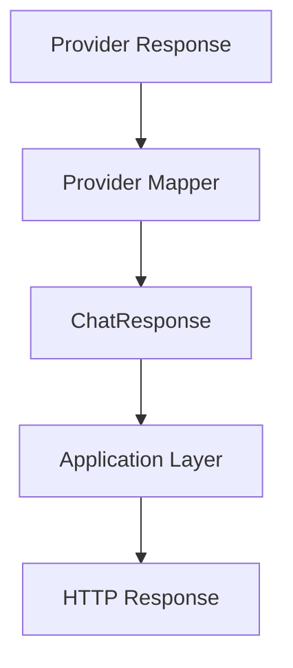

The application should never need to understand provider-specific response structures.

## 21. Usage Mapping

If the provider returns token usage:

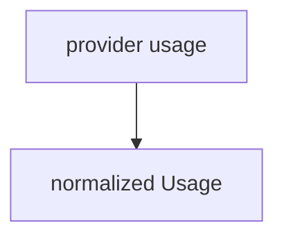

Example:

```rust
Usage {
    prompt_tokens: 100,
    completion_tokens: 50,
    total_tokens: 150,
}
```

If usage is unavailable, the provider adapter should return:

```rust
None
```

rather than estimating usage without an explicitly defined mechanism.

## 22. Provider Errors

All provider failures must be normalized.

Example:

```rust
pub enum ProviderError {
    Authentication,
    InvalidRequest,
    ModelNotFound,
    RateLimited,
    Timeout,
    Unavailable,
    ServerError,
    Network,
    InvalidResponse,
    Unknown,
}
```

The final enum should be refined during implementation.

The important requirement is that application code should not depend on provider-specific error types.

## 23. Provider Error Translation

Example:

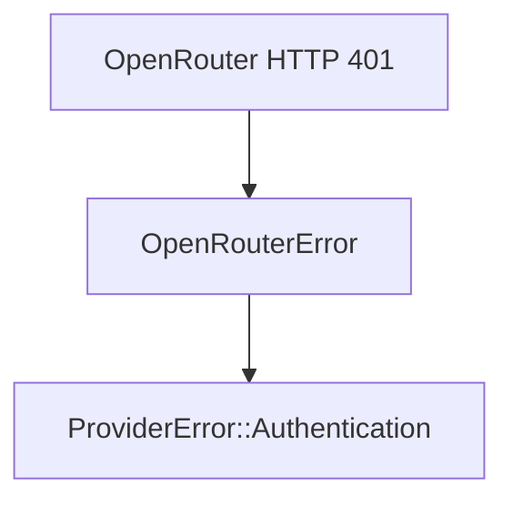

Another example:

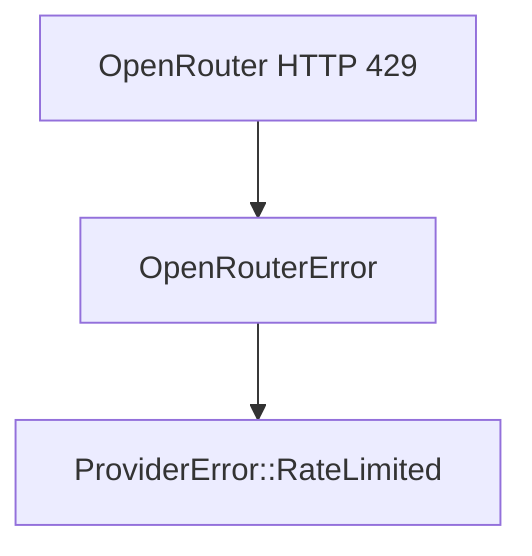

The gateway can then decide whether an error is:

```text
retryable
```

or:

```text
non-retryable
```

without knowing the provider's raw error format.

## 24. Retry Classification

Provider errors should expose enough information for the reliability subsystem.

Conceptually:

```rust
impl ProviderError {
    pub fn is_retryable(&self) -> bool {
        // classification
    }
}
```

Potentially retryable:

```text
Network
Timeout
Unavailable
ServerError
```

Potentially non-retryable:

```text
Authentication
InvalidRequest
ModelNotFound
```

The exact retry policy belongs to the reliability subsystem rather than the provider adapter.

## 25. Rate Limiting by Provider

A provider may impose its own rate limits.

The adapter should translate provider rate-limit responses into:

```rust
ProviderError::RateLimited
```

The gateway may then:

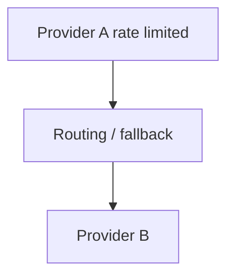

Provider rate limits must be distinguished from gateway rate limits.

## 26. Gateway vs Provider Rate Limits

There are two different concepts.

### Gateway rate limit

Controlled by the gateway:

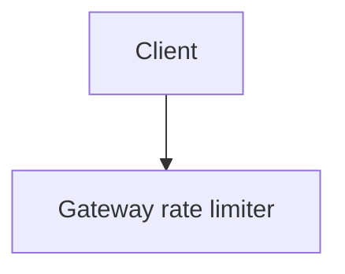

Example:

```text
100 requests/minute
```

### Provider rate limit

Controlled by the external provider:

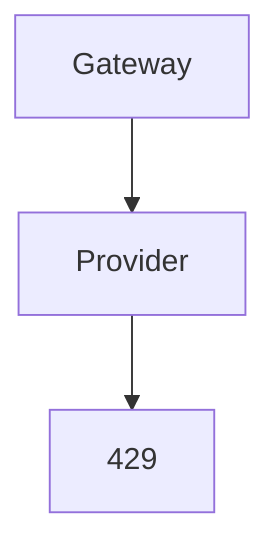

These must not be treated as the same subsystem.

## 27. Provider Timeouts

Each provider request must have an explicit timeout.

Example configuration:

```yaml
providers:
  openrouter:
    timeout_seconds: 60
```

The provider adapter must not allow an external request to run indefinitely.

Timeout errors are normalized into:

```rust
ProviderError::Timeout
```

## 28. Provider HTTP Client

The provider infrastructure should use an asynchronous HTTP client compatible with Tokio.

The HTTP client should be created once and reused.

Conceptually:

```rust
reqwest::Client
```

The exact HTTP client implementation can be finalized during the implementation phase.

## 29. HTTP Headers

Provider-specific headers belong inside the provider adapter.

For example:

```text
Authorization
Content-Type
provider-specific metadata headers
```

The application should not manually construct provider headers.

Example architecture:

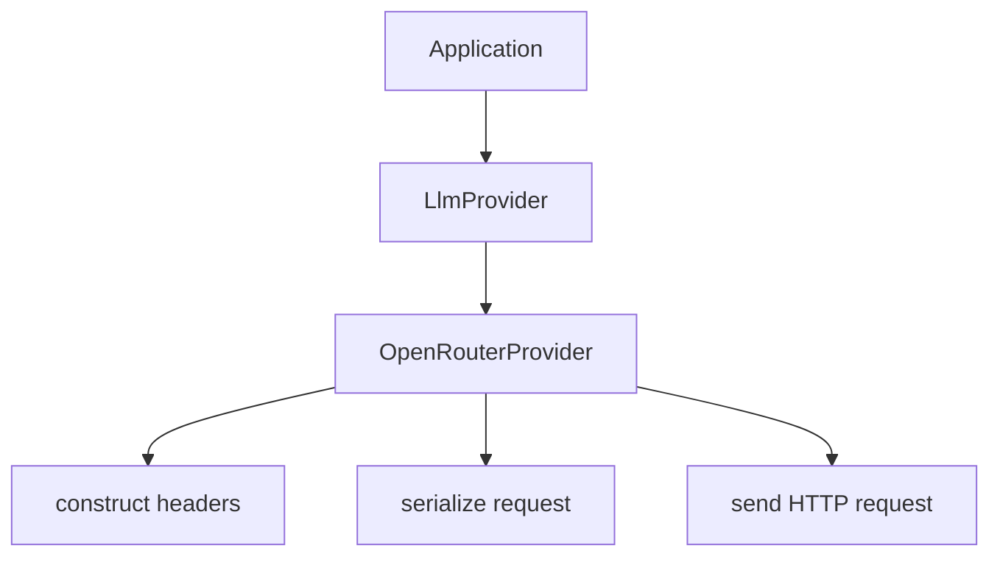

## 30. Provider Authentication

Provider credentials are infrastructure secrets.

The provider adapter owns the credential needed to communicate with the provider.

Example:

```text
OPENROUTER_API_KEY
```

The credential must:

- never be returned through the gateway API
- never be logged
- never be included in tracing attributes
- never be committed to Git
- never be included in error messages

## 31. Provider Health

Future versions should support provider health information.

Conceptually:

```rust
pub enum ProviderHealth {
    Healthy,
    Degraded,
    Unavailable,
}
```

Possible inputs:

- recent request failures
- timeout rate
- provider health endpoint
- circuit breaker state
- rate limiting
- latency

Provider health can be consumed by the routing subsystem.

## 32. Provider Availability

A provider may be:

```text
enabled
disabled
temporarily unavailable
```

Configuration:

```yaml
providers:
  openrouter:
    enabled: true
```

Disabled providers must not receive requests.

The routing subsystem should exclude unavailable providers.

## 33. Provider Capabilities

Different providers may support different capabilities.

Future capability representation:

```rust
pub struct ProviderCapabilities {
    pub chat: bool,
    pub streaming: bool,
    pub tools: bool,
    pub structured_output: bool,
    pub embeddings: bool,
}
```

The gateway should use capability information during model/provider selection.

The MVP only requires:

```text
chat
```

Streaming will be added later.

## 34. Capability Negotiation

The gateway should not assume that every provider supports every feature.

Example:

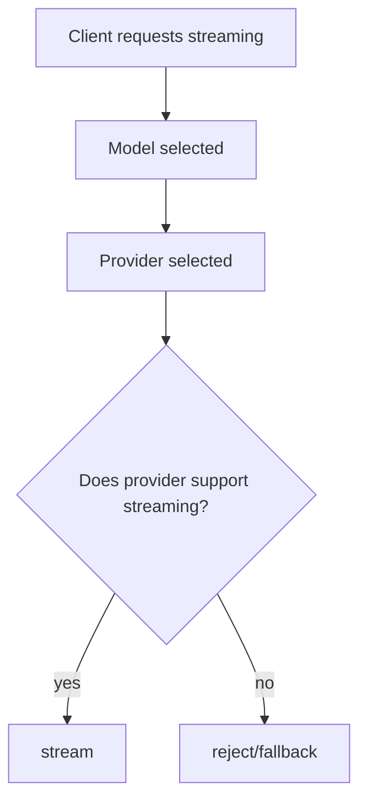

The exact behavior should be defined by the routing and policy subsystems.

## 35. Streaming Provider Interface

Streaming should be added after the non-streaming provider abstraction is stable.

A future interface may look conceptually like:

```rust
async fn chat_stream(
    &self,
    request: &ChatRequest,
) -> Result<ProviderStream, ProviderError>;
```

The exact stream type should be selected during the streaming feature implementation.

The provider adapter is responsible for translating provider streaming events into normalized gateway events.

## 36. Normalized Streaming Event

Future normalized event:

```rust
pub struct ChatStreamChunk {
    pub id: String,
    pub content: Option<String>,
    pub finish_reason: Option<String>,
}
```

Provider-specific streaming events should never leak through the public API.

## 37. Provider Fallback

The provider layer should support the routing subsystem by returning structured failures.

Example:

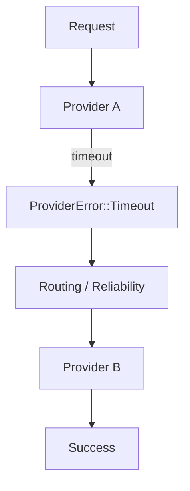

Fallback decisions belong to the routing/reliability layer.

The provider itself should not decide which provider to call next.

## 38. Provider Isolation

Each provider adapter should be isolated from other providers.

```text
providers/
├── openrouter/
│   ├── client.rs
│   ├── models.rs
│   ├── mapper.rs
│   └── error.rs
│
├── provider_b/
│   ├── client.rs
│   ├── models.rs
│   ├── mapper.rs
│   └── error.rs
│
└── provider_c/
    ├── client.rs
    ├── models.rs
    ├── mapper.rs
    └── error.rs
```

Provider B must not import OpenRouter-specific types.

## 39. Testing Providers

Provider implementations must be testable without making real external API calls.

Tests should cover:

### Request mapping

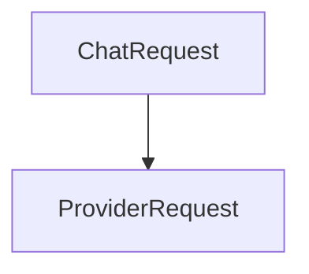

### Response mapping

```mermaid
flowchart TD
    PR[ProviderResponse] --> CR[ChatResponse]
```

### Error mapping

```mermaid
flowchart TD
    H[Provider HTTP error] --> PE[ProviderError]
```

### Configuration

```mermaid
flowchart TD
    PC[ProviderConfig] --> CL[ProviderClient]
```

### Authentication

Verify that the expected authorization mechanism is applied without exposing credentials.

## 40. Mock Provider

The gateway should provide a mock provider for unit and integration tests.

Conceptually:

```rust
pub struct MockProvider;
```

Example:

```mermaid
flowchart TD
    T[Test] --> A[Application]
    A --> MP[MockProvider]
    MP --> CR[Synthetic ChatResponse]
```

This allows testing the application layer without calling OpenRouter.

## 41. Provider Contract Tests

All provider implementations should eventually satisfy a common provider contract.

Conceptually:

```mermaid
flowchart TD
    CT[Provider Contract Tests] --> O[OpenRouter]
    CT --> PB[Provider B]
    CT --> PC[Provider C]
```

The contract should verify common behavior such as:

- successful chat request
- invalid request handling
- provider errors
- timeout handling
- response normalization
- usage normalization

## 42. Provider Observability

Provider requests should produce structured telemetry.

Useful fields include:

```text
provider
model
request_id
latency
status
error_type
retry_count
usage
```

Do not record:

```text
API keys
provider credentials
full sensitive prompts
full model responses
```

unless an explicit and appropriately protected diagnostic mechanism is introduced.

## 43. Provider Metrics

Future provider-specific metrics include:

```text
provider_requests_total
provider_errors_total
provider_timeouts_total
provider_latency_seconds
provider_tokens_total
provider_rate_limits_total
```

Metrics should include controlled dimensions such as:

```text
provider
model
status
```

Avoid unbounded labels such as:

```text
full prompt
request ID
API key
```

## 44. Provider Cost

Provider usage may be used by the gateway's cost-management subsystem.

The provider layer should expose normalized usage.

The cost subsystem should then calculate:

```text
usage
  +
pricing configuration
  =
estimated cost
```

Cost calculation should not be embedded inside the provider HTTP client.

## 45. Provider Lifecycle

Provider lifecycle:

```mermaid
flowchart TD
    C[Configuration] --> V[Validation]
    V --> I[Initialization]
    I --> R[Registration]
    R --> RD[Ready]
    RD -->|request| RD
    RD --> S[Shutdown]
```

Providers should support graceful application shutdown.

Long-lived HTTP clients should be released when the application shuts down.

## 46. Adding a New Provider

Adding a new provider should require:

1. Provider configuration
2. Provider client
3. Provider-specific request models
4. Provider-specific response models
5. Request mapper
6. Response mapper
7. Error mapper
8. `LlmProvider` implementation
9. Provider registration
10. Provider tests

The application API should not need to change.

## 47. Example: Adding Provider B

Configuration:

```yaml
providers:
  provider_b:
    enabled: true
    base_url: "https://provider.example.com"
    api_key_env: "PROVIDER_B_API_KEY"
```

Implementation:

```text
src/infrastructure/providers/provider_b/
├── mod.rs
├── client.rs
├── models.rs
├── mapper.rs
└── error.rs
```

Registration:

```text
ProviderRegistry
    |
    +--> openrouter
    |
    +--> provider_b
```

No changes should be required to:

```text
/v1/chat/completions
```

## 48. Provider Security Boundary

The provider subsystem is a security boundary between:

```text
Gateway
```

and:

```text
External Provider
```

Provider credentials must be isolated.

The provider subsystem must:

- protect credentials
- validate provider responses
- enforce timeouts
- avoid SSRF through uncontrolled provider URLs
- avoid leaking internal errors
- validate response structures
- handle malformed provider responses safely

## 49. Provider URL Validation

Provider base URLs are configuration values.

Production configuration should restrict them to explicitly configured destinations.

The gateway should not accept arbitrary provider URLs directly from clients.

Bad:

```json
{
  "provider_url": "https://some-user-supplied-host.example"
}
```

Preferred:

```mermaid
flowchart TD
    C[Client] --> GM[gateway model]
    GM --> CP[configured provider]
```

This prevents clients from controlling outbound provider destinations.

## 50. Provider Response Validation

Provider responses are external/untrusted input.

The adapter must validate:

- HTTP status
- JSON structure
- required fields
- message content
- usage values
- finish reason
- streaming events

Malformed responses must produce a normalized error:

```rust
ProviderError::InvalidResponse
```

## 51. Provider Architecture and Domain Boundaries

The dependency structure should remain:

```mermaid
flowchart TD
    P[Presentation] --> A[Application]
    A --> D[Domain]
    I[Infrastructure] --> D
    I --> O[OpenRouter Adapter]
    I --> X[Other Adapters]
```

Provider-specific code belongs in infrastructure.

## 52. Provider Directory Structure

Recommended project structure:

```text
src/
├── domain/
│   ├── chat.rs
│   ├── model.rs
│   └── usage.rs
│
├── application/
│   └── chat/
│       └── service.rs
│
├── infrastructure/
│   └── providers/
│       ├── mod.rs
│       ├── registry.rs
│       ├── factory.rs
│       ├── mock.rs
│       │
│       └── openrouter/
│           ├── mod.rs
│           ├── client.rs
│           ├── models.rs
│           ├── mapper.rs
│           └── error.rs
│
└── api/
    └── chat.rs
```

This structure may evolve as additional providers and capabilities are introduced.

## 53. Provider Request Lifecycle

A normal request follows:

```mermaid
flowchart TD
    Req[HTTP Request] --> H[API Handler]
    H --> S[Chat Service]
    S --> MR[Model Registry]
    MR --> R[Routing]
    R --> PR[Provider Registry]
    PR --> L[LlmProvider]
    L --> OA[OpenRouter Adapter]
    OA --> O[OpenRouter API]
    O --> OR[OpenRouter Response]
    OR --> RM[Response Mapper]
    RM --> CR[ChatResponse]
    CR --> S2[Chat Service]
    S2 --> HR[HTTP Response]
```

## 54. Provider Design Rules

The following rules are mandatory:

1. **Rule 1** — Application code must depend on `LlmProvider`, not concrete providers.
2. **Rule 2** — Provider-specific types must remain inside the provider adapter.
3. **Rule 3** — Provider credentials must never enter the domain layer.
4. **Rule 4** — Provider failures must be normalized.
5. **Rule 5** — Provider requests must have explicit timeouts.
6. **Rule 6** — Provider responses must be validated.
7. **Rule 7** — Provider adapters must be independently testable.
8. **Rule 8** — Adding a provider must not require changing the public chat API.
9. **Rule 9** — Provider fallback decisions belong to routing/reliability.
10. **Rule 10** — Provider-specific behavior must not leak into the normalized API contract.

## 55. MVP Provider Scope

The first provider milestone contains only:

```text
OpenRouter
```

The MVP should implement:

```mermaid
flowchart TD
    LP[LlmProvider] --> OP[OpenRouterProvider]
    OP --> NC[Non-streaming chat]
```

The initial scope is:

```text
configuration
      +
provider client
      +
request mapping
      +
response mapping
      +
error mapping
      +
tests
```

The following are later features:

```text
streaming
multiple providers
provider health
fallback
circuit breakers
capability negotiation
advanced routing
provider-specific model capabilities
```

## 56. Future Provider Architecture

The final architecture should support:

```mermaid
flowchart TD
    MR[Model Router] --> PR[Provider Registry]
    PR --> O[OpenRouter]
    PR --> PB[Provider B]
    PR --> PC[Provider C]
    O --> LA[LLM API]
    PB --> LB[LLM API]
    PC --> LC[LLM API]
```

All providers implement the same gateway contract.

The gateway's public API remains stable while provider infrastructure evolves.

## 57. Related Documents

- Product requirements: `docs/prd.md`
- Architecture: `docs/architecture.md`
- API: `docs/api.md`
- Configuration: `docs/configuration.md`
- Reliability: `docs/reliability.md`
- Observability: `docs/observability.md`
- Security: `docs/security.md`
- Testing: `docs/testing.md`
- Implementation roadmap: `docs/plan.md`
- Provider feature specification: `specs/002-provider-abstraction/`

## 58. Provider Contract

The core provider contract is:

```mermaid
flowchart TD
    T[LlmProvider] --> OA[OpenRouter Adapter]
    T --> FP[Future Provider Adapter]
    OA --> API1[Provider API]
    FP --> API2[Provider API]
    API1 --> N[Normalized ChatResponse]
    API2 --> N
```

The provider abstraction is therefore the primary mechanism that allows the AI Gateway to remain **provider-independent, testable, routable, and extensible**.