# AI Gateway — Reliability

## 1. Purpose

Reliability defines how the AI Gateway behaves when LLM providers, networks,
dependencies, or internal components fail.

The gateway must prevent a single provider failure from unnecessarily causing
application-wide failure.

Reliability is implemented through:

- Request timeouts
- Retry policies
- Exponential backoff
- Failure classification
- Provider fallback
- Circuit breakers
- Request cancellation
- Graceful shutdown
- Dependency health checks
- Bounded resource usage
- Explicit degraded-mode behavior

The design should begin with a simple reliable request path and evolve toward
distributed, production-grade reliability.

## 2. Reliability Principles

The gateway follows these principles.

### 2.1 Fail Fast

Requests must not wait indefinitely for a provider.

Every outbound provider request must have a timeout.


A provider that does not respond within the configured timeout must be treated
as failed.

### 2.2 Retry Only When Safe

Not every failure should be retried.

Retrying blindly can:

- increase latency
- increase provider cost
- amplify outages
- duplicate requests
- consume rate limits

The gateway therefore classifies failures before deciding whether to retry.

### 2.3 Bound Everything

The gateway must place explicit limits on:

- request size
- message count
- request duration
- provider response time
- retry count
- concurrent requests
- streaming duration
- queue depth
- connection pools

Unbounded resources can turn a provider outage into a gateway outage.

### 2.4 Degrade Gracefully

When a provider is unavailable, the gateway should use configured fallback
behavior where appropriate.

Example:

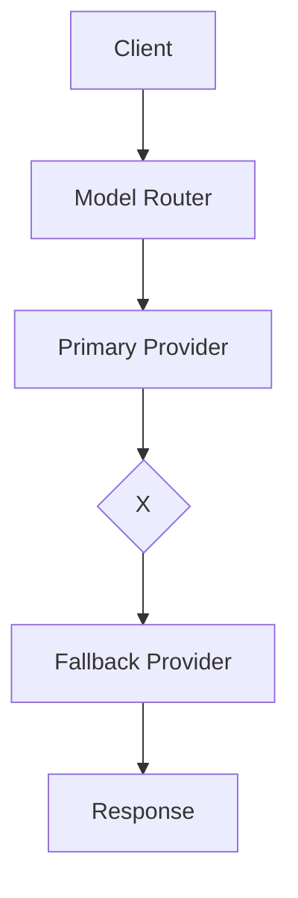

Note: the `X` node represents failure of the primary provider.

If no safe fallback exists, return a clear normalized error.

### 2.5 Preserve Request Context

Every request should have a request ID.

The same request ID must be used throughout:

```text
HTTP request
     |
     +-- authentication
     |
     +-- routing
     |
     +-- provider attempt #1
     |
     +-- retry
     |
     +-- provider attempt #2
     |
     +-- response
```

This makes failures traceable.

## 3. Reliability Scope

Reliability applies to:

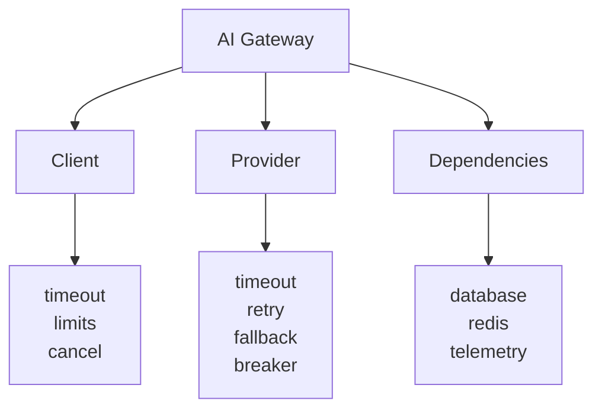

The gateway must handle failures at each boundary.

## 4. Failure Categories

Provider failures are normalized into categories.

```rust
pub enum ProviderError {
    Authentication,
    InvalidRequest,
    ModelNotFound,
    RateLimited,
    Timeout,
    Unavailable,
    ServerError,
    Network,
    InvalidResponse,
    Unknown,
}
```

The reliability layer maps these errors into retry behavior.

## 5. Retry Classification

### 5.1 Non-Retryable Errors

These errors should normally not be retried:

```text
Authentication
InvalidRequest
ModelNotFound
InvalidResponse caused by invalid client input
Authorization failure
Policy rejection
```

Example:

```text
401 Unauthorized
400 Bad Request
403 Forbidden
404 Model Not Found
```

Retrying these requests is unlikely to fix the problem.

### 5.2 Retryable Errors

These may be retried depending on configuration:

```text
Timeout
Network failure
Temporary provider unavailability
HTTP 429
HTTP 500
HTTP 502
HTTP 503
HTTP 504
```

Retry behavior must still respect:

- maximum retries
- request deadline
- provider retry hints
- rate limits
- idempotency considerations

## 6. Retry Policy

The retry policy is configuration-driven.

Example:

```yaml
retry:
  enabled: true
  max_attempts: 3
  initial_delay_ms: 200
  max_delay_ms: 2000
  multiplier: 2.0
  jitter: true
```

`max_attempts` includes the original request.

Therefore:

```text
max_attempts = 3

attempt 1
attempt 2
attempt 3
```

There are two retries after the initial attempt.

## 7. Exponential Backoff

The gateway uses exponential backoff rather than retrying immediately.

Conceptually:

```text
delay = initial_delay * multiplier^(attempt - 1)
```

Example:

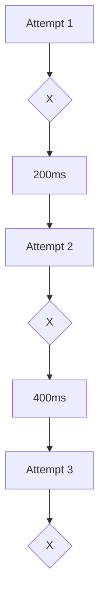

A maximum delay must be enforced.

```text
delay = min(calculated_delay, max_delay)
```

## 8. Jitter

Retries from many gateway instances can synchronize.

For example:

```text
Gateway A ---- retry at 1.0s
Gateway B ---- retry at 1.0s
Gateway C ---- retry at 1.0s
Gateway D ---- retry at 1.0s
```

This can create another load spike.

Jitter introduces controlled randomness into retry delays.

```text
Gateway A ---- retry at 0.82s
Gateway B ---- retry at 1.13s
Gateway C ---- retry at 0.94s
Gateway D ---- retry at 1.21s
```

Jitter should be enabled by default.

## 9. Request Deadline

Retries must not bypass the overall request timeout.

For example:

```text
Gateway request timeout = 30 seconds

Attempt 1 = 10 seconds
Retry wait = 500 ms
Attempt 2 = 10 seconds
Retry wait = 1 second
Attempt 3 = remaining budget
```

The gateway should track the remaining request deadline.

Conceptually:

```rust
remaining_budget = request_deadline - now;
```

A retry must not begin if insufficient time remains.

## 10. Timeout Hierarchy

Timeouts exist at multiple levels.

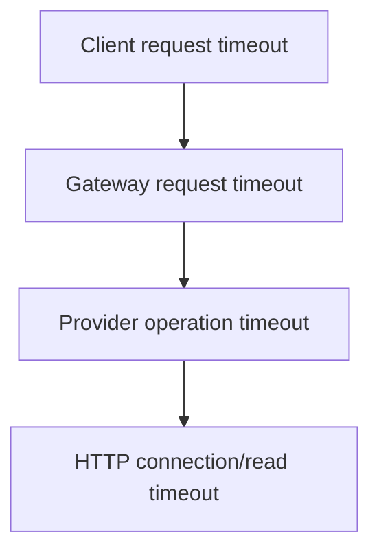

The gateway must avoid configurations where an inner operation can exceed the
outer request deadline.

Recommended conceptual relationship:

```text
provider_timeout <= gateway_request_timeout
```

## 11. Provider Fallback

Fallback allows the gateway to route a failed request to another configured
provider or model.

Example:

```yaml
routing:
  models:
    default-chat:
      primary:
        provider: openrouter
        model: primary-model

      fallback:
        - provider: openrouter
          model: fallback-model
```

Future configurations may support:

```yaml
fallback:
  - provider: provider_a
    model: model_a

  - provider: provider_b
    model: model_b

  - provider: provider_c
    model: model_c
```

## 12. When Fallback Is Allowed

Fallback must not occur for every error.

Fallback is generally appropriate for transient failures such as:

```text
timeout
network failure
provider unavailable
temporary server error
```

Fallback may be inappropriate for:

```text
invalid request
authentication failure
authorization failure
policy rejection
model not found
```

For example:

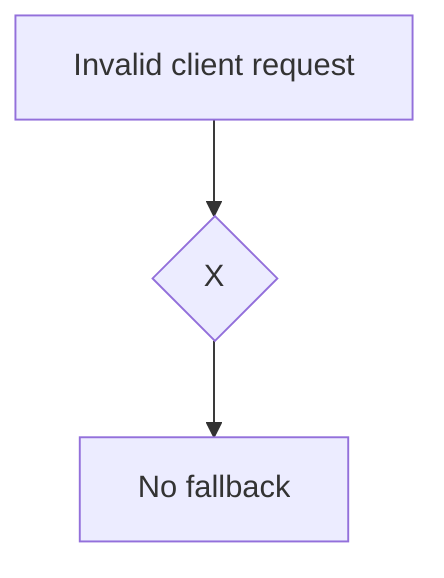

The request itself is invalid, so another provider is unlikely to solve the
problem.

## 13. Fallback Safety

Fallback must preserve the semantic contract of the request.

For example, if the requested model has a specific capability requirement, the
fallback model must satisfy that requirement.

The router should eventually consider:

```text
model capability
context window
tool support
structured output support
streaming support
provider availability
policy restrictions
cost limits
tenant permissions
```

The initial implementation can use explicitly configured fallback models.

## 14. Circuit Breaker

A circuit breaker prevents the gateway from continuously sending requests to an
unhealthy provider.

The conceptual state machine is:

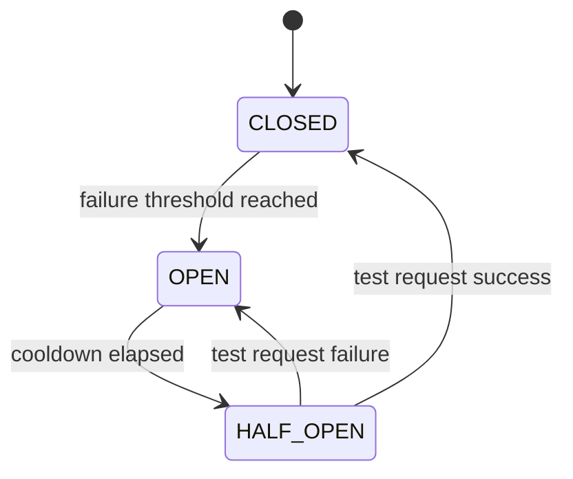

## CLOSED

Requests are sent normally.

```text
Gateway ---> Provider
```

## OPEN

Requests are rejected or routed elsewhere.

```text
Gateway --X--> Provider
     |
     v
Fallback
```

## HALF_OPEN

After a cooldown period, the gateway allows a limited test request.

If successful:

```text
HALF_OPEN -> CLOSED
```

If unsuccessful:

```text
HALF_OPEN -> OPEN
```

## 15. Circuit Breaker Configuration

Example:

```yaml
circuit_breaker:
  enabled: true
  failure_threshold: 5
  open_duration_seconds: 30
  half_open_max_requests: 1
```

The initial MVP does not need a distributed circuit breaker.

An in-memory implementation is sufficient for learning the concept.

For horizontally scaled deployments, circuit-breaker state may eventually
become instance-local or distributed depending on operational requirements.

## 16. Rate Limiting and Provider Failures

Provider rate limiting must not be confused with gateway rate limiting.

Example:

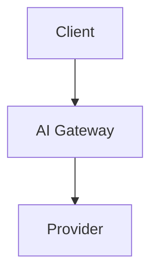

The gateway may receive:

```text
429 Too Many Requests
```

from a provider.

The gateway should:

1. classify the error
2. inspect provider retry information where available
3. respect the request deadline
4. apply configured retry behavior
5. potentially select a fallback
6. return a normalized error if recovery fails

## 17. Retry and Rate Limit Interaction

The gateway must avoid retry storms.

Bad behavior:

```text
Provider -> 429
Gateway -> retry
Provider -> 429
Gateway -> retry
Provider -> 429
Gateway -> retry
...
```

This can increase pressure on an already overloaded provider.

Therefore:

```text
429
 |
 +-- retry allowed?
 |
 +-- retry-after available?
 |
 +-- request deadline sufficient?
 |
 +-- retry budget available?
 |
 +-- provider alternative available?
```

Only then should another attempt occur.

## 18. Request Cancellation

The gateway must propagate request cancellation.

Example:

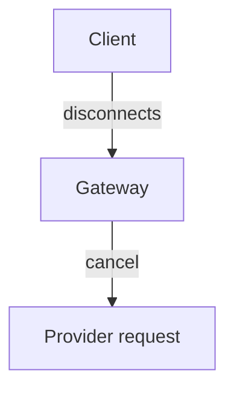

The gateway should avoid continuing expensive provider operations after the
client has disconnected when cancellation can safely be propagated.

Rust async cancellation should be designed explicitly around Tokio tasks and
request futures.

## 19. Streaming Reliability

Streaming introduces additional failure modes.

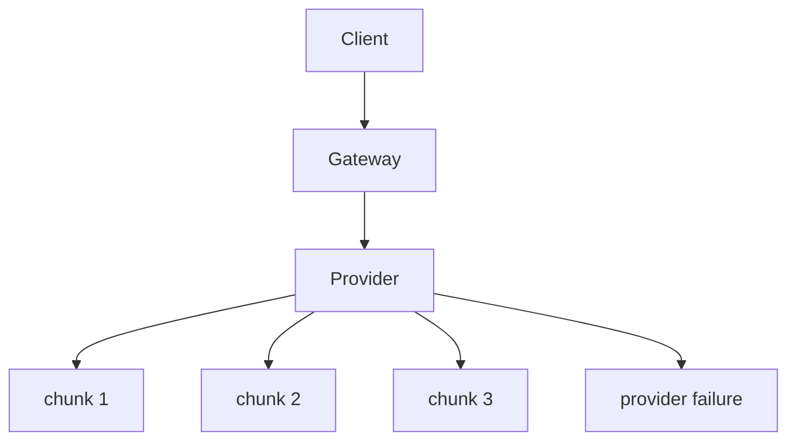

The gateway must handle:

- client disconnects
- provider disconnects
- provider timeout
- partial responses
- stream cancellation
- backpressure
- connection termination
- usage accounting

A partially delivered stream should not be treated as a normal successful
response.

Streaming reliability is implemented after the basic non-streaming request path.

## 20. Partial Responses

A provider may successfully produce part of a response before failing.

Example:

```text
chunk 1 -> client
chunk 2 -> client
chunk 3 -> client
provider fails
```

The gateway generally should not transparently restart the request from another
provider after partial output has already been delivered.

Otherwise the client could receive duplicated or inconsistent content.

Therefore:

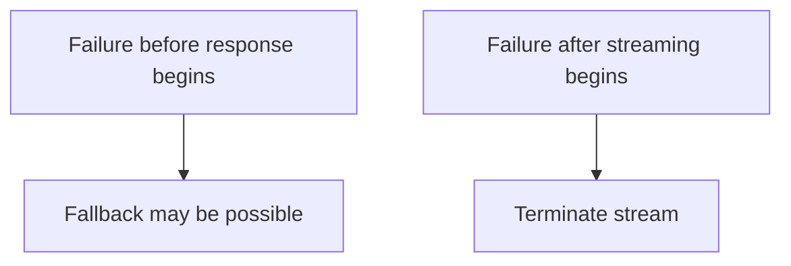

The exact API contract should be documented in `api.md`.

## 21. Graceful Shutdown

The gateway must support graceful shutdown.

Shutdown sequence:

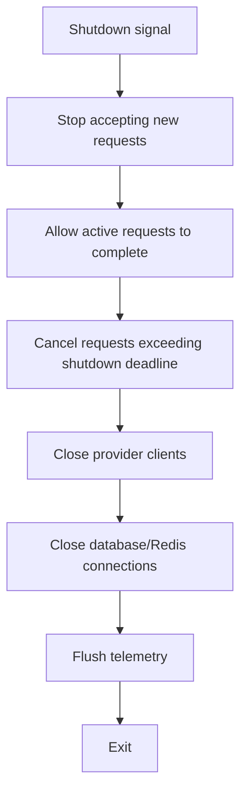

Example configuration:

```yaml
server:
  shutdown_timeout_seconds: 30
```

## 22. Health Checks

The gateway exposes:

```text
GET /health
GET /ready
```

### /health

Indicates whether the process is alive.

This should remain lightweight.

Example:

```json
{
  "status": "ok"
}
```

### /ready

Indicates whether the instance is ready to accept traffic.

Readiness may eventually consider:

```text
configuration loaded
provider registry initialized
required dependencies available
database connection available
```

Provider availability should not necessarily make the entire gateway unready.

For example:

```text
Provider A unavailable
Provider B available
Gateway remains ready
```

This prevents one provider outage from removing the entire gateway instance
from service.

## 23. Dependency Failure

Dependencies include:

```text
PostgreSQL
Redis
provider APIs
telemetry systems
```

The gateway must distinguish critical and non-critical dependencies.

Example:

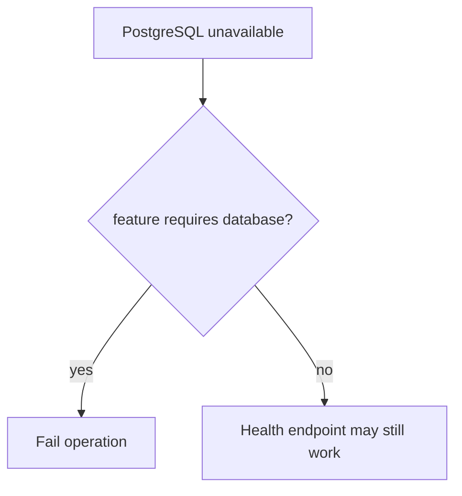

Not every dependency failure should crash the process.

## 24. Resource Protection

The gateway must protect itself from resource exhaustion.

Controls include:

```text
Maximum request body size
Maximum messages per request
Maximum concurrent requests
Maximum provider connections
Maximum retry attempts
Maximum stream duration
Maximum request duration
Maximum queue depth
```

Example:

```yaml
limits:
  max_request_body_bytes: 1048576
  max_messages: 100
  max_concurrent_requests: 1000
```

Actual production values must be determined through testing and workload
measurements.

## 25. Concurrency Limits

An upstream provider outage can cause requests to accumulate.

Example:

```text
1000 clients
    |
    v
Gateway
    |
    +-- provider slow
    +-- provider slow
    +-- provider slow
    +-- provider slow
    ...
```

Without concurrency controls, memory and task usage can grow.

The gateway should eventually use bounded concurrency.

Conceptually:

```text
Semaphore
    |
    +-- request 1
    +-- request 2
    +-- request 3
    ...
```

Requests exceeding the configured concurrency budget should receive a
controlled error or be handled through a bounded queue.

## 26. Error Normalization

Internal provider errors must not leak directly to clients.

For example:

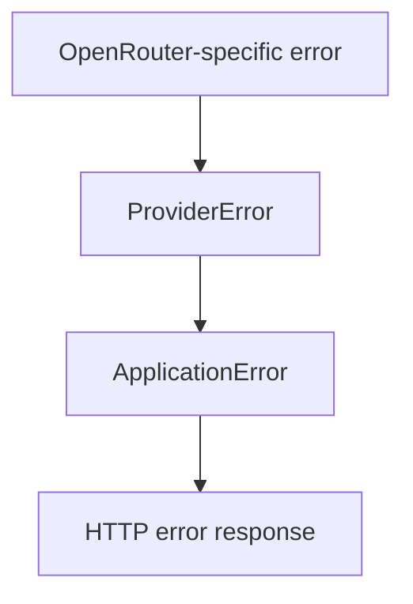

A client should receive a stable gateway error contract.

Example:

```json
{
  "error": {
    "type": "provider_unavailable",
    "message": "The selected model provider is temporarily unavailable.",
    "request_id": "req_123"
  }
}
```

Internal details should remain in logs and traces.

## 27. Idempotency Considerations

Retries can create duplicate provider operations.

For LLM requests, retry behavior must consider whether the operation is safe to
repeat.

The gateway should distinguish:

```text
request accepted
request sent to provider
provider response unknown
```

from:

```text
request definitely never reached provider
```

If a provider connection fails after transmission, the gateway may not know
whether the provider processed the request.

Therefore retry semantics must be conservative.

Future versions may introduce an idempotency key:

```http
Idempotency-Key: <unique-request-key>
```

This should only be implemented once the API contract and provider semantics
are clearly defined.

## 28. Reliability Metrics

The gateway should expose metrics such as:

```text
gateway_requests_total
gateway_request_duration_seconds
gateway_request_errors_total

provider_requests_total
provider_request_duration_seconds
provider_errors_total

provider_retries_total
provider_fallbacks_total

provider_circuit_breaker_state

gateway_timeouts_total
gateway_cancellations_total

gateway_concurrency
gateway_inflight_requests
```

Metrics should be labeled carefully.

Avoid unbounded labels such as:

```text
full_request_text
API key
user ID
request ID
```

Prefer bounded dimensions:

```text
provider
model
status
error_type
```

## 29. Reliability Logging

Structured logs should include:

```text
timestamp
level
request_id
provider
model
attempt
error_type
latency
fallback_used
```

Example:

```json
{
  "level": "WARN",
  "event": "provider_request_failed",
  "request_id": "req_123",
  "provider": "openrouter",
  "model": "example-model",
  "attempt": 2,
  "error_type": "timeout"
}
```

Never log:

```text
API keys
Authorization headers
provider secrets
full prompts
full model responses
```

## 30. Reliability Architecture

The reliability layer sits around provider execution.

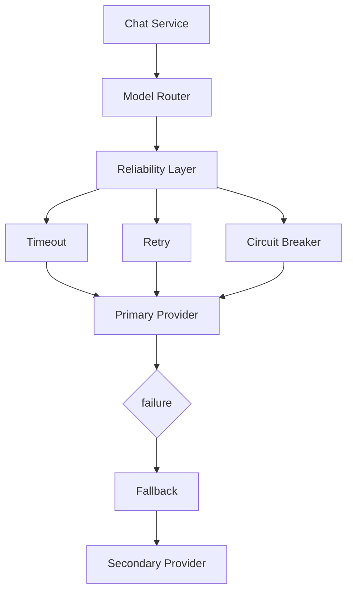

## 31. Rust Design

Reliability should be represented as application-level services rather than
embedded directly into individual provider implementations.

A conceptual interface:

```rust
#[async_trait]
pub trait ProviderExecutor: Send + Sync {
    async fn execute(
        &self,
        request: &ChatRequest,
    ) -> Result<ChatResponse, GatewayError>;
}
```

A reliability-aware implementation may conceptually contain:

```rust
pub struct ReliableProviderExecutor {
    provider: Arc<dyn LlmProvider>,
    retry_policy: RetryPolicy,
    timeout: Duration,
}
```

Later, the executor can incorporate:

```rust
RetryPolicy
CircuitBreaker
FallbackPolicy
RequestDeadline
ConcurrencyLimiter
```

This keeps provider adapters focused on provider-specific communication.

## 32. Retry Policy Type

A possible domain/application model:

```rust
pub struct RetryPolicy {
    pub enabled: bool,
    pub max_attempts: u32,
    pub initial_delay: Duration,
    pub max_delay: Duration,
    pub multiplier: f64,
    pub jitter: bool,
}
```

The policy should be independent of OpenRouter or any other specific provider.

## 33. Failure Classification

A dedicated classifier should determine whether an error is retryable.

Conceptually:

```rust
pub enum RetryDecision {
    Retry,
    DoNotRetry,
}
```

Example:

```rust
pub fn classify(error: &ProviderError) -> RetryDecision {
    match error {
        ProviderError::Timeout
        | ProviderError::Unavailable
        | ProviderError::Network
        | ProviderError::ServerError
        | ProviderError::RateLimited => RetryDecision::Retry,

        ProviderError::Authentication
        | ProviderError::InvalidRequest
        | ProviderError::ModelNotFound
        | ProviderError::InvalidResponse
        | ProviderError::Unknown => RetryDecision::DoNotRetry,
    }
}
```

The exact classification can evolve as provider-specific behavior becomes
better understood.

## 34. Reliability Request Flow

The complete future request flow is:

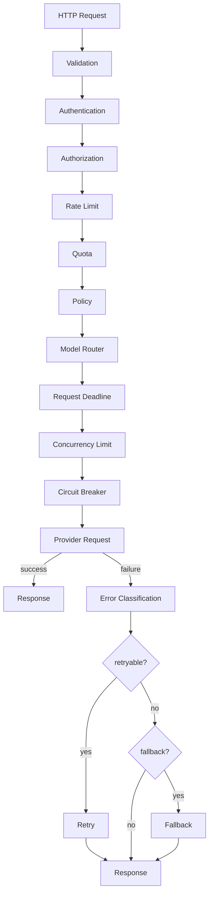

## 35. MVP Reliability

The first implementation should remain intentionally small.

### MVP includes

```text
Provider timeout
Basic retry policy
Exponential backoff
Jitter
Retry classification
Request deadline
Normalized provider errors
Request cancellation
Structured reliability logging
Basic health/readiness
```

### MVP does not require

```text
Distributed circuit breakers
Distributed retry coordination
Advanced adaptive routing
Complex fallback graphs
Distributed queues
Global concurrency management
Advanced provider health scoring
Automatic provider recovery
```

These can be added incrementally.

## 36. Implementation Order

Reliability should be implemented in this order.

### Step 1 — Timeout

Implement provider request timeouts.

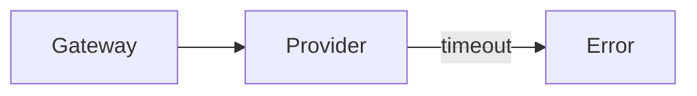

### Step 2 — Error Classification

Normalize provider errors and classify them as retryable or non-retryable.

### Step 3 — Retry

Add:

```text
max_attempts
backoff
jitter
deadline
```

### Step 4 — Cancellation

Ensure request cancellation propagates to provider operations.

### Step 5 — Fallback

Add explicit configured fallback providers/models.

### Step 6 — Circuit Breaker

Introduce circuit-breaker state management.

### Step 7 — Concurrency Protection

Add bounded concurrency and resource protection.

### Step 8 — Streaming Reliability

Add streaming-specific cancellation, timeout, backpressure, and
partial-response handling.

### Step 9 — Reliability Observability

Add metrics and traces for:

```text
timeouts
retries
fallbacks
provider failures
circuit state
latency
request cancellation
```

## 37. Reliability Testing

Reliability must be tested with deterministic failure scenarios.

Tests should include:

### Timeout

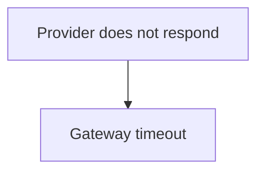

Expected:

```text
controlled timeout error
```

### Retry

```text
Attempt 1 -> failure
Attempt 2 -> success
```

Expected:

```text
successful response
retry metric = 1
```

### Retry exhaustion

```text
Attempt 1 -> failure
Attempt 2 -> failure
Attempt 3 -> failure
```

Expected:

```text
normalized provider error
```

### Non-retryable error

```text
Invalid request
```

Expected:

```text
one provider attempt
no retry
```

### Fallback

```text
Primary -> failure
Fallback -> success
```

Expected:

```text
successful response
fallback metric recorded
```

### Cancellation

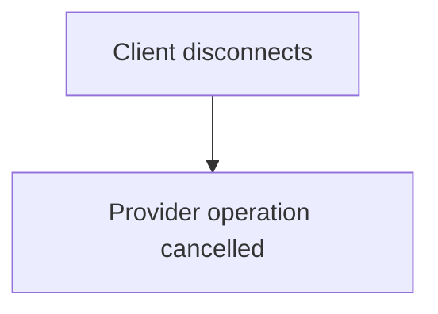

Expected:

```text
no unnecessary background operation
```

### Circuit breaker

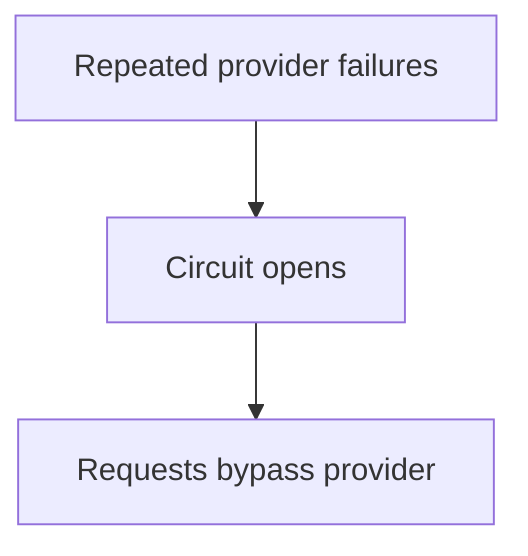

Expected:

```text
requests bypass provider
```

## 38. Failure Injection

The test suite should eventually contain a fake provider capable of
deterministic failures.

Example:

```rust
pub enum MockProviderBehavior {
    Success,
    Timeout,
    NetworkFailure,
    RateLimited,
    ServerError,
}
```

This allows reliability tests without depending on a real external provider.

## 39. Production Reliability Goals

Production reliability should eventually provide:

```text
Bounded request duration
Bounded retries
Provider isolation
Fallback behavior
Circuit breaking
Graceful shutdown
Cancellation
Concurrency protection
Health/readiness
Structured reliability telemetry
Failure-aware routing
```

Reliability targets should be established from actual workload and operational
requirements rather than arbitrary assumptions.

## 40. Reliability Contract

The AI Gateway reliability contract is:

> Every provider request must have a bounded lifetime, explicit failure
> classification, controlled retry behavior, and predictable failure handling.

The gateway must:

1. Never wait indefinitely for a provider.
2. Never retry indefinitely.
3. Never retry known non-retryable failures.
4. Respect request deadlines.
5. Avoid retry storms.
6. Support explicit provider fallback.
7. Prevent unhealthy providers from overwhelming the gateway.
8. Propagate cancellation where possible.
9. Shut down gracefully.
10. Produce observable and normalized failure information.
11. Protect itself from resource exhaustion.
12. Keep provider-specific reliability behavior behind the provider abstraction.

This makes reliability a platform capability rather than provider-specific
application logic.