# AI Gateway — Security

## 1. Overview

Security is a core architectural requirement of the AI Gateway.

The gateway sits between client applications and external AI providers:

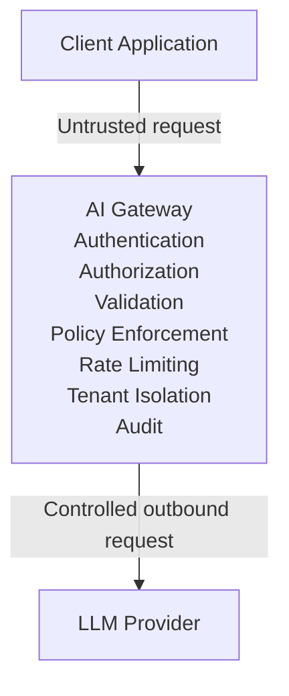

The gateway must protect:

- client applications
- tenant data
- API keys
- provider credentials
- database credentials
- Redis credentials
- configuration
- administrative APIs
- usage information
- audit information
- operational infrastructure

Security must be implemented as a cross-cutting concern rather than as a single
middleware component.

## 2. Security Principles

The project follows these principles:

1. Defense in depth
2. Least privilege
3. Fail closed
4. Explicit authentication
5. Explicit authorization
6. Tenant isolation
7. Secure secret handling
8. Input validation
9. Output validation
10. No sensitive information in logs
11. Secure defaults
12. Provider credential isolation
13. Administrative API isolation
14. Auditing of security-sensitive operations
15. Dependency and supply-chain awareness

## 3. Threat Model

The gateway should assume that:

- clients can be malicious
- API keys can be compromised
- requests can be malformed
- providers can fail
- providers can return malformed responses
- infrastructure dependencies can become unavailable
- configuration can be incorrect
- attackers may attempt to bypass authorization
- attackers may attempt to exhaust gateway resources
- attackers may attempt to access another tenant's data
- attackers may attempt to expose provider credentials

The system must not assume that a request is trustworthy merely because it
reached the HTTP server.

## 4. Security Boundaries

The main security boundaries are:

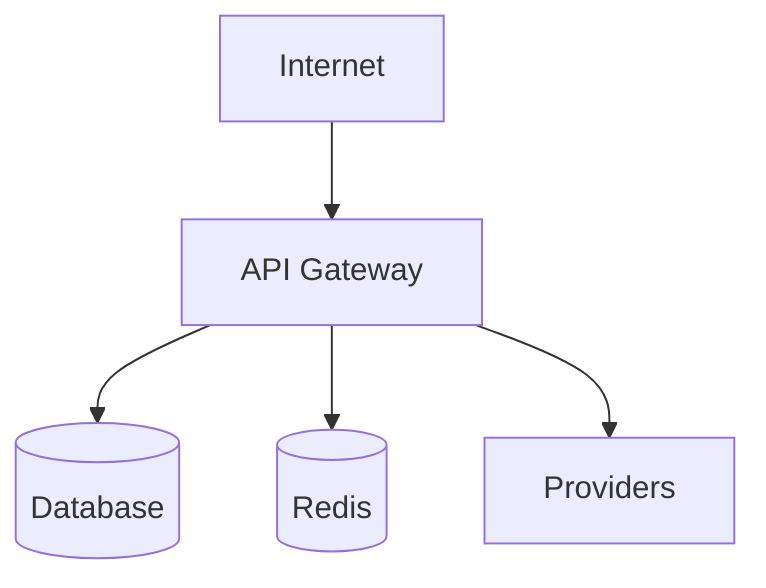

Additional boundaries exist between:

```text
Client -> Gateway
Tenant -> Tenant
User -> Admin API
Gateway -> Provider
Application -> Infrastructure
```

Each boundary requires appropriate validation and authorization.

## 5. Authentication

Authentication establishes the identity associated with a request.

The initial gateway authentication mechanism is API-key based.

Client:

```http
Authorization: Bearer <API_KEY>
```

Authentication flow:

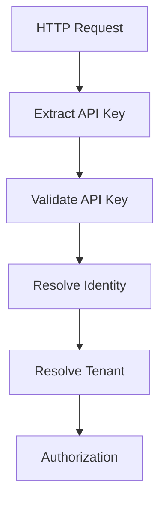

Protected endpoints must reject unauthenticated requests.

## 6. API Key Requirements

API keys must:

- be sufficiently unpredictable
- be stored securely
- be transmitted only over TLS
- never be logged
- never be returned in API responses
- support revocation
- be associated with a tenant
- have defined permissions
- have a lifecycle

Example conceptual identity:

```text
API Key
   |
   +-- key_id
   +-- tenant_id
   +-- permissions
   +-- status
   +-- created_at
   +-- expires_at
```

The actual secret value should not be exposed after creation.

## 7. API Key Storage

The gateway should not store plaintext API keys in the database.

Preferred model:

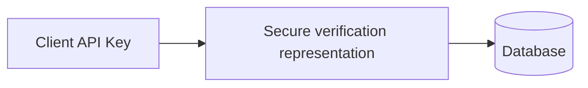

The implementation should use a secure one-way representation where practical.

The exact hashing/verification algorithm will be selected during implementation
based on current security requirements.

## 8. API Key Lifecycle

An API key may have states such as:

```text
active
revoked
expired
```

Lifecycle:

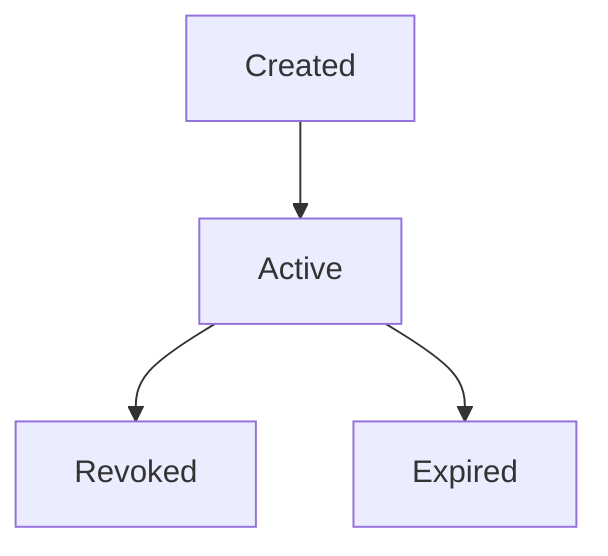

Requests using revoked or expired keys must be rejected.

## 9. Authentication Failure

Missing credentials:

```http
401 Unauthorized
```

Invalid credentials:

```http
401 Unauthorized
```

The API should avoid revealing whether a particular key identifier exists.

Example:

```json
{
  "error": {
    "type": "authentication_error",
    "code": "invalid_api_key",
    "message": "Authentication failed.",
    "request_id": "req_123"
  }
}
```

## 10. Authorization

Authentication answers:

```text
Who are you?
```

Authorization answers:

```text
What are you allowed to do?
```

Authorization occurs after authentication.

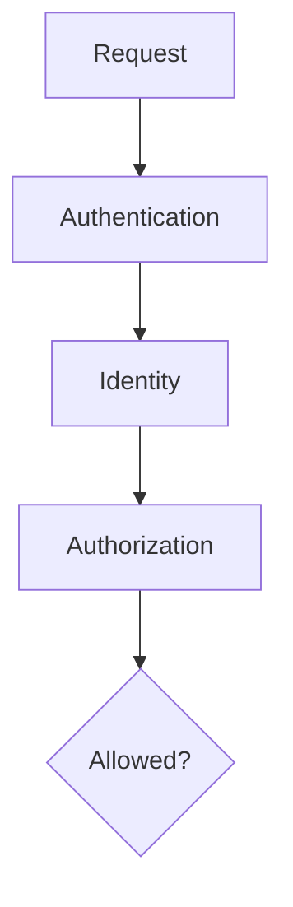

## 11. Permissions

The gateway should support permissions such as:

```text
chat:execute
models:read
usage:read
admin:read
admin:write
```

Example:

```text
Application API Key
    |
    +-- chat:execute
    +-- models:read
```

Administrative keys require additional permissions.

## 12. Least Privilege

Each identity should receive only the permissions it needs.

For example:

```text
Normal application
    -> chat:execute

Read-only monitoring
    -> usage:read

Administrator
    -> admin:read
    -> admin:write
```

An API key used by an application should not automatically receive
administrative permissions.

## 13. Tenant Isolation

Every authenticated request is associated with a tenant.

```text
API Key
   |
   v
Tenant A
```

Another key:

```text
API Key
   |
   v
Tenant B
```

Tenant A must never be able to access Tenant B's protected resources.

Tenant isolation applies to:

- requests
- usage records
- quotas
- API keys
- policies
- audit records
- administrative resources
- cached data
- persistent data

## 14. Tenant Context

After authentication, the application should create an identity context.

Conceptually:

```rust
pub struct Identity {
    pub api_key_id: String,
    pub tenant_id: String,
    pub permissions: Vec<Permission>,
}
```

The request context can then carry the authenticated identity through the
application layer.

The domain should not need to know about HTTP headers.

## 15. Authorization Flow

The complete protected request flow:

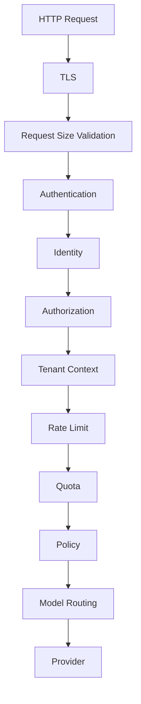

Security checks must happen before sensitive operations.

## 16. Administrative API Security

Administrative endpoints have elevated privileges.

Examples:

```text
/admin/providers
/admin/models
/admin/tenants
/admin/usage
/admin/audit-events
```

Administrative APIs must require:

- authentication
- explicit administrative permissions
- tenant/system authorization
- audit logging

They should not be treated as normal inference endpoints.

## 17. Administrative Isolation

Where practical, administrative functionality should be logically separated
from the public inference API.

Conceptually:

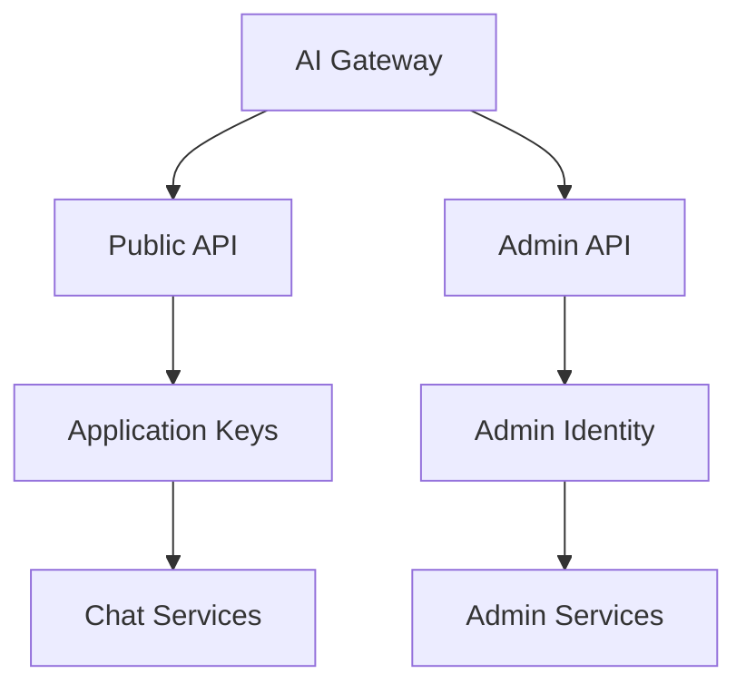

Administrative access should have stricter controls.

## 18. Secret Management

Sensitive credentials include:

```text
OPENROUTER_API_KEY
DATABASE_URL
REDIS_URL
JWT signing secrets
private keys
other provider credentials
```

Secrets must not be committed to Git.

Do not store secrets in:

```text
source code
README files
configuration examples
Docker images
logs
metrics
traces
API responses
```

## 19. Environment Variables

Development may use environment variables:

```bash
OPENROUTER_API_KEY=...
DATABASE_URL=...
REDIS_URL=...
```

A committed `.env.example` may document variable names:

```text
OPENROUTER_API_KEY=
DATABASE_URL=
REDIS_URL=
```

It must not contain real credentials.

## 20. Production Secret Management

Production deployments should prefer a dedicated secret-management system.

Conceptually:

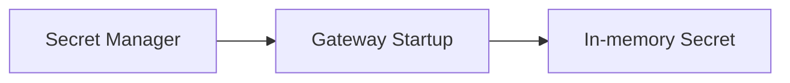

The exact production secret manager is deployment-specific.

The application should avoid embedding a dependency on a single
secret-management vendor.

## 21. Secret Exposure Prevention

Secrets must not appear in:

```text
logs
traces
metrics
error messages
panic messages
debug output
configuration dumps
API responses
```

Example of prohibited logging:

```text
OPENROUTER_API_KEY=sk-...
```

Instead:

```text
provider authentication configured
```

## 22. TLS

Production client-to-gateway communication must use TLS.

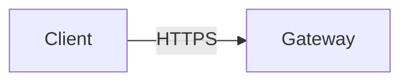

The gateway should not expose sensitive authenticated traffic over plain HTTP
in production.

Development may use:

```text
http://localhost
```

for local testing.

TLS termination may occur:

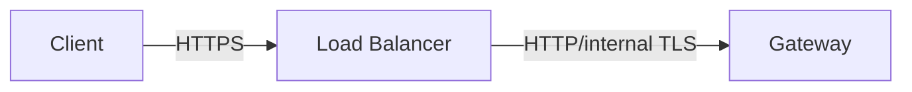

The deployment architecture must explicitly define the trust boundary.

## 23. Outbound Provider Security

The gateway communicates with external providers.

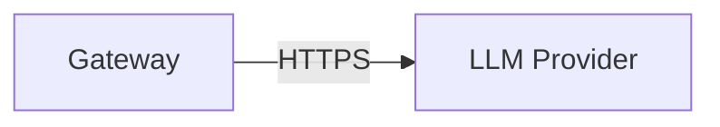

Provider connections must:

- use HTTPS
- validate TLS certificates
- authenticate securely
- enforce timeouts
- validate responses
- avoid arbitrary destinations

## 24. Provider URL Control

Clients must never be allowed to specify arbitrary provider URLs.

Bad:

```json
{
  "provider_url": "https://attacker.example"
}
```

Preferred:

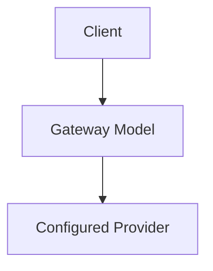

Provider endpoints must come from trusted configuration.

This reduces the risk of server-side request forgery (SSRF).

## 25. SSRF Protection

The gateway must not allow user-controlled URLs for outbound provider requests.

Provider URLs should be:

- configured by trusted operators
- validated during startup
- restricted to expected protocols
- protected from unintended internal-network access where applicable

The gateway should not fetch arbitrary URLs supplied through model requests
unless a separately designed feature explicitly requires it.

## 26. Input Validation

All externally supplied input must be validated.

Inputs include:

```text
HTTP headers
JSON request body
model identifiers
messages
temperature
max_tokens
query parameters
administrative parameters
```

Validation should happen before application processing.

## 27. Request Size Limits

The gateway must enforce request size limits.

Example:

```yaml
security:
  max_request_body_bytes: 1048576
```

Large requests can consume:

- memory
- CPU
- network bandwidth
- provider quota

Requests exceeding configured limits should be rejected.

## 28. Message Validation

Chat messages should be validated for:

- supported role
- non-empty content where required
- maximum content length
- maximum message count
- valid encoding

Example:

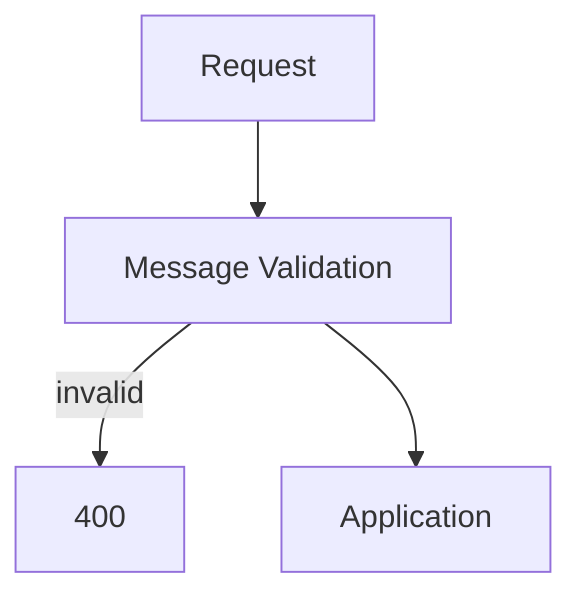

Limits should be configurable.

## 29. Token and Resource Limits

The gateway should enforce resource limits such as:

```text
max request body
max messages
max input size
max output tokens
max concurrent requests
request timeout
provider timeout
```

These controls reduce resource-exhaustion risk.

## 30. Rate Limiting

Rate limiting is a security and availability mechanism.

Possible dimensions:

```text
tenant
API key
model
provider
IP address
```

The initial implementation may use a simpler policy.

Future distributed deployments may use Redis.

## 31. Quotas

Quotas limit aggregate consumption.

Examples:

```text
requests/day
tokens/day
cost/day
```

Quotas protect both infrastructure and provider accounts from unexpected usage.

Rate limiting and quotas must remain separate concepts.

## 32. Denial-of-Service Protection

The gateway should protect itself from excessive resource consumption.

Controls include:

- request size limits
- timeouts
- rate limits
- quotas
- bounded concurrency
- connection limits
- streaming limits
- provider timeouts
- circuit breakers
- backpressure

Security and reliability controls should work together.

## 33. Prompt and Model Input Security

The gateway treats model input as application data.

The gateway must not assume that model messages are trusted instructions.

Future policy features may inspect:

- prohibited content categories
- sensitive information
- tenant-specific policies
- model restrictions
- tool permissions

The gateway should distinguish between:

```text
transport security
```

and:

```text
AI/content safety policy
```

They are related but separate concerns.

## 34. Provider Response Security

Provider responses are external input.

The gateway must validate provider responses before returning them to clients.

Potential problems include:

```text
malformed JSON
missing fields
unexpected data types
unexpected streaming events
invalid usage values
oversized responses
```

Malformed provider responses must not crash the gateway.

## 35. Error Handling Security

Internal errors must not expose:

```text
stack traces
filesystem paths
database credentials
provider credentials
internal hostnames
connection strings
implementation details
```

Production response:

```json
{
  "error": {
    "type": "internal_error",
    "code": "internal_error",
    "message": "An internal error occurred.",
    "request_id": "req_123"
  }
}
```

Detailed information belongs in protected internal logs.

## 36. Logging Security

Logs must be structured and security-aware.

Safe fields may include:

```text
request_id
tenant_id
provider
model
status
latency
error_type
```

Avoid logging:

```text
API keys
provider credentials
authorization headers
full prompts
full model responses
database credentials
```

Sensitive payload logging should be disabled by default.

## 37. Audit Logging

Security-sensitive operations should generate audit events.

Examples:

```text
API key created
API key revoked
tenant created
model configuration changed
provider configuration changed
policy changed
administrator authenticated
administrative operation executed
```

Conceptual audit event:

```json
{
  "event": "api_key_revoked",
  "actor": "admin_123",
  "tenant_id": "tenant_123",
  "request_id": "req_123",
  "timestamp": "..."
}
```

Audit records must not contain secret values.

## 38. Audit Integrity

Audit records should be:

- append-oriented
- access-controlled
- timestamped
- associated with an actor
- associated with a tenant where applicable
- associated with a request ID
- protected from unauthorized modification

Production requirements may include stronger tamper-resistance mechanisms.

## 39. Database Security

Database access must use:

- authenticated connections
- TLS where required by deployment
- least-privilege database users
- parameterized queries
- migration-controlled schema changes

The application must not construct SQL by concatenating untrusted input.

SQLx should use parameterized queries.

## 40. Database Credential Security

The database connection string must not be committed.

Example:

```bash
DATABASE_URL="..."
```

Database credentials must not appear in:

```text
logs
errors
metrics
traces
configuration dumps
```

## 41. Redis Security

If Redis is used, it must be protected with appropriate authentication and
network controls.

Redis may contain:

```text
rate-limit state
quota state
cache entries
distributed state
```

Sensitive values should not be stored unnecessarily.

Cached data must respect tenant boundaries.

## 42. Cache Isolation

If caching is introduced, cache keys must include appropriate
tenant/model/request dimensions.

Bad:

```text
cache:prompt:<hash>
```

if the cached result can cross tenant boundaries.

Preferred conceptual structure:

```text
cache:<tenant>:<model>:<request-hash>
```

The exact key design will be defined during the caching feature.

## 43. Multi-Tenant Cache Security

A response generated for Tenant A must never be returned to Tenant B unless the
cache policy explicitly permits that behavior and the data is demonstrably safe
to share.

Default behavior should favor tenant isolation.

## 44. Dependency Security

The Rust dependency tree is part of the application's security boundary.

The project should:

- keep dependencies reasonably current
- review security advisories
- minimize unnecessary dependencies
- use lockfiles
- review new dependencies
- run dependency auditing in CI

The project should periodically inspect the Cargo dependency tree for known
vulnerabilities.

## 45. Supply Chain Security

The build process should eventually include:

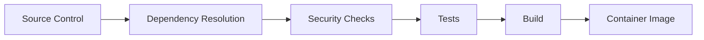

Production builds should be reproducible as far as practical.

## 46. Container Security

The production container should:

- use a minimal runtime image
- avoid unnecessary packages
- avoid running as root where practical
- avoid embedding secrets
- expose only required ports
- use read-only filesystem options where practical
- receive configuration externally

Example:

```text
Docker Image
    |
    +-- Application binary
    |
    +-- No secrets
```

## 47. CI/CD Security

CI/CD must protect:

- repository credentials
- deployment credentials
- provider API keys
- signing credentials
- container registry credentials

Secrets should be stored in the CI/CD platform's secret mechanism rather than
source control.

Pull requests from untrusted sources must not receive privileged secrets.

## 48. Authentication Middleware

The HTTP layer should provide authentication middleware.

Conceptually:

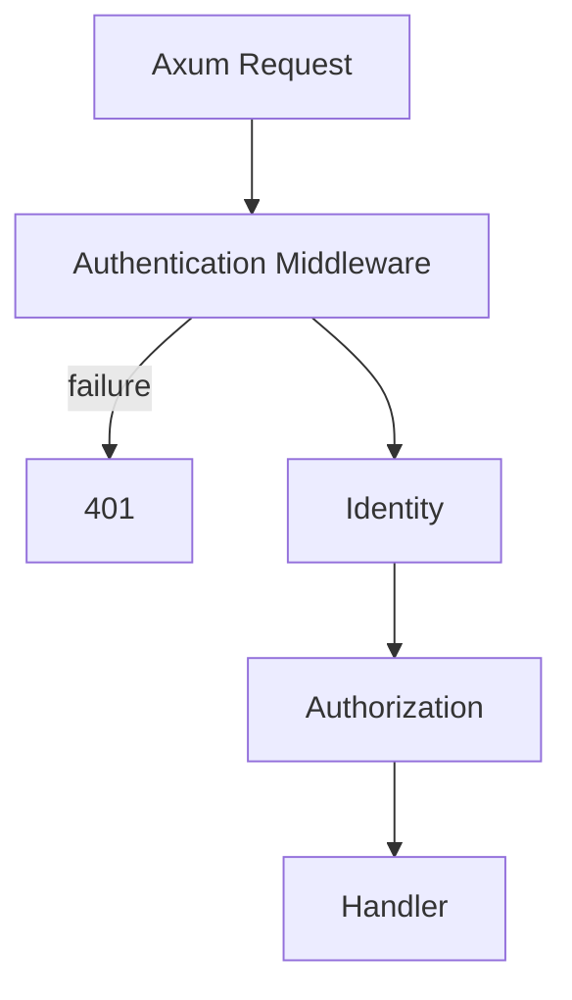

Authentication should be implemented once rather than duplicated in every
handler.

## 49. Authorization Middleware

Authorization may be implemented through middleware and/or application-level
policy checks.

Example:

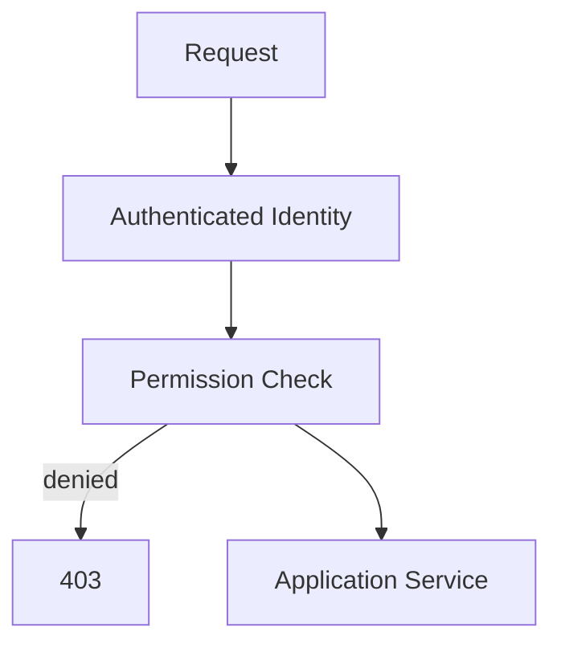

Complex resource-level authorization should remain in the application layer
where appropriate.

## 50. Security Headers

The HTTP layer should consider appropriate security headers for the deployed
environment.

Examples may include:

```text
Strict-Transport-Security
X-Content-Type-Options
Content-Security-Policy
```

The exact set depends on whether the gateway serves browser-facing content.

Since the primary API is machine-to-machine, browser-specific headers should
not be added blindly.

## 51. CORS

CORS should be explicitly configured if browser applications access the API.

The gateway should not default to:

```text
Access-Control-Allow-Origin: *
```

for authenticated production APIs unless the security model explicitly
requires it.

Allowed origins should be configured.

Example:

```yaml
cors:
  enabled: false
  allowed_origins: []
```

CORS is not an authentication mechanism.

## 52. Request Cancellation

The gateway should cancel provider work when a client disconnects where
practical.

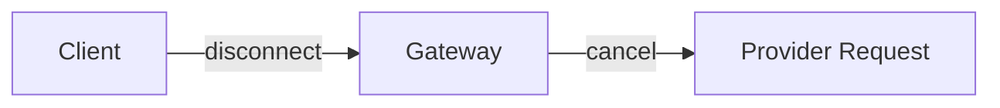

This reduces unnecessary resource consumption.

## 53. Streaming Security

Streaming introduces additional concerns:

```text
connection lifetime
resource exhaustion
client disconnects
provider disconnects
partial responses
timeout enforcement
concurrent stream limits
```

The gateway must enforce bounded resource usage for streaming connections.

## 54. Sensitive Data Handling

LLM requests may contain sensitive business information.

The gateway should therefore treat:

```text
messages
prompts
responses
metadata
```

as potentially sensitive.

The default policy should be:

```text
Do not log full prompts.
Do not log full responses.
Do not expose them through metrics.
Do not put them into traces by default.
```

Explicit diagnostic functionality may be added later with appropriate access
controls.

## 55. Data Retention

The gateway should define retention periods for:

```text
request metadata
usage records
audit events
logs
traces
cached responses
```

Retention should follow the deployment's security and compliance requirements.

The gateway should avoid retaining data that it does not need.

## 56. Privacy by Design

The gateway should minimize collection of sensitive information.

For each stored field, ask:

- Do we need it?
- Why do we need it?
- Who can access it?
- How long should we retain it?

Telemetry should capture operational information without unnecessarily
capturing user content.

## 57. Security Monitoring

Security-relevant events should be observable.

Examples:

```text
authentication failures
authorization failures
API key revocations
unusual request rates
quota exhaustion
provider credential failures
administrative operations
```

Metrics and audit events should support operational investigation.

## 58. Security Incident Handling

The architecture should support investigation through:

```text
request_id
tenant_id
timestamp
actor
provider
model
status
audit event
trace ID
```

A security incident should be traceable across:

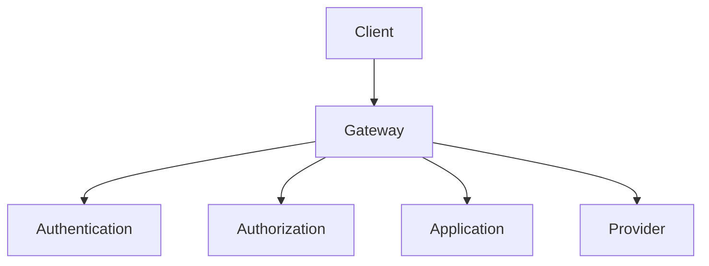

Sensitive values must not be required to reconstruct the request lifecycle.

## 59. Fail-Closed Behavior

Security failures should normally fail closed.

Examples:

```text
authentication unavailable
authorization unavailable
invalid policy
unknown identity
invalid configuration
```

The gateway should not silently grant access because a security component
failed.

## 60. Startup Security Validation

At startup, the gateway should validate:

```text
provider configuration
provider credentials
authentication configuration
database configuration
TLS configuration where applicable
security limits
routing configuration
```

Invalid security configuration should prevent startup.

## 61. Production Security Checklist

Before production deployment:

```text
[ ] TLS configured
[ ] API authentication enabled
[ ] Authorization enabled
[ ] API keys protected
[ ] Secrets externalized
[ ] No secrets in Git
[ ] Request size limits configured
[ ] Rate limiting configured
[ ] Quotas configured
[ ] Provider timeouts configured
[ ] Database access secured
[ ] Redis access secured
[ ] Audit logging enabled
[ ] Sensitive logging disabled
[ ] Error responses sanitized
[ ] Dependency audit enabled
[ ] Container does not require root
[ ] CI/CD secrets protected
[ ] Administrative API protected
[ ] Tenant isolation tested
[ ] Cache isolation tested
[ ] Security tests passing
```

## 62. Security Testing

Security tests should cover:

### Authentication

```text
missing API key
invalid API key
revoked API key
expired API key
```

### Authorization

```text
missing permission
normal user accessing admin API
cross-tenant access
```

### Input validation

```text
oversized request
invalid model
invalid message
invalid parameter
```

### Resource protection

```text
rate-limit enforcement
quota enforcement
timeout enforcement
concurrency limits
```

### Secrets

```text
API key not logged
provider credential not logged
database credentials not exposed
```

### Provider security

```text
invalid provider response
provider timeout
provider authentication failure
untrusted provider URL rejection
```

## 63. Security Test Strategy

The security test pyramid should contain:

```text
             E2E Security Tests
                    /\
                   /  \
                  /----\
                 /      \
                /Integration\
               /--------------\
              /                \
             /   Unit Tests    \
            /------------------\
```

Unit tests verify individual security components.

Integration tests verify interactions between authentication, authorization,
application services, and persistence.

End-to-end tests verify the complete request path.

## 64. Security Architecture

The target architecture is:

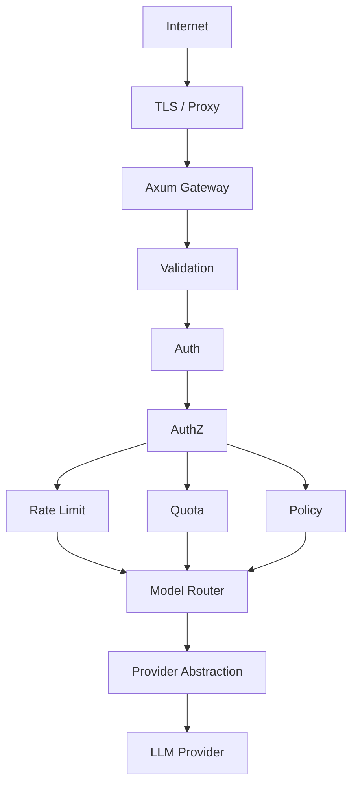

## 65. Security Responsibilities by Layer

| Layer               | Security Responsibility                   |
| ------------------- | ----------------------------------------- |
| Proxy/Load Balancer | TLS, network controls                     |
| Axum/API            | request parsing and validation            |
| Authentication      | identity verification                     |
| Authorization       | permission checks                         |
| Application         | resource-level authorization and policies |
| Domain              | security-relevant invariants              |
| Provider Layer      | credential isolation and outbound security |
| Database            | persistence access control                |
| Redis               | protected distributed state               |
| Observability       | prevent sensitive data leakage            |
| CI/CD               | supply-chain and secret protection        |
| Deployment          | runtime isolation                         |

## 66. Security Non-Goals

The gateway does not attempt to provide:

```text
model training security
GPU/inference infrastructure security
full enterprise identity platform
full DLP platform
complete content moderation platform
general-purpose web proxy
arbitrary URL fetching
```

Those capabilities may integrate with the gateway but are outside its core
security boundary.

## 67. MVP Security Scope

The MVP should implement:

```text
API key authentication
basic authorization
request validation
request size limits
provider credential protection
provider HTTPS
provider timeout
sanitized errors
request IDs
safe structured logging
basic security tests
```

The MVP should not initially implement:

```text
complex RBAC
OAuth/OIDC
dynamic policy engine
advanced tenant administration
distributed rate limiting
advanced audit analytics
dynamic secret rotation
full enterprise IAM integration
```

These are later features.

## 68. Security Implementation Order

Security should evolve alongside the gateway.

Recommended order:

```text
Phase 1
Request validation

Phase 2
API key authentication

Phase 3
Authorization

Phase 4
Secret management

Phase 5
Provider security

Phase 6
Rate limiting

Phase 7
Quota enforcement

Phase 8
Audit logging

Phase 9
Tenant isolation

Phase 10
Security hardening

Phase 11
Security testing

Phase 12
Production security review
```

Security must not be postponed until the final deployment phase.

## 69. Security Rules

The following rules are mandatory:

### Rule 1

Never log secrets.

### Rule 2

Never expose provider credentials to clients.

### Rule 3

Never trust client-supplied provider URLs.

### Rule 4

Authenticate protected requests.

### Rule 5

Authorize actions after authentication.

### Rule 6

Enforce tenant isolation.

### Rule 7

Validate all external input.

### Rule 8

Validate external provider responses.

### Rule 9

Use explicit timeouts.

### Rule 10

Fail closed when security decisions cannot be made safely.

### Rule 11

Keep administrative access separate from normal inference access.

### Rule 12

Minimize sensitive data collection and retention.

## 70. Related Documents

Product requirements:

```text
docs/prd.md
```

Architecture:

```text
docs/architecture.md
```

API:

```text
docs/api.md
```

Configuration:

```text
docs/configuration.md
```

Providers:

```text
docs/providers.md
```

Reliability:

```text
docs/reliability.md
```

Observability:

```text
docs/observability.md
```

Testing:

```text
docs/testing.md
```

Deployment:

```text
docs/deployment.md
```

Project principles:

```text
constitution.md
```

Implementation roadmap:

```text
docs/plan.md
```

Feature specifications:

```text
specs/
```

## 71. Security Contract

The gateway security model can be summarized as:

```mermaid
flowchart TD
    REQ[REQUEST] --> TP[TLS / Proxy]
    TP --> IL[Input Limits]
    IL --> A[Authentication]
    A --> AZ[Authorization]
    AZ --> TI[Tenant Isolation]
    TI --> RQ[Rate / Quota]
    RQ --> Pol[Policy]
    Pol --> MR[Model Router]
    MR --> PS[Provider Security]
    PS --> P[LLM Provider]
```

The security architecture ensures that requests are **authenticated,
authorized, validated, isolated, rate-controlled, and safely forwarded to
configured providers**, while credentials and sensitive data remain protected
throughout the request lifecycle.